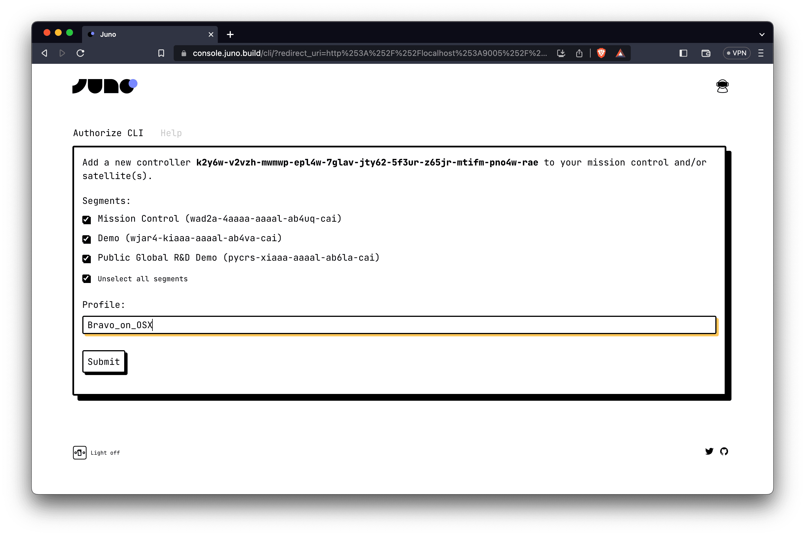
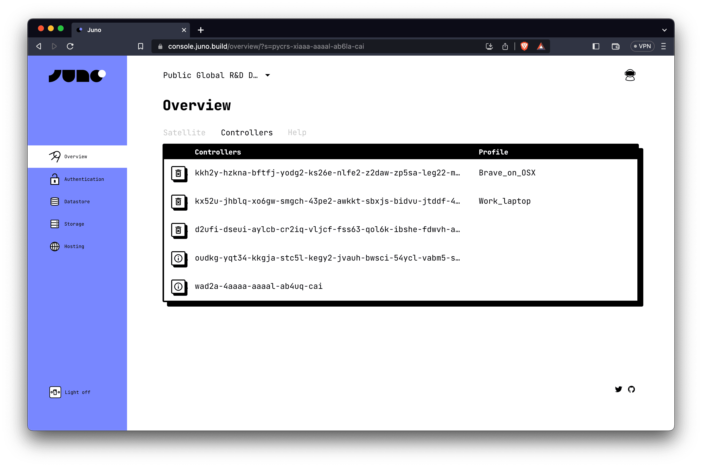
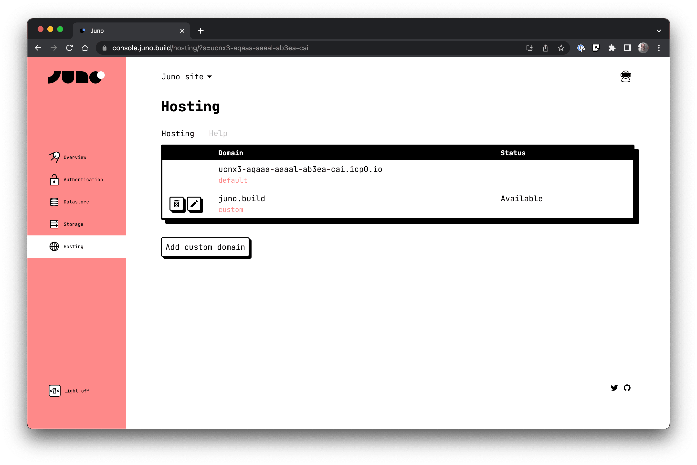
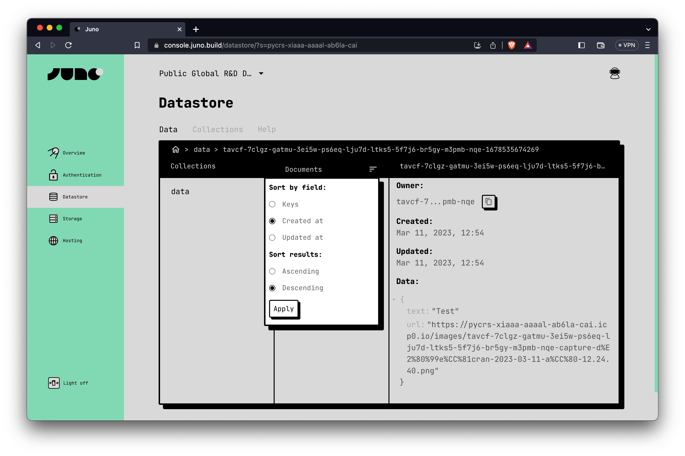
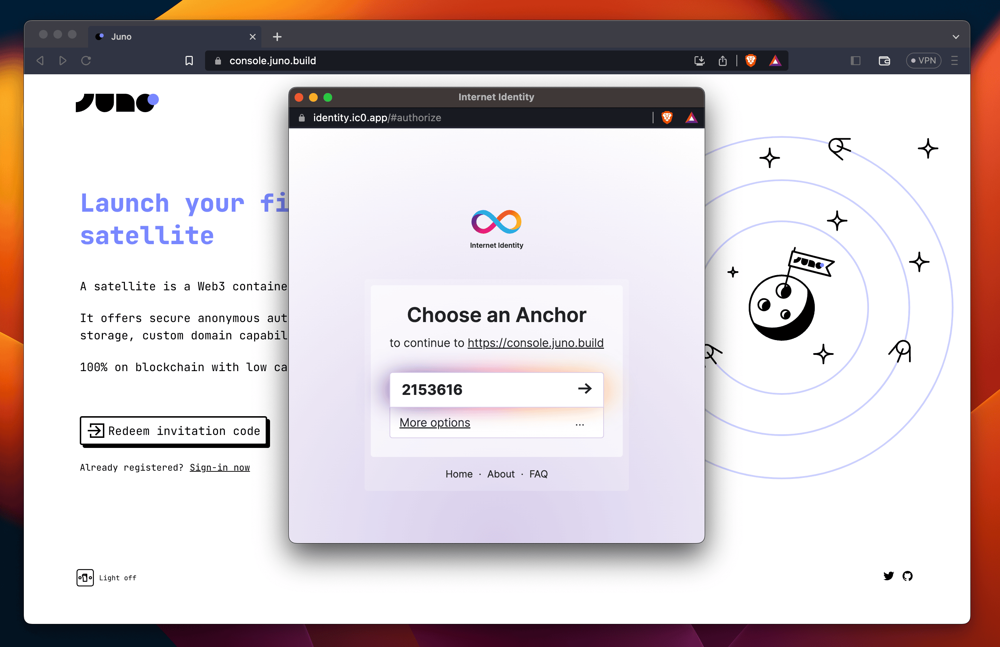
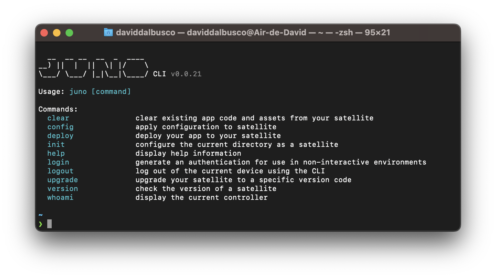

A month ago, the first beta for Juno was released to the world. Since then, we have been fixing bugs and gathering feedback on what to tackle next. Today, we are excited to announce the release of some of our most requested features, which include:

- [Enhanced controller user experience](#enhanced-controller-user-experience)
- [Custom domains support](#custom-domains-support)
- [Expanded ordering and filtering options](#expanded-ordering-and-filtering-options)
- [New CLI and JS library features](#new-cli-and-js-library-features)

<!--truncate-->

---

## Enhanced controller user experience

Controllers play a critical role in Juno, as they are used to grant administrative permissions to [mission controls] and [satellites]. They are the cornerstone of the authorization scheme that developers use to sign in and control their segments.

In previous versions, controllers were recorded and displayed only as IDs, which could be confusing. It was difficult to track which controller was granted on which machine and for what purpose.

To address this issue, we have reworked the system to give developers the option to set a "profile" for a controller when they [log in](/docs/miscellaneous/cli#login).



These profiles, these hints, will be displayed in the console and saved in the local authorization for easy reference.



This way, developers can also manage multiple profiles locally and always know which identity they used to sign in.

```bash
❯ juno use -p Brave_on_OSX
Now using Brave_on_OSX
❯ juno whoami
Profile: Brave_on_OSX
Controller: kkh2y-hzkna-bftfj-yodg2-ks26e-nlfe2-...
```

:::caution

If you are part of the beta program, it's important to note that this new feature was partially shipped as a breaking change and therefore requires an upgrade.

After installing the latest version of the CLI, we recommend upgrading your [mission control] first, followed by any [satellites].

```bash
❯ npm i -g @junobuil/cli
❯ juno upgrade -m
❯ juno upgrade
```

:::

---

## Custom domains support

With Juno Hosting, maintaining your brand identity is easier than ever thanks to the new support for custom domains. You can now use domain names like "yolo.com" or "hello.world.com" to reinforce your unique online presence.



Furthermore, not only are custom domains now supported in Juno Hosting, but you can also easily edit and delete their configurations. To assist with on-boarding, we have improved the documentation and resources available for this feature.

---

## Expanded ordering and filtering options

During the early beta stage, pagination and filtering based on keys were available for listing assets and documents, but ordering options were limited.

To address this, we have extended the sorting feature to include timestamps, and you can now sort the `keys`, `updated_at`, and `created_at` fields in either ascending or descending order.

```typescript
import { listDocs } from "@junobuild/core";

const myList = await listDocs({
  collection: "my_collection_key",
  filter: {
    order: {
      desc: true,
      field: "updated_at"
    }
  }
});
```

Since the [console] uses the same technology to present the data to developers, you can also use these options to efficiently manage your data.



These [console]'s filters are now saved in local storage, ensuring that the last options selected are always applied.

---

## New CLI and JS library features

Of the many new features added to the CLI and JS library, the most useful one is likely the [Web Worker](/docs/build/authentication#advanced) that automatically logs out users when their session expires.

```typescript
import { initJuno } from "@junobuild/core";

await initJuno({
  satelliteId: "aaaaa-bbbbb-ccccc-ddddd-cai",
  workers: {
    auth: true // ----------------------------------|
  } //|
}); //|
//|
authSubscribe((user: User | null) => {
  //|
  console.log("User:", user); // auto sign-out <-----|
  // when session expires
});
```

This allows developers to proactively inform their users about the session's state, as it cannot be extended.

To provide a more natural experience, Juno uses now a default behavior of a modal for [Internet Identity](https://internetcomputer.org/internet-identity) login, which is commonly done in separate tabs.



Several iterations of the [CLI](/docs/miscellaneous/cli) were developed to support the deployment of these new features. Despite adding many of those, we aimed to keep the interface simple and avoid overcomplicating things unnecessarily.



Finally, the feedback we received from developers has been positive and motivating, and we believe we are close to making Juno publicly available. We have implemented everything necessary to achieve this goal.

---

👋

Thank you for reading! Follow us on [Twitter](https://twitter.com/junobuild) to stay up to date.

And, if you’ve read this far, you should definitely join us on [Discord](https://discord.gg/wHZ57Z2RAG). 😉

[console]: /docs/terminology#console
[satellites]: /docs/terminology#satellite
[mission controls]: /docs/terminology#mission-control
[mission control]: /docs/terminology#mission-control
