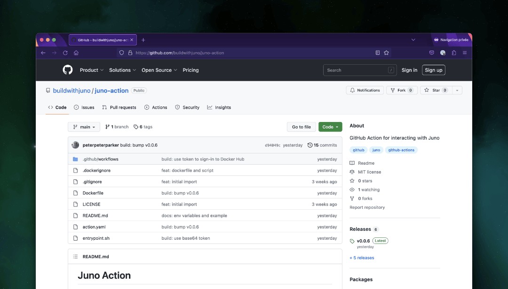
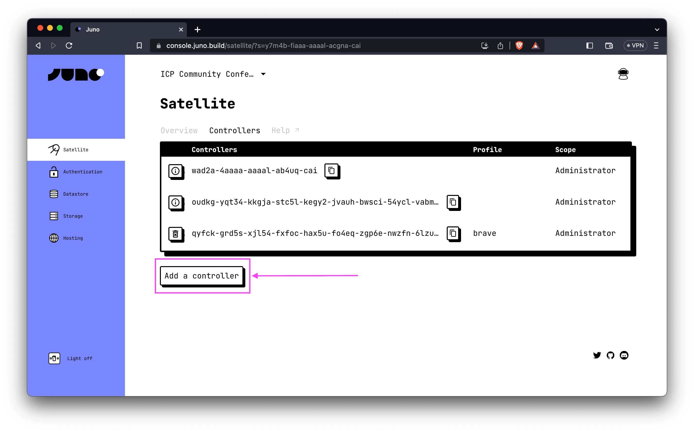
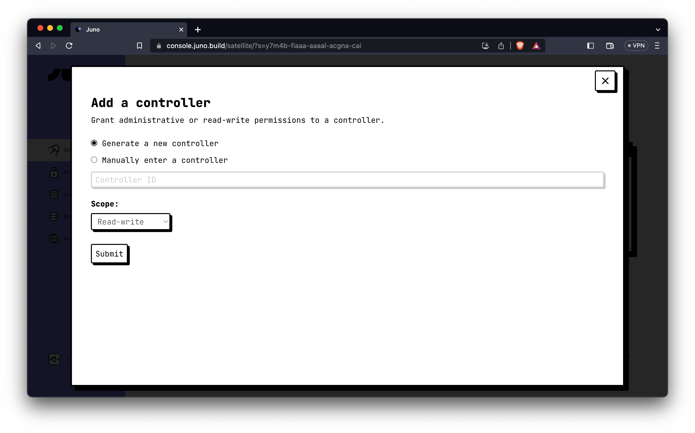
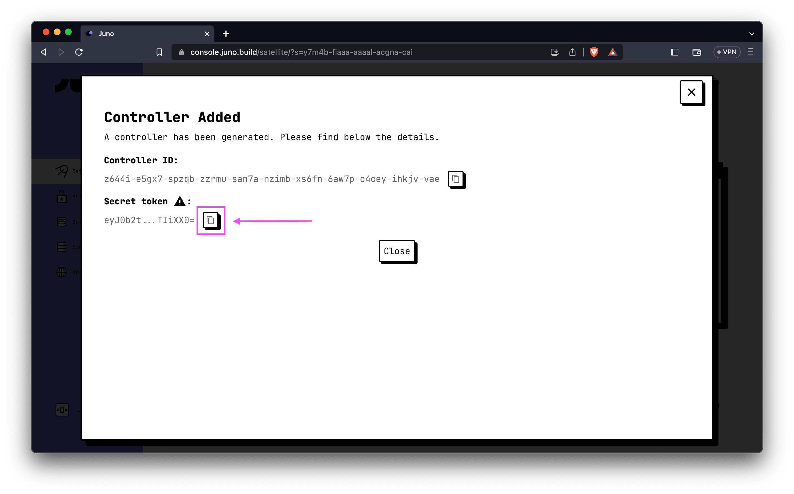

---

In the fast-paced world of decentralized applications (dapps), automating deployment processes is key to accelerating development workflows. Juno, an innovative platform for building and hosting dapps on the [Internet Computer](https://internetcomputer.org/), introduces an exciting new feature that simplifies the deployment process - the [Juno GitHub Action](https://github.com/marketplace/actions/github-action-for-juno).

In this blog post, we will delve into how this powerful integration enables developers to effortlessly deploy their dapps to the Internet Computer, leveraging the capabilities of the Juno platform.

---

## Adding a Secret Token for Automation

Before implementing automation with the Juno GitHub Action, it is essential to add a secret token to your GitHub repository or organization. This token enables Continuous Integration (CI) to deploy your dapp to the satellite.

To generate a new controller and obtain the secret token, follow these steps:

1. Access the Juno console.
2. Choose your desired satellite.
3. Navigate to the "Controllers" tab on the satellite's dashboard.
4. Click on "Add a controller".



5. Generate a new controller with the default options and select the "Read-write" permission scope.



6. Click "Submit" to create the controller.
7. Once successfully created, you will be provided with a "Secret token". Copy the token value.



8. Save the secret token as an encrypted secret in your repository or organization, assigning it the key `JUNO_TOKEN`.

Note: While it is possible to generate a controller with administrative permission, we recommend using the "Read-write" scope to prevent unwanted operations on your smart contract by GitHub. By choosing the "Read-write" scope, you retain complete control over your decentralized app and minimize the risk of interference.

---

## Configuring the GitHub Action

To configure the GitHub Action and complete the deployment process, follow these final steps:

1. Create a `deploy.yaml` file in the `.github/workflows` subfolder of your repository.
2. Copy and paste the following code into the `deploy.yaml` file:

```yaml
name: Deploy to Juno

on:
  release:
    types: [released]

jobs:
  build:
    runs-on: ubuntu-latest
    steps:
      - name: Check out the repo
        uses: actions/checkout@v3

      - uses: actions/setup-node@v3
        with:
          node-version: "18"

      - name: Install Dependencies
        run: npm ci

      - name: Build
        run: npm run build

      - name: Deploy to Juno
        uses: buildwithjuno/juno-action@main
        with:
          args: deploy
        env:
          JUNO_TOKEN: ${{ secrets.JUNO_TOKEN }}
```

That's it! This configuration sets up the GitHub Action for deployment. It performs a series of steps, including checking out the repository, installing dependencies, building the application, and finally utilizing the [buildwithjuno/juno-action](https://github.com/buildwithjuno/juno-action) GitHub Action to deploy your dapp to Juno.

Remember to adjust the code according to your specific requirements, such as modifying the branch name and package manager command to match your setup.

With the GitHub Action configured, you are now ready to automate the deployment of your dapp to Juno. Simply push a release, and the action will trigger, deploying your application seamlessly.

---

👋

Thank you for reading! Stay connected with Juno by following us on [Twitter](https://twitter.com/junobuild) to keep up with our latest updates.

And if you made it this far, we’d love to have you join the Juno community on [Discord](https://discord.gg/wHZ57Z2RAG). 😉

⭐️⭐️⭐️ are also much appreciated: visit the [GitHub repo](https://github.com/buildwithjuno/juno) and show your support!
