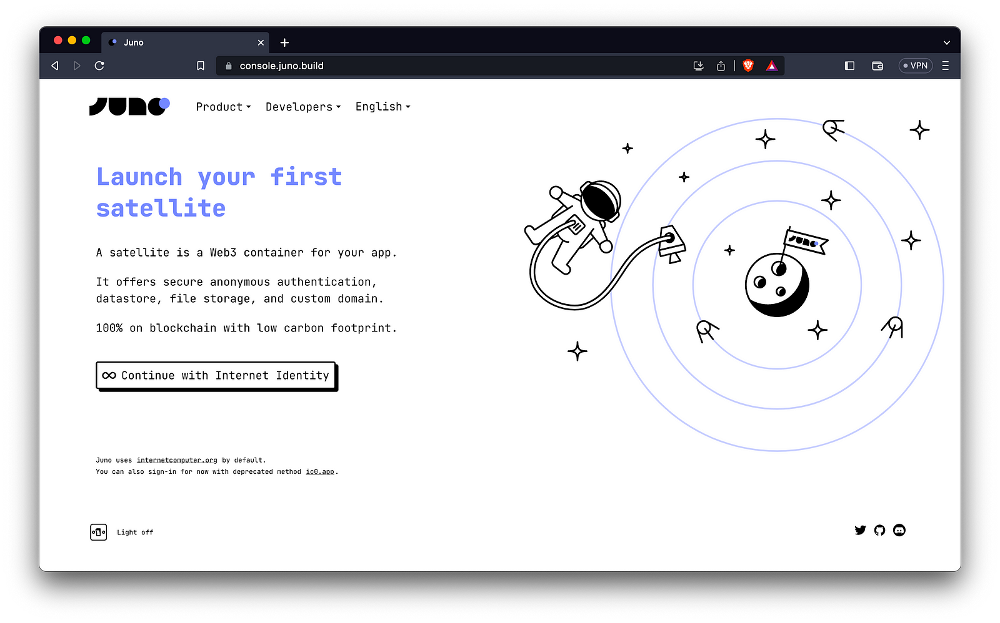
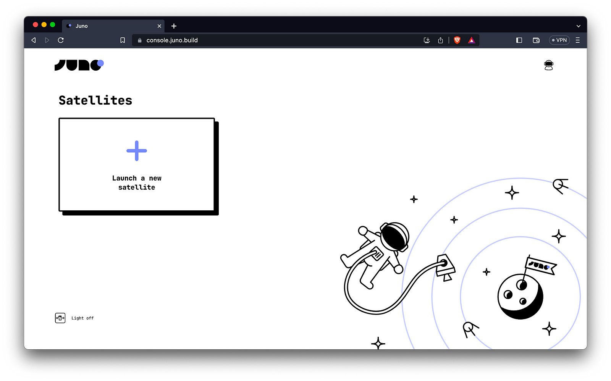
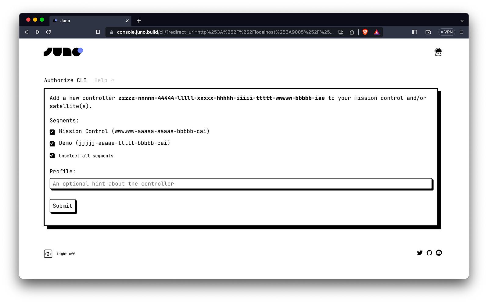
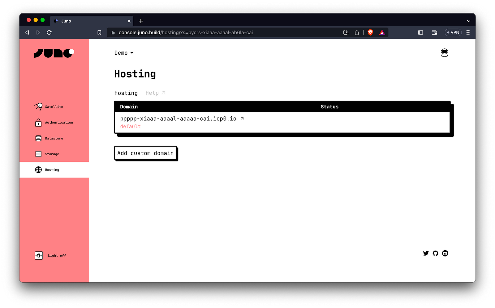
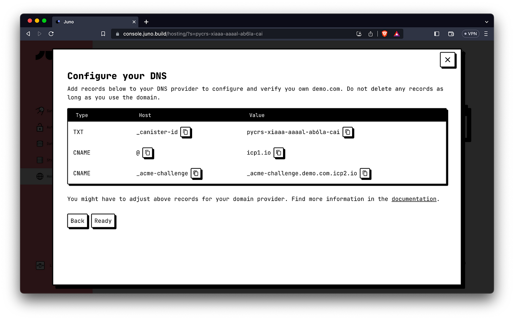

## Hosting Your Website on the Internet Computer with a Custom Domain

[cover]

Deploying a static site fully on Web3 is possible thanks to the [Internet Computer](https://internetcomputer.org/) and made effortless with the help of [Juno](https://juno.build/). It’s just as easy as it is on the good old Web 2.0, but without the limitations of trust-based or centralized approaches that may not be as beloved.

In this article, we will guide you through the step-by-step process of deploying your website on a canister smart contract, ensuring that you have complete ownership and control over it.

Furthermore, we will explore how to establish your domain name, guaranteeing the preservation of your brand identity that your clients and users hold dear. By following our instructions, you can ensure a seamless transition to the Internet Computer while maintaining your online presence and brand recognition.

---

## Table of contents

To host your website on-chain, this tutorial will guide you through the following three steps:

1. Creating the canister smart contract (no developer skills required)

2. Deploying your website

3. Setting up the custom domain

---

## Creating the canister smart contract

When deploying a smart contract using Juno, it automatically comes with a predefined set of features that are specifically designed to enhance your projects and streamline the development process. These features include commonly needed functionalities such as authentication, a simple database, file storage capabilities, and website hosting.

To begin, sign in to the [Juno console](https://console.juno.build/).



We affectionately refer to these feature-rich smart contracts as “Satellites.” To create your website project, simply click “Launch a new satellite” and follow the guided wizard to set it up.



That wraps up the setup phase. Your canister now lives on the Internet Computer, solely owned by you and and you alone.

---

## Deploying your website

While deploying your dapp in a continuous deployment environment like GitHub Actions is certainly possible, for the sake of simplicity, we will assume that you prefer to perform your initial website deployment from your computer.

To accomplish this, ensure that [Node.js is installed](https://nodejs.org/en/download) on your machine (if it isn’t already), and proceed to install the Juno [command line interface](https://juno.build/docs/miscellaneous/cli). You can do this by executing the following command in your terminal:

```bash
npm i -g @junobuild/cli
```

Once the installation is complete, you can log in to your satellite from the terminal.

```bash
juno login
```

Running this command will open Juno’s console in your browser. You will be prompted to grant access to your satellite(s) and mission control (which is your own canister holding references to your satellites) for your machine.



With the ability to interact with your smart contract on the Internet Computer, you can now deploy your website project to its dedicated satellite by running the following command from your project’s root folder:

```bash
juno deploy
```

During the initial deployment, you will be prompted to select the target satellite. The process should proceed smoothly, and upon completion, your website will be hosted on-chain 🎉.

To access your deployed website, you can find its URL in Juno’s console under the “Hosting” tab or simply run the command line juno open.

---

## Setting up the custom domain

As if serving your dapps directly from the blockchain to browsers wasn’t amazing enough, preserving your unique brand image is also fully supported.

To configure your domain name, navigate to the hosting tab of Juno’s console. From there, initiate the setup process by clicking on “Add custom domain” and follow the guided wizard.



Once you have entered your desired domain name, Juno will provide you with the necessary records that need to be added to your DNS provider. These will ensure proper mapping of your domain to your deployed website on the Internet Computer.



Once you have configured the DNS records for your domain, click on “Ready” to confirm. At this point, Juno will take over and handle the rest of the process for you.

After completing the configuration, you will eventually see the status displayed as “Available.” This signifies that your website is now being served on the web with its unique name, but with the added benefit of being served directly from the blockchain!

---

## Need Help or Have Questions?

Do you have any questions or have you encountered any issues while following this tutorial? Don’t worry! We’re here to help. If you need further clarification, assistance, or want to share your experience, feel free to reach out on [Twitter](https://twitter.com/junobuild) or our vibrant community on [Discord](https://discord.gg/wHZ57Z2RAG). You can also check out our [FAQ section](https://juno.build/docs/faq) on our website for additional information and answers to common queries.

---

👋

Thank you for reading! Stay connected with Juno by following us on [Twitter](https://twitter.com/junobuild) to keep up with our latest updates.

⭐️⭐️⭐️ are also much appreciated: visit the [GitHub repo](https://github.com/buildwithjuno/juno) and show your support!
