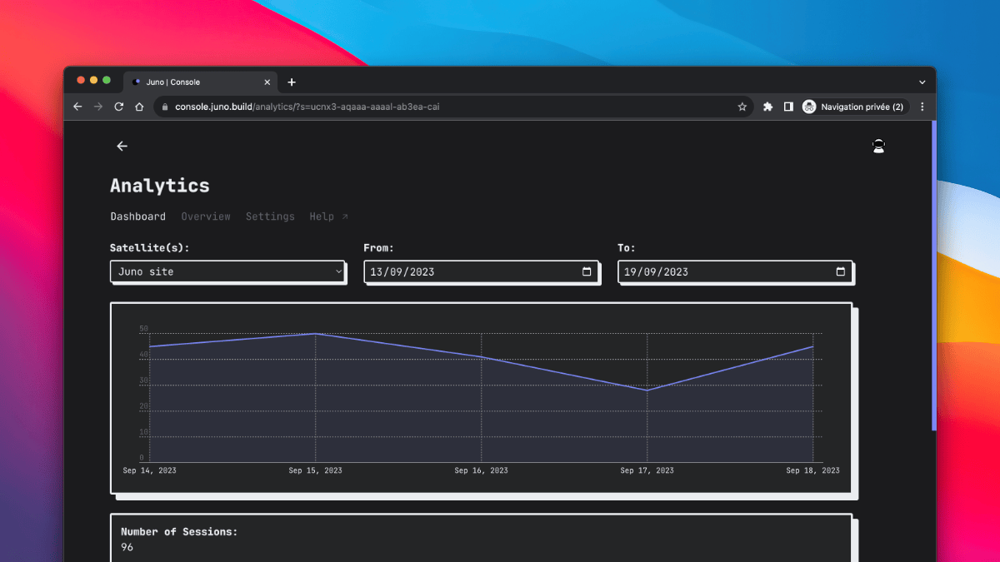

---

We're excited to introduce Juno Analytics, a simple, performant, and open-source web3 analytics solution designed with your privacy in mind.

In a digital age where data privacy is paramount, Juno Analytics empowers you to gather valuable insights about your users while ensuring anonymity and respecting their privacy.

Here's a closer look at this powerful new feature:

---

## Privacy-Friendly Analytics

Juno Analytics is part of our commitment to user privacy. It conducts measurements of your dapps and sites completely anonymously, without using cookies or collecting any personal data.

This means no more intrusive cookie banners, no persistent identifiers, no cross-site tracking, and no cross-device tracking.

Your analytics data remains solely focused on providing you valuable insights without any other ulterior motives.

---

## Performance-Optimized Script

Our JavaScript library for gathering analytics is designed for peak performance. It consists of a minimal main script that seamlessly integrates with your application's user interface and a dedicated worker responsible for handling logic and cryptography.

This thoughtful design ensures that adding analytics won't slow down your application, even during boot time, preserving your customer acquisition rate.

---

## Comprehensive Tracking

With Juno Analytics, you're not limited to just basic page views. You can gain deeper insights into your visitors by creating custom events to track conversions, attributions, and more. It's a powerful tool for optimizing your dapps and sites.

---

## Fully Open Source

Juno is fully committed to the principles of open-source development. Unlike proprietary tools like Google Analytics, Juno Analytics is built with a commitment to transparency and freedom.

---

## You Own Your Data

All data tracked by our analytics solution is securely stored on the blockchain. As with all our services, you have full control over your smart contracts, and your data remains exclusively yours.

---

## Getting Started

To begin using Juno Analytics, please refer to our detailed documentation for [step-by-step instructions](/docs/build/analytics#getting-started).

It will guide you through the process of setting up and integrating Analytics into your websites and dapps. 🚀

---

We hope you're as excited about Juno Analytics as we are! This feature marks a significant stride toward a more privacy-conscious analytics solution and provide Juno's developers an additional feature in the eco-system to build awesome decentralized applications.

👋

Stay connected with Juno by following us on [Twitter](https://twitter.com/junobuild).

⭐️⭐️⭐️ stars are also much appreciated: visit the [GitHub repo](https://github.com/buildwithjuno/juno) and show your support!
