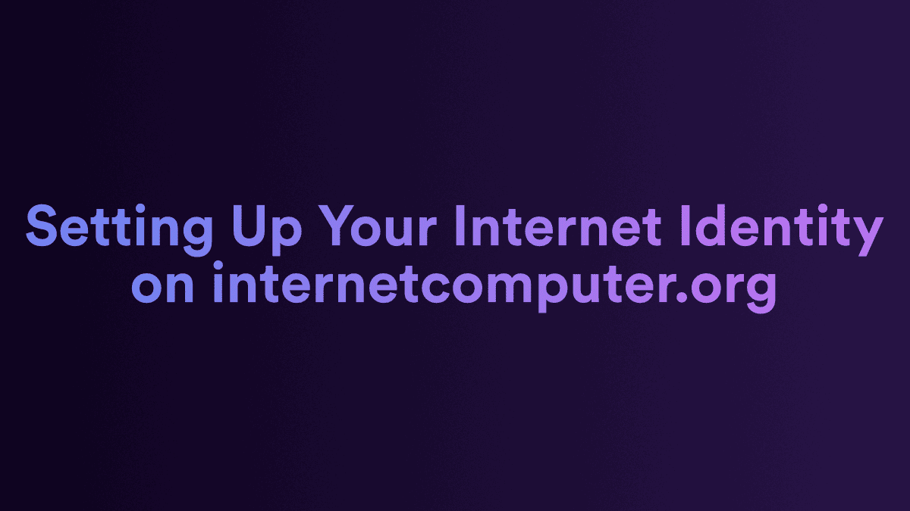
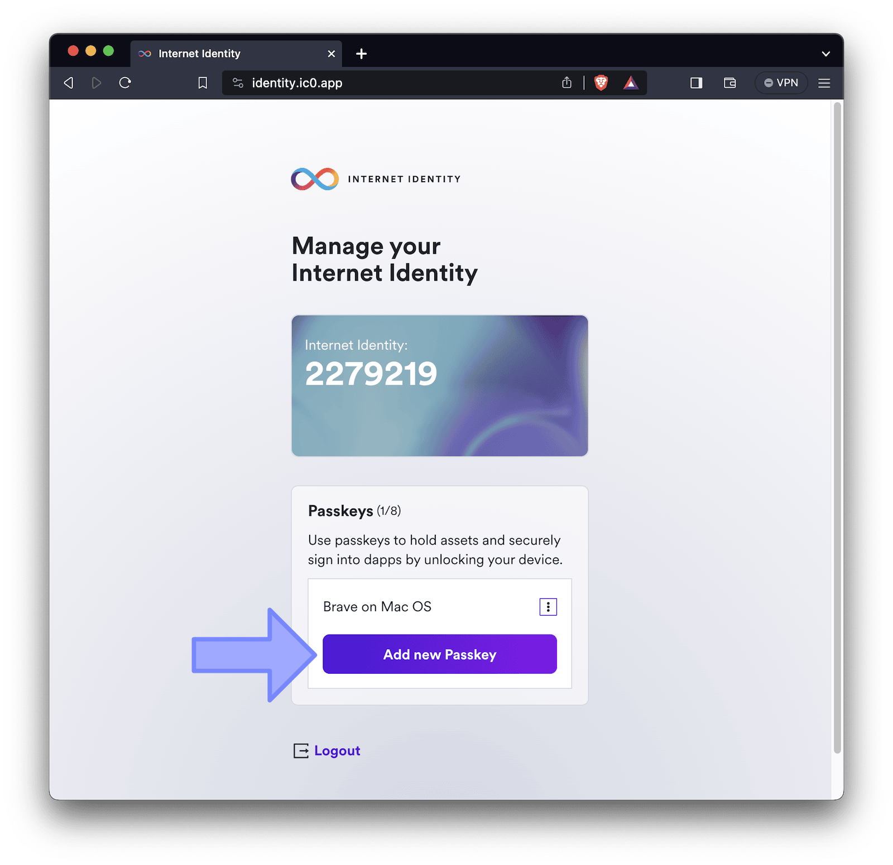
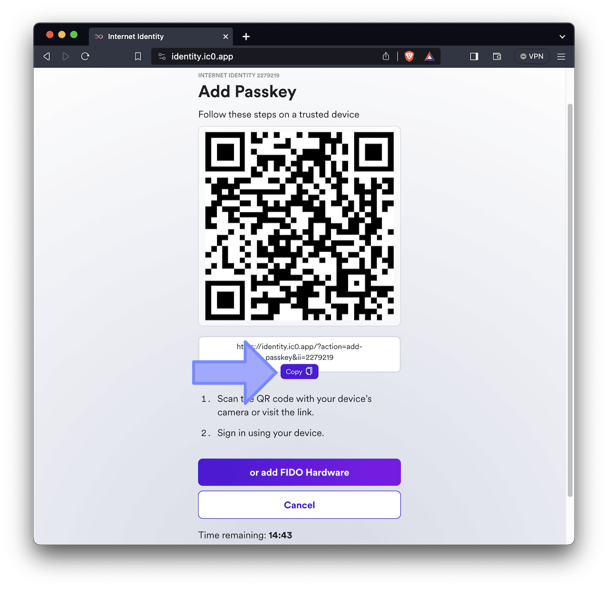
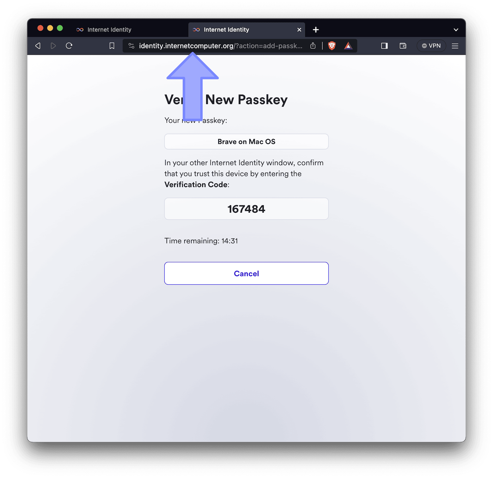
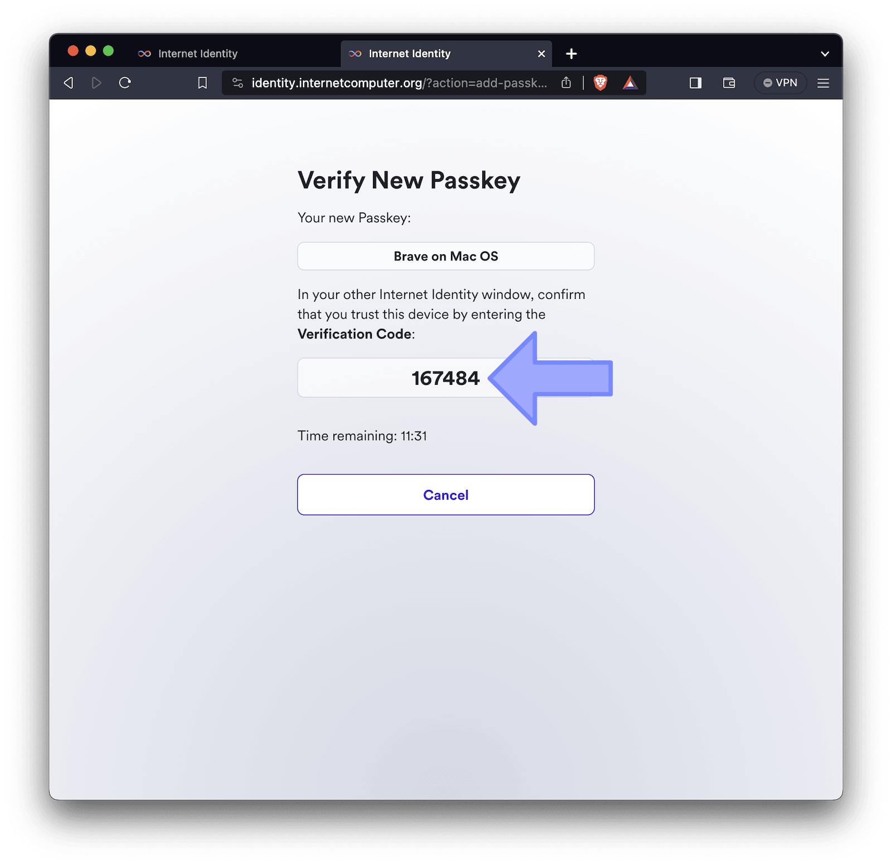
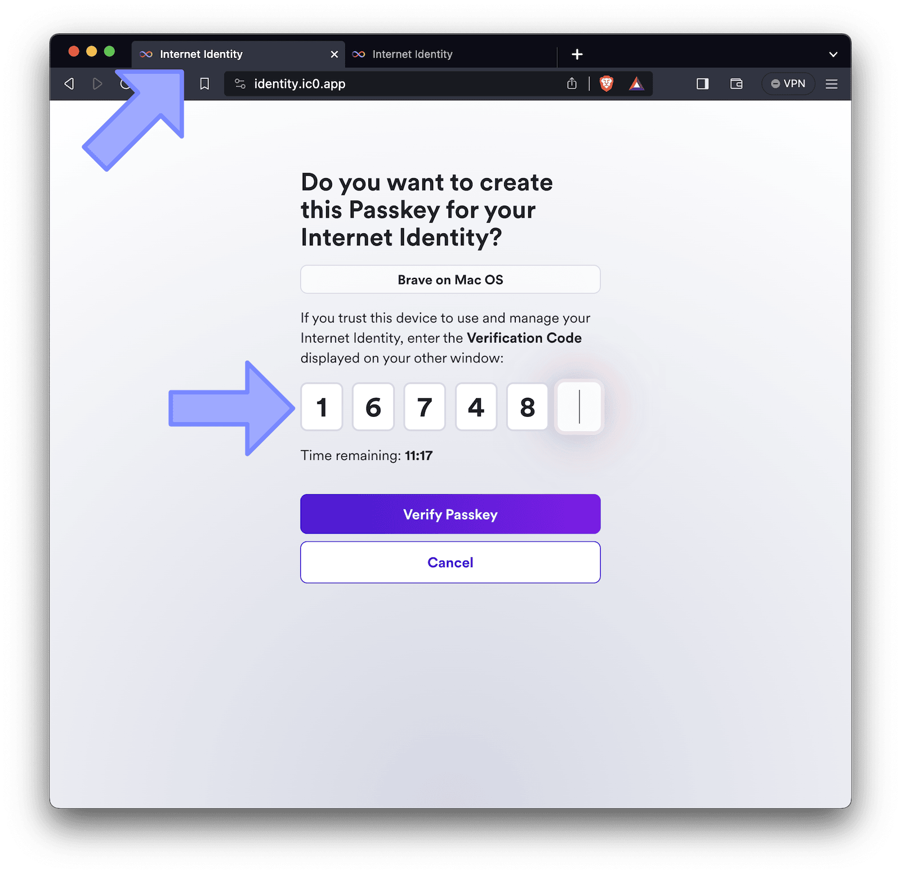
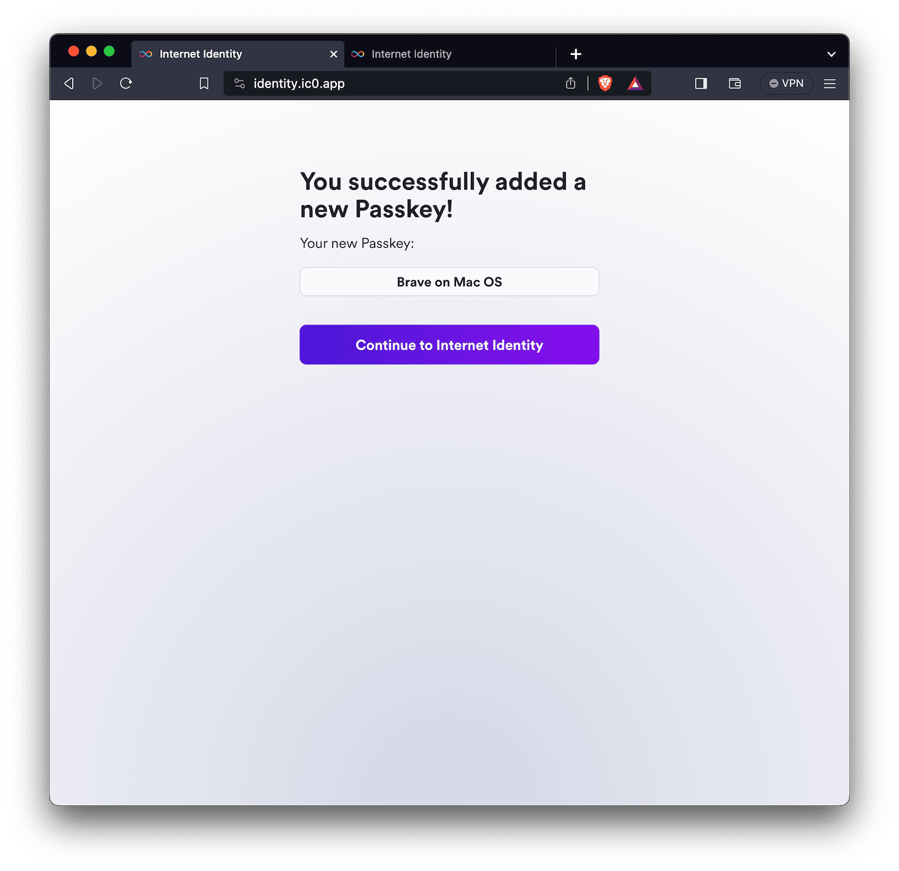
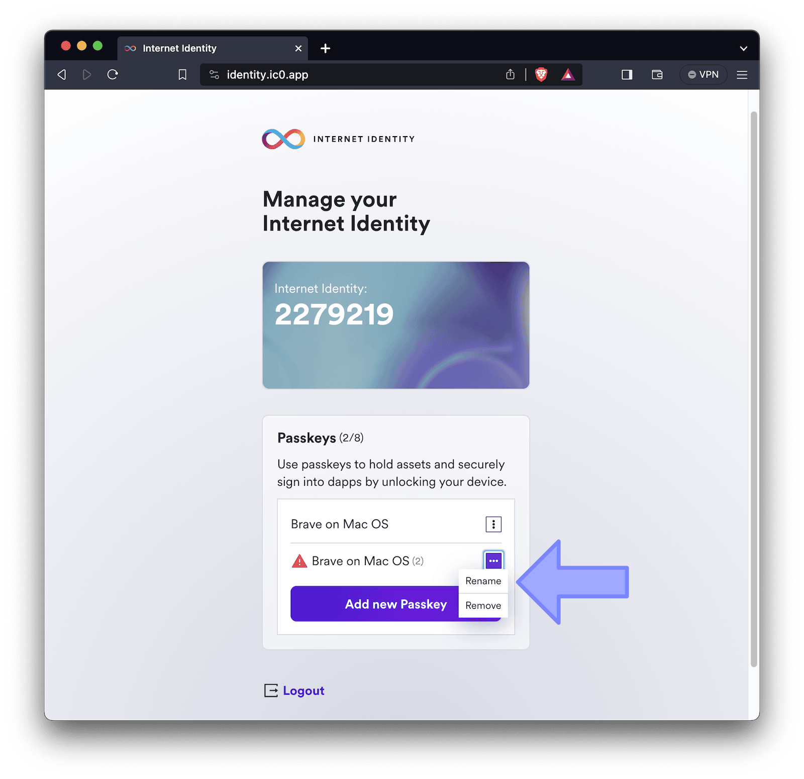

---

Web 2.0 uses usernames and passwords for logging into websites, which isn't very secure, can be a hassle, and doesn't always keep your information private.

Internet Identity (II), on the other hand, is a better way to log in online. Instead of just usernames and passwords, it uses new technology like fingerprints or Face ID on your phone or special hardware devices to make sure it's really you when you log in.

This authentication provider is used by Juno to secure access to its administration console for developers.

While most decentralized applications on the Internet Computer use the default domain `ic0.app` for the registration process using Internet Identity (referred to as the "old domain" in this article), Juno defaults to the more recognizable, aesthetically pleasing and easy to remember domain `internetcomputer.org`.

However, there is a caveat to this choice. When you register with Internet Identity, it's tied to a specific domain. This means that if you have previously created an identity to access other decentralized apps on the Internet Computer, you may not be able to sign in to Juno's console seamlessly using the main "call to action". You won't be blocked from logging in; the login screen also supports the old domain. However, the option to use it is not as prominent.

That's why in this article, we will guide you through the process of ensuring your identity works seamlessly on both domains. By adding a passkey for the other domain, you will ensure that your identity is available for sign-in, regardless of those two choices.

:::note

In the following instructions, we assume that your identity works on `identity.ic0.app`, and we are demonstrating how to add it for `identity.internetcomputer.org`. Of course, this tutorial also applies in reverse; you can simply switch the domain while following these steps.

:::

---

## Step-by-Step Guide

Here are the steps to follow:

### 1. Sign-in Internet Identity

As a first step, you need to login into Internet Identity. Go to [https://identity.ic0.app](https://identity.ic0.app).

### 2. Add passkey

As we are looking to register a passkey for the other domain on your device, initiate the process by clicking "Add passkey".

### 3. Copy the URL

Internet Identity will present you with various user-friendly options for registering a new passkey. While these options are handy if you plan to add an additional browser or device, for the purpose of this tutorial, our goals are different.

Therefore, please ignore the information on the screen and only copy the code that is presented to you.

### 4. Navigate to modified URL

We are assuming that you want to register the other domain for the same browser. In that case, open a new tab and paste the URL you just copied **but**, before pasting the link, modify the domain part to point to the other domain.

For example, change a copied link from https://identity.ic0.app/?action=add-passkey&ii=2279219 to https://identity.internetcomputer.org/?action=add-passkey&ii=2279219 by replacing ~~ic0.app~~ with **internetcomputer.org**.

Note that along the way, you will be prompted to authenticate yourself with your authentication method, such as fingerprint or Face ID. This ensures a secure sign-in on the other domain as well.

### 5. Enter verification code

To validate the new passkey, you will be prompted to verify a code in the original tab where you initiated the creation of the new passkey.

Simply select and copy the verification code displayed on the screen.

Return to the previous tab and enter the code. You can either manually type it or, once you've placed your cursor in the first digit field, paste the entire code (Ctrl|Cmd+V), which will be automatically filled.

### 6. Confirmation

Congratulations, the passkey on the device you just used for this tutorial is now ready for both the old and other domain.

### 7. Optionally, rename the new passkey

The new passkey will inherit a default name. Optionally, you can rename it to make it clear in the future which one is related to which domain. To do this, continue to Internet Identity, select "Rename", and follow the instructions provided.

---

## Conclusion

In this guide, we've walked you through the process of setting up your Internet Identity for another domain. We hope this has been helpful and will provide you with easy access to Juno's administration console and other dApps using multiple domains for sign-in with Internet Identity.

👋

Stay connected with Juno by following us on [X/Twitter](https://twitter.com/junobuild).

Reach out on [Discord](https://discord.gg/wHZ57Z2RAG) or [OpenChat](https://oc.app/community/vxgpi-nqaaa-aaaar-ar4lq-cai/?ref=xanzv-uaaaa-aaaaf-aneba-cai) for any questions.

⭐️⭐️⭐️ stars are also much appreciated: visit the [GitHub repo](https://github.com/buildwithjuno/juno) and show your support!
