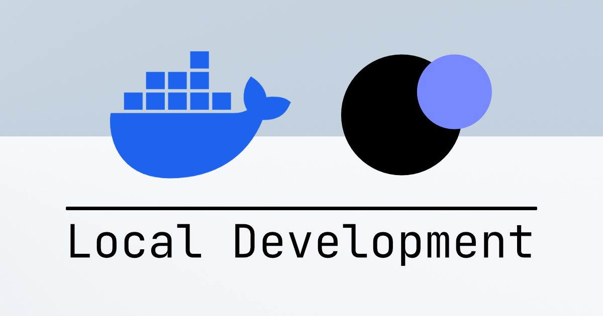
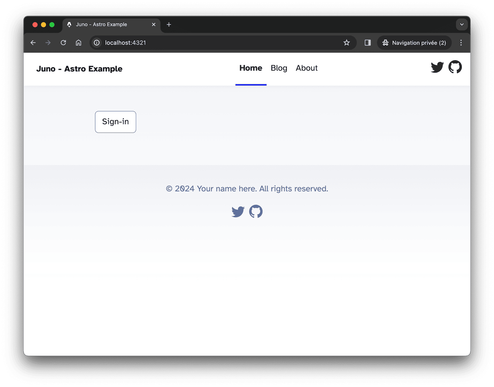
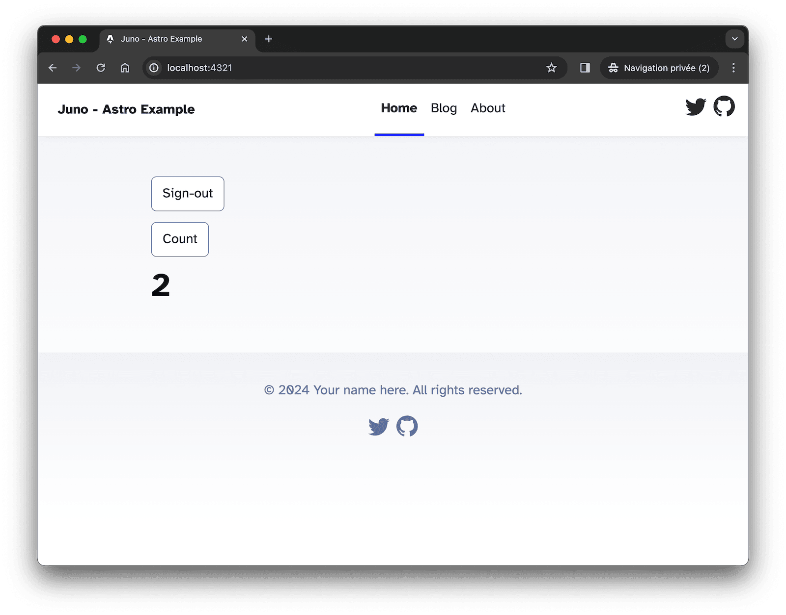

---

Hello 👋,

I'm excited to share that local dApp development and end-to-end testing are now available on Juno through our new Docker image.

This update serves as a key addition to our upcoming features for the year to come, offering developers a practical solution to build or test their projects in a sandbox environment.

The documentation for this new feature is available [here](/docs/guides/local-development). Moreover, the container's code is open source, and you can access it [here](https://github.com/junobuild/juno-docker) for more insights.

In this blog post, rather than reiterating the documentation, I'll provide an example to demonstrate how you can effectively utilize this feature in your development workflow.

---

## Before you begin

Make sure you have [Docker](https://www.docker.com/products/docker-desktop/) installed on your machine.

---

## Clone the example

I've prepared a sample project to demonstrate how a dApp can be run and persist data in a local environment. Open your terminal and clone the sample project developed with Astro:

```bash
git clone https://github.com/junobuild/examples/
cd examples/astro
npm ci
```

---

## Run the Docker Image

To start the container, head to the subfolder containing the configuration I prepared for you.

```bash
cd docker
```

In this folder, you will find two files. A `docker-compose.yml` file contains essential information for the image, such as the port and a volume. For more details, refer to the [documentation](/docs/guides/local-development).

```yml title="docker-compose.yml"
services:
  juno-satellite:
    image: junobuild/satellite:latest
    ports:
      - 5987:5987
    volumes:
      - astro_dapp:/juno/.juno
      - ./juno.dev.json:/juno/juno.dev.json

volumes:
  astro_dapp:
```

There's also a `juno.dev.json` file, which is designed to set up a collection once the Satellite is populated locally, similar to what you can do in Juno's administration console.

```json title="juno.dev.json"
{
  "satellite": {
    "collections": {
      "db": [
        {
          "collection": "counter",
          "read": "managed",
          "write": "managed",
          "memory": "stable"
        }
      ]
    }
  }
}
```

Given that everything is set for you, you can run the following command to start the container:

```bash
docker compose up
```

And that's it! The container is designed to manage serving a local [Internet Computer](https://internetcomputer.org/) replica. It also embeds a custom CLI which handles deploying and populating the [Internet Identity](https://identity.internetcomputer.org/) and a Satellite. With this setup, you have everything necessary for efficient local development.

---

## Run the dApp

To get the sample dApp up and running, open another terminal window. Navigate back to the root folder of the project and start the dApp using the following command:

```bash
npm run dev
```

This project leverages our Vite Plugin and libraries, streamlining the setup process with minimal configuration needed. I've already configured it for you, but typically, you would only need to set a `container` option for the plugin:

```javascript title="astro.config.js"
import { defineConfig } from "astro/config";
import juno from "@junobuild/vite-plugin";

export default defineConfig({
  vite: {
    plugins: [
      juno({
        container: true
      })
    ]
  }
});
```

And pass along the environment variable to the initialization:

```javascript
await initSatellite({
  satelliteId: import.meta.env.PUBLIC_SATELLITE_ID,
  container: import.meta.env.PUBLIC_CONTAINER
});
```

With the local dApp server active, you can now access it in your browser at [http://localhost:4321](http://localhost:4321).

Upon visiting the site, you'll find an option to sign in using Internet Identity. Since everything is deployed locally in a sandbox, your existing identity (anchor) won't be recognized, that's why you will have to create a new one.



Once signed in, you'll see a "count" action, a simple feature that increments a counter and saves a value associated with your identity.



This demonstrates the dApp's capability to interact with local data and user identities.

---

## Conclusion

In conclusion, the integration of local development capabilities with Juno, using Docker, marks a significant step forward in streamlining and simplifying the development process for dApps.

This setup not only facilitates a more efficient development cycle but also offers a practical environment for thorough testing. It's a straightforward, no-frills approach that underscores Juno's commitment to improving the developer experience without overcomplicating the process.

I am excited to see the innovative applications and solutions the developers of our community will create with these enhanced tools at their disposal.

👋

---

Stay connected with Juno by following us on [X/Twitter](https://twitter.com/junobuild).

Reach out on [Discord](https://discord.gg/wHZ57Z2RAG) or [OpenChat](https://oc.app/community/vxgpi-nqaaa-aaaar-ar4lq-cai/?ref=xanzv-uaaaa-aaaaf-aneba-cai) for any questions.

⭐️⭐️⭐️ stars are also much appreciated: visit the [GitHub repo](https://github.com/junobuild/juno) and show your support!
