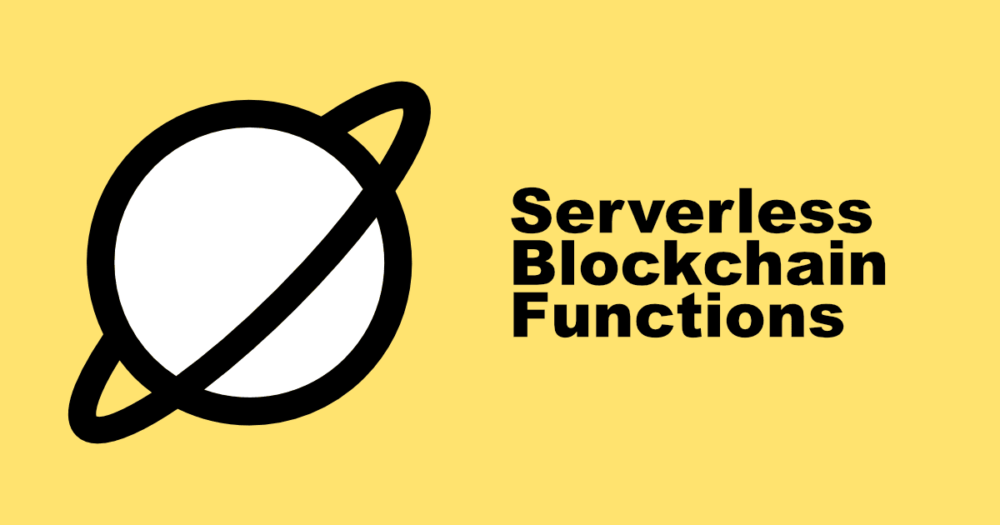

---

Hey there 👋,

Are you looking to extend Juno's features? Stop right there, because it is now possible!

I'm thrilled to unveil today's new addition to the set of features offered by Juno: the introduction of serverless [Functions](/docs/build/functions) enabling developers to extend the native capabilities of Satellites. This groundbreaking update opens a plethora of opportunities for developers to innovate and customize their applications like never before.

---

## What Are Serverless Blockchain Functions?

In the realm of cloud computing, serverless architecture allows developers to build and run applications and services without the burden of managing infrastructure. This model enables the execution of server-side code based on user demand, allowing for direct interactions with APIs, databases, and other resources as part of your project's deployment. It's a paradigm that significantly reduces overhead and increases the agility of software development processes.

The introduction of serverless blockchain functions by Juno innovatively takes this concept a step further by integrating blockchain technology into this flexible and efficient framework. This groundbreaking development opens the door for extending the native capabilities of Satellites smart contracts, pushing the boundaries of what's possible within the blockchain space.

This means you can now enhance the functionality of Satellites smart contracts and extend those capabilities with anything that can be achieved on the [Internet Computer](https://internetcomputer.org) blockchain.

---

## How Does It Work?

At the core of Juno's serverless blockchain functions are hooks, which are essentially the backbone of how these functions operate within the ecosystem. These hooks are defined to automatically respond to event triggers related within your Satellite, including operations such as creating, updating, and deleting to documents and assets.

An essential feature of these optional hooks is their ability to spawn asynchronously, a design choice that significantly enhances the efficiency and responsiveness of applications built on Juno. This asynchronous spawning means that the hooks do not block or delay the execution of calls and responses between your client-side decentralized application (dApp) and the smart contract.

A picture is worth a thousand words, so here is a simplified schematic representation of a hook that is triggered when a document is set:


---

## Getting Started

In addition to unveiling this new feature, we're also excited to introduce a brand-new developer experience we hope you're going to enjoy. This is built on the [local development environment](../2024-01-04-local-development/index.md) we released earlier this year, designed to make your work with Juno smoother and more intuitive.

:::note

Make sure you have Juno's [CLI](/docs/reference/cli#installing-the-juno-cli) tool installed on your machine.

:::

Start by ejecting the Satellite within your project. This step prepares your project for local development. Open your terminal and run:

```bash
juno dev eject
```

In a new terminal window, kick off the local development environment that leverages Docker:

```bash
juno dev start
```

Now, your local development environment is up and running, ready for you to start coding.

Once you're ready to see your changes in action, compile your code:

```bash
juno dev build
```

One of the key benefits of Juno's local development environment is its support for hot reloading. This feature automatically detects changes to your code and deploys them in the local environment. It means you can immediately test your custom code locally, ensuring a fast and efficient development cycle.

---

## Demonstrating Hooks and Data Operations

This sample application illustrates the use of Juno's serverless functions to perform asynchronous data operations with a small frontend client and backend hook setup.

The frontend client is designed to save a document in the Datastore, while the backend hook modifies this document upon being triggered. This process exemplifies the asynchronous capability of functions to read from and write to the Datastore.

### Getting the Sample

To begin exploring this functionality, clone the example repository and prepare the environment with the following commands:

```bash
git clone https://github.com/junobuild/examples
cd rust/hooks
npm ci
```

After setting up the project, to start and debug the sample in your local environment, please follow the steps as outlined in the previous chapter [Getting Started](#getting-started).

### Hook Implementation Details

The core of this sample is the hook code, which is triggered upon the document set operation in a specific collection. Here’s the hook's logic:

```rust
#[on_set_doc(collections = ["demo"])]
async fn on_set_doc(context: OnSetDocContext) -> Result<(), String> {
    // Decode the new data saved in the Datastore
    let mut data: Person = decode_doc_data(&context.data.data.after.data)?;

    // Modify the document's data
    data.hello = format!("{} checked", data.hello);
    data.yolo = false;

    // Encode the data back into a blob
    let encode_data = encode_doc_data(&data)?;

    // Prepare parameters to save the updated document
    let doc: SetDoc = SetDoc {
        data: encode_data,
        description: context.data.data.after.description,
        updated_at: Some(context.data.data.after.updated_at),
    };

    // Save the updated document
    set_doc_store(
        context.caller,
        context.data.collection,
        context.data.key,
        doc,
    )?;

    Ok(())
}
```

This hook demonstrates asynchronous processing by reading the initial data saved from the frontend, modifying it, and then saving the updated version back to the Datastore. It's triggered specifically for documents within the "demo" collection and showcases how to handle data blobs, execute modifications, and interact with the Datastore programmatically.

---

## Unlocking Anything on the Internet Computer

As mentioned in the introduction, the serverless functions extend Juno's capabilities to anything that can be achieved on the Internet Computer. With this in mind, let's explore implementing [HTTPS outcalls](https://internetcomputer.org/https-outcalls) to a Web2 API in another sample.

### Getting the Sample

To explore this advanced functionality, follow the steps below to clone the repository and set up the project:

```bash
git clone https://github.com/junobuild/examples
cd rust/https-outcalls
npm ci
```

After cloning and navigating to the correct directory, proceed with starting and debugging the sample in your local environment, as outlined in the [Getting Started](#getting-started) chapter.

### Hook Implementation Details

The hook implemented in this sample interacts with the [Dog CEO API](https://dog.ceo/dog-api/) to fetch random dog images and update documents within the dogs collection in the Datastore. Here's how it works:

```rust

// The data of the document we are looking to update in the Satellite's Datastore.
#[derive(Serialize, Deserialize)]
struct DogData {
    src: Option<String>,
}

// We are using the Dog CEO API in this example.
// https://dog.ceo/dog-api/
//
// Its endpoint "random" returns such JSON data:
// {
//     "message": "https://images.dog.ceo/breeds/mountain-swiss/n02107574_1118.jpg",
//     "status": "success"
// }
//
// That's why we declare a struct that matches the structure of the answer.
#[derive(Serialize, Deserialize)]
struct DogApiResponse {
    message: String,
    status: String,
}

#[on_set_doc(collections = ["dogs"])]
async fn on_set_doc(context: OnSetDocContext) -> Result<(), String> {
    // 1. Prepare the HTTP GET request
    let url = "https://dog.ceo/api/breeds/image/random".to_string();

    let request_headers = vec![];

    let request = CanisterHttpRequestArgument {
        url,
        method: HttpMethod::GET,
        body: None,
        max_response_bytes: None,
        // In this simple example we skip sanitizing the response with a custom function for simplicity reason.
        transform: None,
        // We do not require any particular HTTP headers in this example.
        headers: request_headers,
    };

    // 2. Execute the HTTP request. A request consumes Cycles(!). In this example we provide 2_000_000_000 Cycles (= 0.002 TCycles).
    // To estimate the costs see documentation:
    // - https://internetcomputer.org/docs/current/developer-docs/gas-cost#special-features
    // - https://internetcomputer.org/docs/current/developer-docs/integrations/https-outcalls/https-outcalls-how-it-works#pricing
    // Total amount of cycles depends on the subnet size. Therefore, on mainnet it might cost ~13x more than what's required when developing locally. Source: https://forum.dfinity.org/t/http-outcalls-cycles/27439/4
    // Note: In the future we will have a UI logging panel in console.juno.build to help debug on production. Follow PR https://github.com/junobuild/juno/issues/415.
    //
    // We rename ic_cdk::api::management_canister::http_request::http_request to http_request_outcall because the Satellite already includes such a function's name.
    match http_request_outcall(request, 2_000_000_000).await {
        Ok((response,)) => {
            // 3. Use serde_json to transform the response to a structured object.
            let str_body = String::from_utf8(response.body)
                .expect("Transformed response is not UTF-8 encoded.");

            let dog_response: DogApiResponse =
                serde_json::from_str(&str_body).map_err(|e| e.to_string())?;

            // 4. Our goal is to update the document in the Datastore with an update that contains the link to the image fetched from the API we just called.
            let dog: DogData = DogData {
                src: Some(dog_response.message),
            };

            // 5. We encode those data back to blob because the Datastore holds data as blob.
            let encode_data = encode_doc_data(&dog)?;

            // 6. Then we construct the parameters required to call the function that save the data in the Datastore.
            let doc: SetDoc = SetDoc {
                data: encode_data,
                description: context.data.data.after.description,
                updated_at: Some(context.data.data.after.updated_at),
            };

            // 7. We store the data in the Datastore for the same caller as the one who triggered the original on_set_doc, in the same collection with the same key as well.
            set_doc_store(
                context.caller,
                context.data.collection,
                context.data.key,
                doc,
            )?;

            Ok(())
        }
        Err((r, m)) => {
            let message =
                format!("The http_request resulted into error. RejectionCode: {r:?}, Error: {m}");

            Err(message)
        }
    }
}
```

This sample not only provides a practical demonstration of making HTTP outcalls but also illustrates the enhanced capabilities that serverless functions offer to developers using Juno.

---

## Conclusion

In conclusion, Juno's serverless functions mark a significant advancement in blockchain development, offering developers the tools to create more sophisticated and dynamic applications. This feature set not only broadens the scope of what can be achieved within Juno's ecosystem but also underscores the platform's commitment to innovation and developer empowerment. As we move forward, the potential for serverless technology in blockchain applications is boundless, promising exciting new possibilities for the future.

👋

---

Stay connected with Juno by following us on [X/Twitter](https://twitter.com/junobuild).

Reach out on [Discord](https://discord.gg/wHZ57Z2RAG) or [OpenChat](https://oc.app/community/vxgpi-nqaaa-aaaar-ar4lq-cai/?ref=xanzv-uaaaa-aaaaf-aneba-cai) for any questions.

⭐️⭐️⭐️ stars are also much appreciated: visit the [GitHub repo](https://github.com/junobuild/juno) and show your support!
