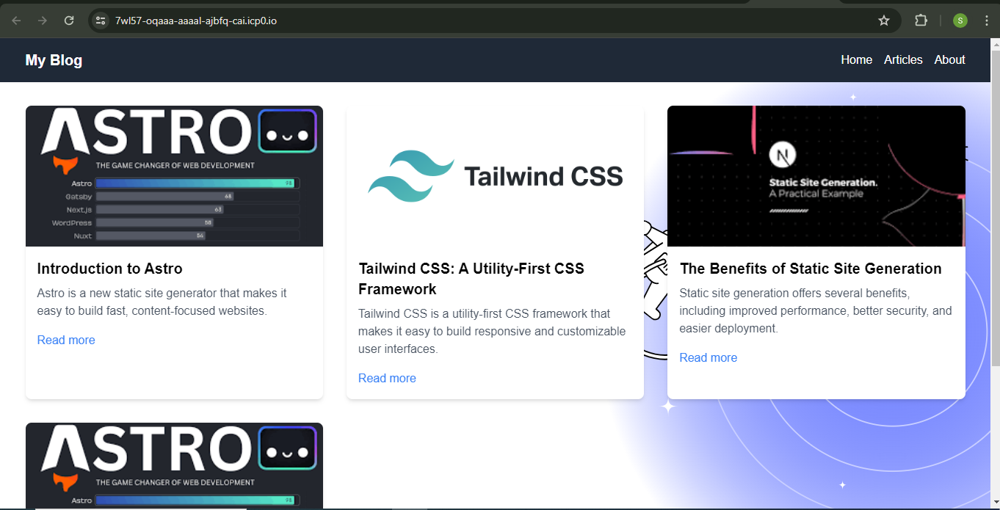
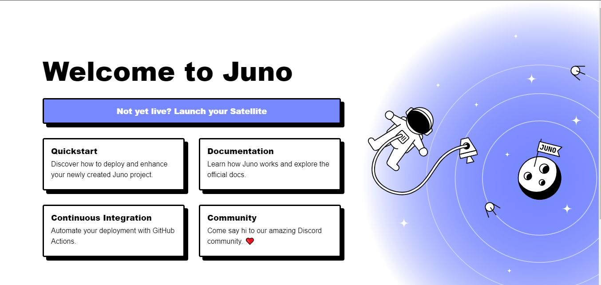
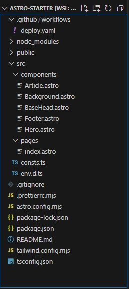
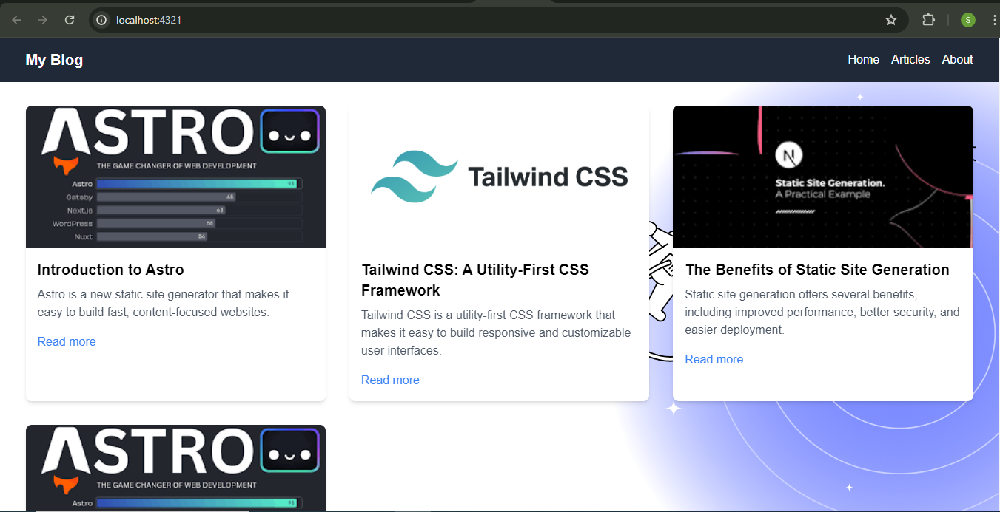
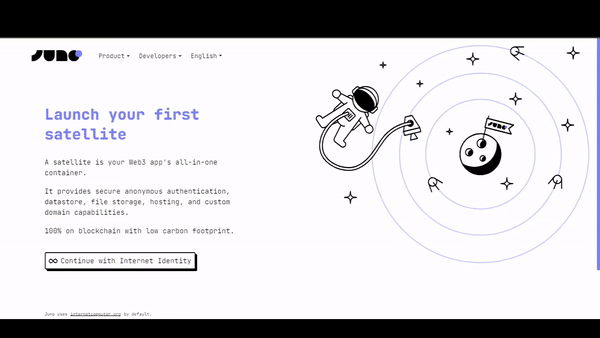
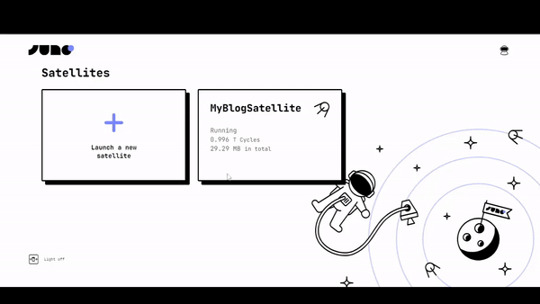
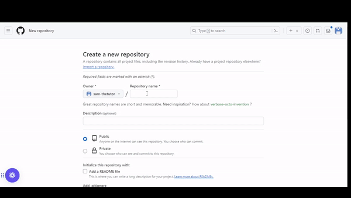

---

## Introduction

Beyond cryptocurrencies, Blockchain technology offers tools to build secure, transparent applications fully controlled by the user. Building a blog website on the blockchain allows the user to establish a censorship resistant space where they retain full ownership of their content and data.

In this article, we will look at how to create and host your blog website on the blockchain using Juno. Juno is an open-source Blockchain-as-a-service platform that offers a fully decentralized and secure infrastructure for your applications. This article will cover setting up a boilerplate project, configuring the hosting, developing the code for your blog and deploying the project on the blockchain using some of Juno's super powers.

By the end of this article, you will have an understanding of how Juno works, how to host your websites on the blockchain and how to automate the different tasks using Github Actions.

---

## Prerequisites

- Prior knowledge of working with HTML, CSS and JavaScript
- Prior knowledge of working with terminal or command line
- Prior knowledge of Github

To follow along this article, you dont need any knowledge about crypto and blockchain

---

## What is Juno?

Juno works just like traditional serverless platforms such as Google Firebase or AWS Amplify, but with one key difference: everything on Juno runs on the blockchain. This means that you get a fully decentralized and secure infrastructure for your applications, which is pretty cool if you ask me.

Behind the scenes, Juno uses the Internet Computer blockchain network and infrastructure to launch what we call a “Satellite” for each project you build. A Satellite is essentially a smart contract on steroids that contains your entire app. From its assets provided on the web (such as JavaScript, HTML, and image files) to its state saved in a super simple database, file storage, and authentication, each Satellite controlled solely by you contains everything it needs to run smoothly.

---

## What is ICP?

The Internet Computer (ICP) is a blockchain-based platform that aims to create a new type of internet, one that is decentralized, secure, and scalable. Developed, among others, by the DFINITY Foundation, the Internet Computer is designed to serve as a global public compute infrastructure, allowing developers to build and deploy decentralized applications (dApps) and services directly on the blockchain.

Unlike traditional blockchains, the Internet Computer uses a unique consensus mechanism called Threshold Relay, which allows it to achieve high transaction throughput and low latency. The platform is also designed to be highly scalable, with the ability to add more nodes and increase its computing power as demand grows. This makes the Internet Computer a promising platform for building a wide range of decentralized applications, from social media and e-commerce to finance and cloud computing. [Learn more about ICP](https://internetcomputer.org/)

---

## About the Project

This is a secure and decentralized blog website. The frontend is build with Astro, which is a modern, flexible web framework focused on building fast, content-rich websites with minimal JavaScript. Here is what you will build by the end of thi article:


---

## Setting up the project

In this section, we will look at how to create a boilerplate template for our project.

In your terminal, run the command below

```bash
npm create juno@latest -- --template astro-starter
```

In the prompts;

- Provide the name of the project folder `myBlog`
- Select `yes` to configure Github Actions
- Select `no` to configure the local development emurator
- Select `yes` to install the dependencies
- Select `yes` to install juno's CLI tool. Juno CLI will help us to deploy our project in the satellite.

Navigate to the project folder `myBlog` and open it in your favorite code editor.
If every previous step is successfull, running `npm run dev` will open the project in your browser and you should have something similar to this.



---

### File Structure

Having followed the above steps, and opening the project in a code editor, your project should have a file structure similar to the one below.



---

## Blog code

In this section,we will adapt the boilerplate code to transform your project into a blogging website.

### `index.astro`

Replace all the code in the in the `index.astro` file with the code below

```js
---
// Import necessary components and data
import blogPosts from '../components/blogPosts.json';
import Article from '../components/Article.astro';
import Background from "../components/Background.astro";
import BaseHead from "../components/BaseHead.astro";
import { SITE_TITLE, SITE_DESCRIPTION, SITE_SOCIAL_IMAGE } from "../consts";

---

<!doctype html>
<html lang="en">
  <head>
    <BaseHead
      title={SITE_TITLE}
      description={SITE_DESCRIPTION}
      image={SITE_SOCIAL_IMAGE}
    />
            <link rel="stylesheet" href="https://cdn.jsdelivr.net/npm/tailwindcss@2.2.16/dist/tailwind.min.css" />

  </head>

  <body>
    <header class="bg-gray-800 text-white py-4">
      <nav class="container mx-auto flex justify-between items-center">
        <a href="/" class="text-xl font-bold">My Blog</a>
        <ul class="flex space-x-4">
          <li><a href="/" class="hover:text-gray-300">Home</a></li>
            <li><a href="*" class="hover:text-gray-300">Articles</a></li>
          <li><a href="*" class="hover:text-gray-300">About</a></li>
        </ul>
      </nav>
    </header>

    <main>
      <div class="container mx-auto my-8">
        <div class="grid grid-cols-1 md:grid-cols-2 lg:grid-cols-3 gap-8">
          {blogPosts.map((post) => (
            <Article
              title={post.title}
              image={post.image}
              description={post.description}
              url={post.url}
            />
          ))}
        </div>
      </div>
    </main>
    <Background/>
  </body>
</html>
```

The above code displays a navbar that has three tabs `Home`,`Articles`, and `About`. It also displays information about the different articles from our sample article data.

### `Article.astro`

Replace the code in the `Article.astro` file with the code below

```js
---
interface Props {
  title: string;
  image: string;
  description: string;
  url: string;
}

const { title, image, description, url } = Astro.props;
---

<div class="bg-white shadow-md rounded-lg overflow-hidden">
  <a href={url} target="_blank">
    
  </a>
  <div class="p-4">
    <h3 class="text-xl font-bold mb-2">{title}</h3>
    <p class="text-gray-600 mb-4">{description}</p>
    <a href={url} target="_blank" class="text-blue-500 hover:text-blue-700">Read more</a>
  </div>
</div>
```

We will diplsay the title, image, desciption of every article from our sample data, as well as a link to the full article.

### `blogPosts.json`

In the components folder, create a new file and name it `blogPosts.json`. Paste the code below

```json
[
  {
    "title": "Introduction to Astro",
    "image": "https://a2ede-rqaaa-aaaal-ai6sq-cai.raw.icp0.io/uploads/download.300.168.png",
    "description": "Astro is a new static site generator that makes it easy to build fast, content-focused websites.",
    "url": "https://docs.astro.build/en/getting-started/"
  },
  {
    "title": "Tailwind CSS: A Utility-First CSS Framework",
    "image": "https://a2ede-rqaaa-aaaal-ai6sq-cai.raw.icp0.io/uploads/tttttt.512.256.png",
    "description": "Tailwind CSS is a utility-first CSS framework that makes it easy to build responsive and customizable user interfaces.",
    "url": "https://tailwindcss.com/docs/installation"
  },
  {
    "title": "The Benefits of Static Site Generation",
    "image": "https://a2ede-rqaaa-aaaal-ai6sq-cai.raw.icp0.io/uploads/staticsite.270.148.png",
    "description": "Static site generation offers several benefits, including improved performance, better security, and easier deployment.",
    "url": "https://www.netlify.com/blog/2016/05/02/top-ten-reasons-the-static-website-is-back/"
  },
  {
    "title": "Introduction to Astro",
    "image": "https://a2ede-rqaaa-aaaal-ai6sq-cai.raw.icp0.io/uploads/download.300.168.png",
    "description": "Astro is a new static site generator that makes it easy to build fast, content-focused websites.",
    "url": "https://docs.astro.build/en/getting-started/"
  }
]
```

This file holds our sample article data that we are using for this project.

If all the above steps are successfull, your project should look like this in the browser



---

## Deployment

In this section, we will look at how to deploy our project live.

### Creating a satellite

We need to create a satellite that will host our project. Follow the steps below to create your own satellite.



- Navigate to the administration [console](https://console.juno.build/) website
- Login with your [internet Identity](https://internetcomputer.org/internet-identity)
- On the dashboard, select Launch new satellite
- Provide name `myBlogSatellite` for the satellite.
- Click `Create Satellite`

:::tip

To keep the satellite operational, the developer pays a small fee that is used to purchase the necessary cycles for the satellite's storage and computation requirements. [Learn more about pricing](https://juno.build/docs/pricing)

:::

---

## Connect Project to the Satellite

We need to link our project to the satellite. follow the steps below

In the project terminal, run the command `juno init` and follow the prompts

- Select `yes` to login and authorize the terminal to access your satellite in your browser

- Select `myBlogSatellite` as the satellite to connect the project to

- Select `dist` as the location of the compiled app files

- Select `TypeScript` as the configuration file format.

If the above step is successful, a new file `juno.config.ts`
will be added at the root of our project folder. It contains the configuration necessary for our poject to connect to the satellite. You need this file if your project is to be deployed successfully to the satellite. Learn more about this [configuration](https://juno.build/docs/miscellaneous/configuration)

### Compiling and deploying the Project

Now that we connected our project to the satellite, we have to compile and deploy project to the satellite

```bash
npm run build
```

The above command compiles our project and outputs the compiled files in the `dist` folder

```bash
juno deploy
```

This will deploy our compiled files to the satellite that we connected linked our project to.

At this stage, if all the previous steps are successful, `juno deploy` command will output a link whixh is in this format `https://<SATELLITE_ID>.icp0.io` where `SATELLITE_ID` is the id of the satellite that we connected our project to.

:::tip

Running `juno open` in your terminal opens your project in your favorite browser.

:::

Opening the link in the browser, you should have something like this below


If you have reached this step, well done, you have successfully deployed your first blog website on the blockchain using Juno.

---

## Setting up Github Actions

If you noticed in the previous steps, every time we make changes to our project, we have to manually run the commands that compile and deploy our code to the satellite. But in this section, we will learn how to automate these tasks using [Gihtub Actions](https://docs.github.com/en/actions) so that whenever we make changes to our project, these changes are automatically deployed to oour satellite

In our project, we have a folder `.github` which contains the file `deploy.yaml`. This file has all the configurations required to setup Github Actions in our project. This folder must be present in your poject to successfully setup Github Actions. You can add it manually if you dont have it in your project. Below are the contents of the `deploy.yaml` file

```yaml
name: Deploy to Juno

on:
  push:
    branches: [main]

jobs:
  build:
    runs-on: ubuntu-latest
    steps:
      - name: Check out the repo
        uses: actions/checkout@v3

      - uses: actions/setup-node@v3
        with:
          node-version: "20.x"
          registry-url: "https://registry.npmjs.org"

      - name: Install Dependencies
        run: npm ci

      - name: Build
        run: npm run build

      - name: Deploy to Juno
        uses: junobuild/juno-action@main
        with:
          args: deploy
        env:
          JUNO_TOKEN: ${{ secrets.JUNO_TOKEN }}
```

### Generating a secret token from the juno console

To set up Github Actions, we need a secret token that uniquely identifies our satellite. Github needs this secret token to associate our repo to the satellite.

- Visit [juno console](https://console.juno.build/), and select `myBlogSatellite` satellite.
- Under the controllers tab, click add controller
- Select 'Genetate new controller' and select 'Read-write' as the scope.
- Click submit.
  Once the new controller is generated, it will provide a secret token, copy and store the secret token.
  

### Setting up Github Repo

On your Github account, create a new repo and name it `myfirstBlog`.

- On the settings tab, navigate to `Secrets and variables` and click `Actions`.
- Click on the `new repository secret`, add `JUNO_TOKEN` as the name, paste the secret token you copied from the juno console in the `Secret` section.
- Click `Add secret`.



### Pushing Code to Github

To upload our code to our remote GitHub repository, we must establish a connection between our local project and the repository

Run the command below in your project terminal

```bash
git init
git remote add origin https://github.com/sam-thetutor/myfirstBlog.git
git add .
git commit -m "my first commit"
git push -u origin main
```

The above code established the required connection to our remote Github repo, and pushes all our project code to that repo.Now every time we make changes to our project, all we have to do is push these changes to our github repo and they will be deployed to our satellite automatically. [Learn more about setting up Github Actions with Juno](https://juno.build/docs/guides/github-actions)

---

## Next Steps

Now that we have successfully hosted our blog website on the blockchain, you can go ahead and add more articles to the blog to showcase your skills. You can also add more features on the website to make it more robust.

---

## Conclusion

In this article, we have looked at how to create a boilerplate template project using juno, how to create a satellite from the juno console, writing code for our project, how to connect the satellite to the our local project, deploying our project to the satellite and configuring Github Actions to automate compiling and deployment tasks for our project

---

👋

Stay connected with Juno by following us on [Twitter](https://twitter.com/junobuild) to keep up with our latest updates.

And if you made it this far, we’d love to have you join the Juno community on [Discord](https://discord.gg/wHZ57Z2RAG). 😉
