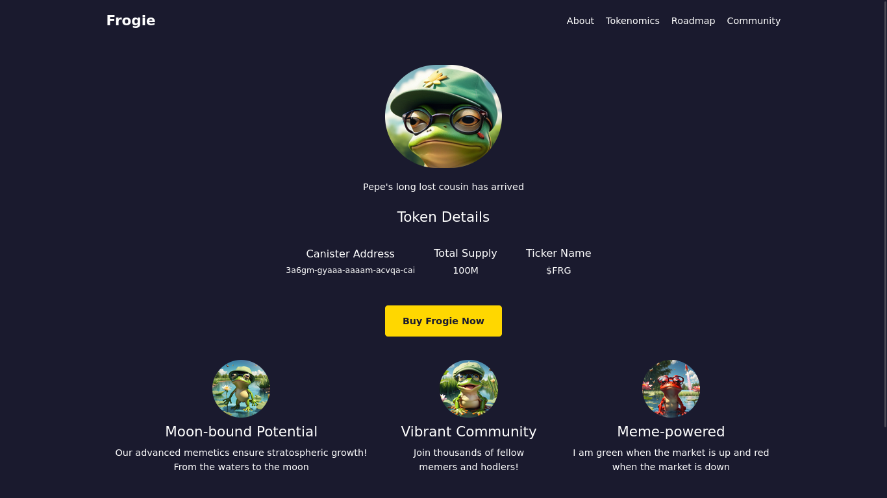
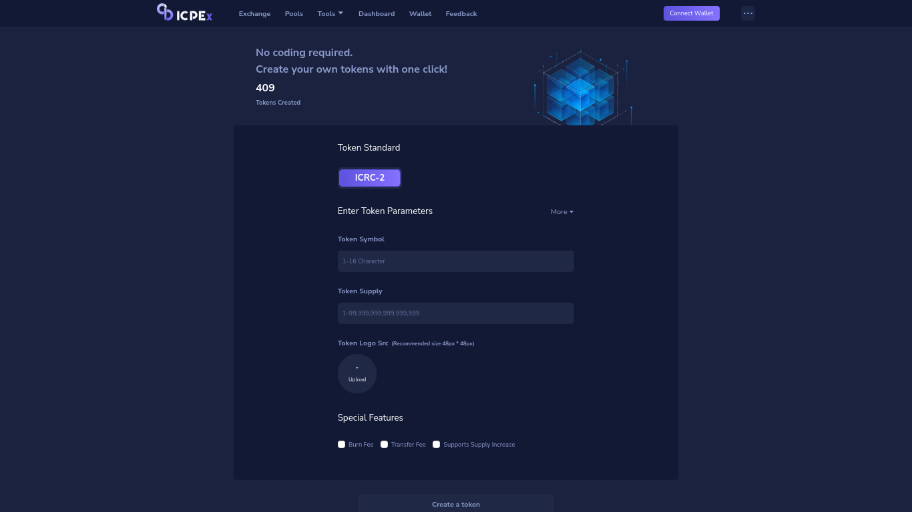
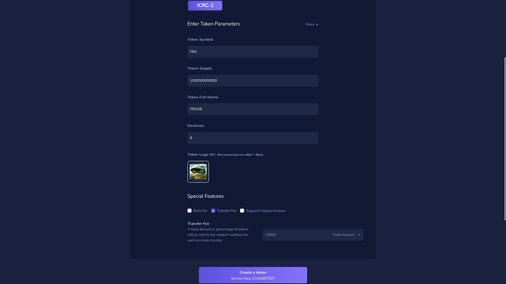
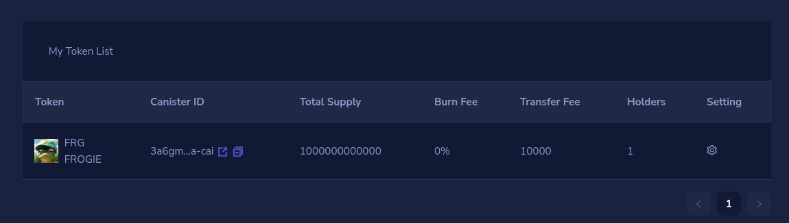
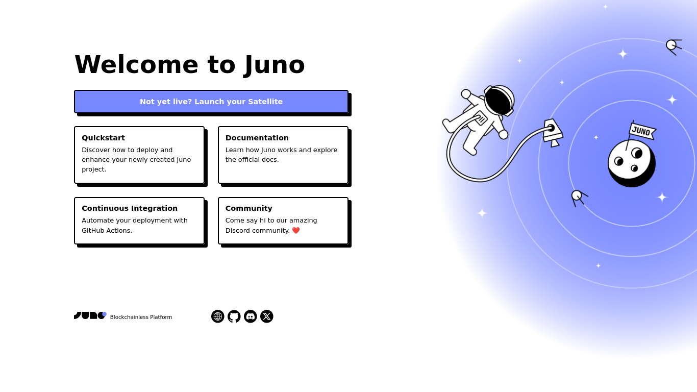
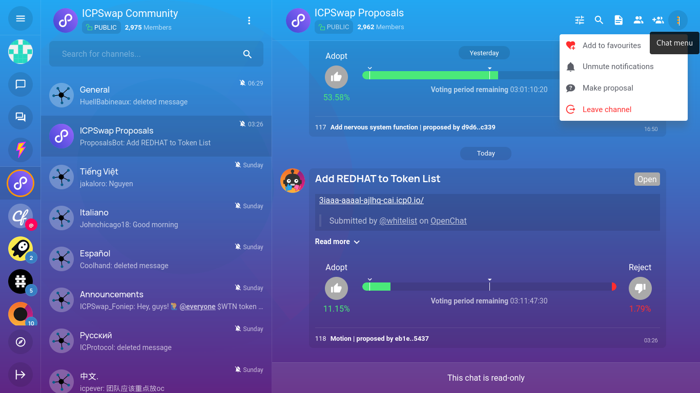
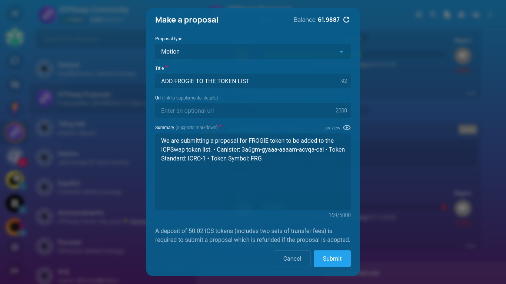

---


## Introduction

Memecoins are starting to gain significant traction on the Internet Computer network(ICP). Some of these tokens, such as Windoge98 and Ghost, have reached high prices and attracted many retail investors into the ecosystem. Now, you may be wondering how these meme tokens were launched. In this article, we will walk you through all the steps you need to follow in order to create your own memecoin project.

From creating the token canister to building a marketing website for your token using Juno, and then launching the token on ICPSwap, a major decentralized exchange (DEX) on the Internet Computer network, we've got you covered.
 
 We will also provide some useful tips that you can use to create a successful memecoin project. By the end of this article, you will have all the necessary information to create a memecoin project on the Internet Computer.

## Prerequisites

This article is for anyone interested in creating a memecoin on ICP.

## What is ICP

The Internet Computer (ICP) is a blockchain-based platform that aims to create a new type of internet, one that is decentralized, secure, and scalable. Developed, among others, by the DFINITY Foundation, the Internet Computer is designed to serve as a global public compute infrastructure, allowing developers to build and deploy decentralized applications (dApps) and services directly on the blockchain.

Unlike traditional blockchains, the Internet Computer uses a unique consensus mechanism called Threshold Relay, which allows it to achieve high transaction throughput and low latency. The platform is also designed to be highly scalable, with the ability to add more nodes and increase its computing power as demand grows. This makes the Internet Computer a promising platform for building a wide range of decentralized applications, from social media and e-commerce to finance and cloud computing. [Learn more about ICP](https://internetcomputer.org/)

## What is Juno

Juno works just like traditional serverless platforms such as Google Firebase or AWS Amplify, but with one key difference: everything on Juno runs on the blockchain. This means that you get a fully decentralized and secure infrastructure for your applications, which is pretty cool if you ask me.

Behind the scenes, Juno uses the Internet Computer blockchain network and infrastructure to launch what we call a “Satellite” for each project you build. A Satellite is essentially a smart contract on steroids that contains your entire app. From its assets provided on the web (such as JavaScript, HTML, and image files) to its state saved in a super simple database, file storage, and authentication, each Satellite controlled solely by you contains everything it needs to run smoothly.

## Creating the token smart contract canister

We will use a no-code tool to create our token smart contract canister

- Visit the [ICPEx](https://icpex.org/createToken) website and choose an identity provider such as Plug, Internet Identity, Stoic, or NFID to log in.
   

- On the dashboard, fill out the required fields to set up your new token, including the token name, symbol, and other details. You can also set the transfer fee for your token, as well as set if you want to mint more tokens in the future
- To make the token deflationary, you can activate the burn feature that allows you to burn a certain amount of tokens everytime a user makes a transaction,but we wont do that in this tutorial

    

- You will be charged a small fee of 0.14 ICP to use this service, so ensure you have some ICP tokens in your wallet.

  

- Once you have created your token, it will appear in `My token List` section.

The next step is to set up a marketing website for your new meme token.

## Launching the marketing website

In this section, we are going to look setup the marketing website for our token using Juno.

To set up a marketing website for your token using Juno, follow these steps:

- Ensure you have Node.js and npm installed on your computer. If not, follow the [guide](https://docs.npmjs.com/downloading-and-installing-node-js-and-npm/) to install them.

- Open your computer's terminal and run the following command to initialize a template using the Juno package

  ```bash
  npm create juno@latest -- --template astro-starter
  ```

- Provide the name of the project folder myToken
- Select no to configure Github Actions
- Select no to configure the local development emurator
- Select yes to install the dependencies
- Select yes to install juno's CLI tool. Juno CLI will help us to deploy our project in the satellite.

Navigate to the project folder myToken and open it in your favorite code editor. If every previous step is successfull, running `npm run dev` in the terminal will open the project in your browser and you should have something similar to this.



### Editing the code for the website

We will create a simple website for our token.

In the `pages` folder, replace all the code in the `index.astro` with the code below

```js
---
import BaseHead from "../components/BaseHead.astro";
import { SITE_TITLE, SITE_DESCRIPTION, SITE_SOCIAL_IMAGE } from "../consts";
---

<!doctype html>
<html lang="en">
  <head>
    <BaseHead
      title={SITE_TITLE}
      description={SITE_DESCRIPTION}
      image={SITE_SOCIAL_IMAGE}
    />
  </head>
  <body class="font-montserrat m-0 p-0 bg-[#1a1a2e] text-white">
    <div class="container max-w-[1200px] mx-auto px-5">
      <header class="flex justify-between items-center py-5">
        <div class="logo text-2xl font-bold text-green">Frogie</div>
        <nav>
          <ul class="list-none flex">
            <li class="ml-5"><a href="" class="text-white hover:text-[#ffd700]">About</a></li>
            <li class="ml-5"><a href="" class="text-white hover:text-[#ffd700]">Tokenomics</a></li>
            <li class="ml-5"><a href="" class="text-white hover:text-[#ffd700]">Roadmap</a></li>
            <li class="ml-5"><a href="" class="text-white hover:text-[#ffd700]">Community</a></li>
          </ul>
        </nav>
      </header>

      <main>
        <section class="flex flex-col items-center w-full justify-center py-[40px]">
          <div class="mb-5 flex items-center justify-center w-full ">

            
          </div>
          <span>Pepe's long lost cousin has arrived</span>
          <h2 class="text-2xl mt-6">Token Details</h2>
          <div class="flex w-1/2 mt-4 gap-2 p-4 justify-center">
            <div class="flex flex-col justify-center gap-1 items-center w-full md:w-1/2 lg:w-1/2">
              <h3 class="text-lg">Canister Address</h3>
              <p class="text-center text-sm">3a6gm-gyaaa-aaaam-acvqa-cai</p>
            </div>
            <div class="flex flex-col justify-center gap-1 items-center w-full md:w-1/2 lg:w-1/3">
              <h3 class="text-lg">Total Supply</h3>
              <p class="text-center">100M</p>
            </div>
            <div class="flex flex-col justify-center gap-1 items-center w-full md:w-1/2 lg:w-1/3">
              <h3 class="text-lg">Ticker Name</h3>
              <p class="text-center">$FRG</p>
            </div>
          </div>

          <button class="inline-block mt-8 bg-[#ffd700] text-[#1a1a2e] px-[30px] py-[15px] rounded-[5px] font-bold hover:bg-[#ffed4a]">
            Buy Frogie Now
          </button>
        </section>

        <section class="flex justify-center gap-8 items-center mb-16">
          <div class="flex flex-col justify-center gap-2 items-center">
          
            
            <h2 class="text-2xl">Moon-bound Potential</h2>
            <p class="text-center flex ">Our advanced memetics ensure stratospheric growth! From the waters to the moon</p>
          </div>
          <div class="flex flex-col justify-center gap-2 items-center">
            
            <h2 class="text-2xl">Vibrant Community</h2>
            <p class="text-center flex ">Join thousands of fellow memers and hodlers!</p>
          </div>
          <div class="flex flex-col justify-center gap-2 items-center">
            
            <h2 class="text-2xl">Meme-powered</h2>
            <p class="text-center flex ">I am green when the market is up and red when the market is down</p>
          </div>
        </section>
      </main>
    </div>
    <div class="bg-[#1a1a2e] py-[10px] overflow-hidden">
      <div class="ticker-content inline-block whitespace-nowrap pl-[100%] animate-ticker">
        <span class="ticker-item inline-block px-[20px]">🚀 Frogie to the moon!</span>
        <span class="ticker-item inline-block px-[20px]">💎 HODL for life!</span>
        <span class="ticker-item inline-block px-[20px]">🐸 Pepe's long lost cousin is here!</span>
        <span class="ticker-item inline-block px-[20px]">🎉 1 Frogie = 1 Frogie</span>
      </div>
    </div>
    <footer class="text-center py-[20px] bg-[#16213e]">
      <p>&copy; 2024 Frogie. All rights reserved. To the moon! 🚀</p>
    </footer>

</html>
```
In the above code, we created a sinple website to display the logo of our token, as well as the name,symbol and total supply of the token. There is also a button that allows the user to but our token from an exchange where it is listed. Edit the code above to display the information of your token including the name, symbol, total supply, and logo. You can get ifnormation about your token from the ICPEx platform where you created it from

## Deployment

In this section, we will create a live link for our token website using Juno.

### Creating a satellite

We need to create a satellite that will host our website . Follow the steps below to create your own satellite from the Juno console..

- Navigate to the administration [console](https://console.juno.build/) website
- Login with your internet Identity
- On the dashboard, select Launch new satellite
- Provide name myToken for the satellite.
- Click Create Satellite

## Connect Project to the Satellite

We need to link our project to the satellite. follow the steps below

- Back to the project terminal on your computer, run the command `juno init` and follow the prompts

- Select yes to login and authorize the terminal to access your satellite in your browser

- Select myToken as the satellite to connect the project to

- Select dist as the location of the compiled app files

- Select TypeScript as the configuration file format.

If the above step is successful, a new file juno.config.ts will be added at the root of our project folder. It contains the configuration necessary for our poject to connect to the satellite. You need this file if your project is to be deployed successfully to the satellite.

### Compiling and deploying the Project

Now that we connected our project to the satellite, we have to compile and deploy the webiste to the satellite

```bash
npm run build
```

The above command compiles our website and outputs the compiled files in the `dist` folder

```bash
juno deploy
```

This will deploy our compiled files to the satellite that we connected linked our website to.

At this stage, if all the previous steps are successful, juno deploy command will output a link whixh is in this format `https://<SATELLITE_ID>.icp0.io` where SATELLITE_ID is the id of the satellite that we connected our project to.

> **TIP:** Running `juno open` in your terminal opens your project in your favorite browser.

Opening the link in the browser, you should have something like this below


## Listing the token on ICPSwap

In this section, we will look at how to list our newly created token on ICPSwap.

ICPSwap is a decentralized exchange that facilitates token trading and swapping by allowing tokens to be listed and liquidity pools to be created for different token pairs.

As ICPSwap is a decentralized autonomous organization (DAO) controlled by the community members, to add a token to their list, you need to submit a proposal that will be voted on by the community members. If the proposal passes, the token will be listed on this exchange.

We will create a proposal to add our token on ICPSwap in the following steps

- Visit the [ICPSwap](https://oc.app/community/qhpy7-vqaaa-aaaar-aurxa-cai/channel/146905696808670344863162689200573775433) community group on OpenChat
- CLick on te three dots in the right corner ans select `make proposal`



- Select `MOTION` as the proposal type
- Add a descriptive title, somthing like "ADD FROGIE TO THE TOKEN LIST"
- In the summary section,add all the details about your token forexample the token canister address, social media handles and any other information you feel will help the voter to understand more about your token
- Once your have filled all the fields, click submit and the proposal will be sumbitted. 
- You will be charged a fee of 50 ICS for this service, therefore ensure you have enough ICS balance before you peform this step



The voting duration for proposals on the ICPSwap platform is typically three days. If a proposal passes during this voting period, your token will be listed on the exchange and will be tradable.
Once your token is available for trading, you can update the link on the `Buy Frogie Now` button to redirect the user to the exchnage from where they can buy the token

If you have reached this step without any errors, congratulations, you have created your first meme coin project. Now you can start marketing to attract more users and holders. Good luck

## Tips for a successful memecoin project

In this section, we will cover some tips you need to launch a successful memecoin project.


**Develop a Unique and Relatable Concept**

The first step to creating a successful meme coin is finding a unique topic that resonates with people. Your concept should be relatable, funny or nostalgic. Capture the essence of internet culture with a catchy name and logo that embodies the humor and appeal of your chosen meme.

**Build a Strong Community**

Think of your meme coin's community like a big group of friends who all love the same joke. To make that friend group huge and enthusiastic:

- Know your meme and what makes your coin funny
- Find the websites, apps, and chat rooms where your target audience hangs out and get involved
- Make hilarious memes using your coin's name or logo and encourage your community to create them too
- Give away some of your coin as prizes to active community members
- Work with other meme coins or popular meme accounts to reach even more people
- Make new people feel instantly part of the joke

**Implement a Comprehensive Marketing Strategy**

Effective crypto marketing is critical for meme coin success. Implement a multi-faceted strategy across various channels:

- Utilize social media platforms like Twitter, Reddit, and Telegram to build a strong online presence
- Create engaging content like memes, videos, blog posts to generate buzz and attract attention
- Host events, AMAs, and giveaways to keep your audience interested and invested
- Form strategic partnerships with influencers, projects, and industry leaders to expand your reach
- Monitor performance using analytics tools and gather feedback to continuously improve

**Leverage Influencer Marketing**

Most successful meme coin projects hire specialized crypto influencer marketing teams with extensive networks. Partner with online personalities who like memes or crypto and have them talk about your coin to their followers.

## Conclusion

In this article, we have covered everything you need to launch a successful memecoin project, from creating the token canister, to creating a marketing website using Juno and listing the token on ICPSwap.
This article is for educational purposes only and is not financial advice of any form.Do Your Own Research (DYOR) if you want to invest in memecoins

👋

Stay connected with Juno by following us on [Twitter](https://twitter.com/junobuild) to keep up with our latest updates.

And if you made it this far, we’d love to have you join the Juno community on [Discord](https://discord.gg/wHZ57Z2RAG). 😉
