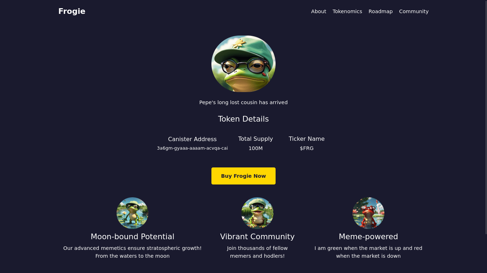
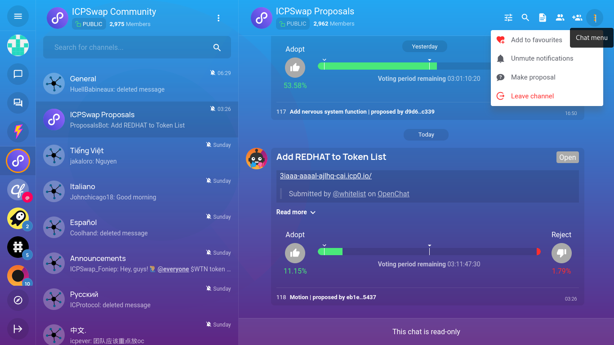
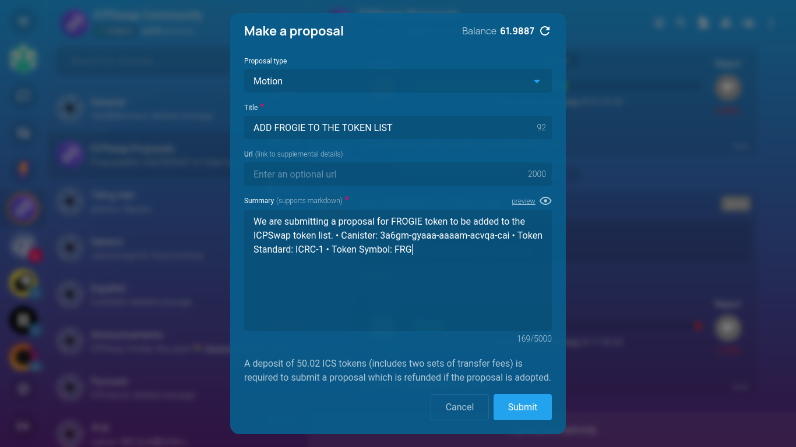

---

## Introduction

Memecoins are starting to gain significant traction. Some of these tokens, such as [Windowge98](https://windoge98.com/), [Damonic Welleams](https://damonicwelleams.com/), [Wumbo](https://qmpah-qqaaa-aaaal-ajabq-cai.icp0.io/), [Spellkaster](https://spellkaster.app/) and [$stik](https://bj2ym-biaaa-aaaal-aji3q-cai.icp0.io/), have reached high prices and attracted many retail investors into the ecosystem. Now, you may be wondering how these meme tokens were launched. In this article, we will walk you through all the steps you need to follow in order to create your own memecoin project.

From creating the token smart contract (canister) to building a marketing website using Juno, and finally launching the token on [ICPSwap](https://icpswap.com), a major decentralized exchange (DEX) on ICP, we've got you covered.

We will also provide useful tips to ensure your memecoin project is successful. By the end of this article, you will have all the information needed to launch your token.

:::important

This article is for educational purposes only and is not financial advice of any form.

:::

---

## What is ICP

The Internet Computer (ICP) is a blockchain-based platform that aims to create a new type of internet, one that is decentralized, secure, and scalable. Developed, among others, by the DFINITY Foundation, the Internet Computer is designed to serve as a global public compute infrastructure, allowing developers to build and deploy decentralized applications (dApps) and services directly on the blockchain. [Learn more about ICP](https://internetcomputer.org/)

--- 

## What is Juno

Juno is a blockchain-as-a-service (“blockchainless”) platform that empowers developers to build decentralized apps efficiently. Similar to Web2 cloud service platforms but with significant improvements, it offers a comprehensive toolkit to scaffold secure and efficient projects running on the blockchain.

In short, Juno is the Google Firebase alternative for Web3.

--- 

## Creating the token smart contract canister

:::info

There are simpler ways to launch your own token that do not involve scripting, such as using no-code platforms like [ICPEx](https://icpex.org/createToken) or [ICPI](https://www.icpi.xyz/#/deploy).

However, since Juno is dedicated to providing developers with full ownership without compromise, this tutorial showcases an approach that aligns with our core values.

Who knows, maybe in the future, Juno itself will make launching ledgers to the moon easy too! 😉

:::

To deploy a ledger for your token proceed as following:

- Make sure you have the `dfx` CLI installed on your machine. If not, follow this [guide](https://internetcomputer.org/docs/current/developer-docs/getting-started/install/) to complete the installation.

- Creating a canister requires cycles, which measure and pay for resources like memory, storage, and compute power. Follow this [guide](https://internetcomputer.org/docs/current/tutorials/developer-journey/level-1/1.4-using-cycles) to load cycles on your machine for deploying your ledger.

The following steps assume that you have cycles on your machine

- On your computer, make an empty folder and name it `myToken`, and open it in your favorite editor

- Create a file inside the folder and name it `dfx.json`paste the code below

```json
{
    "canisters": {
      "myToken": {
        "type": "custom",
        "candid": "https://raw.githubusercontent.com/dfinity/ic/4472b0064d347a88649beb526214fde204f906fb/rs/rosetta-api/icrc1/ledger/ledger.did",
        "wasm": "https://download.dfinity.systems/ic/4472b0064d347a88649beb526214fde204f906fb/canisters/ic-icrc1-ledger.wasm.gz"
      }
    },
    "defaults": {
      "build": {
        "args": "",
        "packtool": ""
      }
    },
    "output_env_file": ".env",
    "version": 1
}
```

Next, we are going to define some parameters for our token and prepare the script for deployment.

Create a new file named `deploy.sh` and paste the following code:

```bash
#!/usr/bin/env bash

# Token settings
TOKEN_NAME="FROGIE"
TOKEN_SYMBOL="FRG"
TRANSFER_FEE=10000
PRE_MINTED_TOKENS=100_000_000_00_000_000
FEATURE_FLAGS=true
TRIGGER_THRESHOLD=2000
CYCLE_FOR_ARCHIVE_CREATION=10000000000000
NUM_OF_BLOCK_TO_ARCHIVE=1000

# Identities
dfx identity use default
DEFAULT=$(dfx identity get-principal)

dfx identity new archive_controller
dfx identity use archive_controller
ARCHIVE_CONTROLLER=$(dfx identity get-principal)

dfx identity new minter
dfx identity use minter
MINTER=$(dfx identity get-principal)

# Switch back to the identity that contains cycles
dfx identity use "<YOUR-IDENTITY>"

# Create and deploy the token canister
dfx canister create myToken --network ic
dfx deploy myToken --network ic  --argument "(variant {Init =
record {
  token_symbol = \"${TOKEN_SYMBOL}\";
  token_name = \"${TOKEN_NAME}\";
  minting_account = record { owner = principal \"${MINTER}\" };
  transfer_fee = ${TRANSFER_FEE};
  metadata = vec {};
  feature_flags = opt record{icrc2 = ${FEATURE_FLAGS}};
  initial_balances = vec { record { record { owner = principal \"${DEFAULT}\"; }; ${PRE_MINTED_TOKENS}; }; };
  archive_options = record {
    num_blocks_to_archive = ${NUM_OF_BLOCK_TO_ARCHIVE};
    trigger_threshold = ${TRIGGER_THRESHOLD};
    controller_id = principal \"${ARCHIVE_CONTROLLER}\";
    cycles_for_archive_creation = opt ${CYCLE_FOR_ARCHIVE_CREATION};
  };}
})"
```

In this script, we define our token's name, symbol, transfer fee, and initial supply. Adjust these settings to match your tokenomics and token information details. For our token, we are premining 100 million tokens.

The script also specifies default settings for the token and sets up identities for minting and archiving.

:::note

Ensure you switch back to the identity that contains the cycles on your machine before running the commands below.

:::

Once the file saved, run the command below in your terminal to deploy the token canister on the network:

```bash
./deploy.sh
```

If all the previous steps are successful, you should get a link in this format `https://a4gq6-oaaaa-aaaab-qaa4q-cai.raw.icp0.io/?id=<TOKEN-CANISTER-ID>` where `TOKEN-CANISTER-ID` is the id of your token ledger that was deployed.

All the premined tokens are now held by the principal address of the `default` identity. You can transfer these to an external wallet like plug to ease with the transfer process since using the command line to distribute the tokens is a little bit cumbersome.
[Learn more about creating token canisters](https://internetcomputer.org/docs/current/developer-docs/defi/icrc-1/icrc1-ledger-setup)

The next step is to set up a marketing website for your project.

--- 

## Launching the marketing website

In this section, we will guide you through setting up a marketing website for your token using Juno. Follow these steps to create your site.

- Ensure you have Node.js and npm installed on your computer. If not, follow the [guide](https://docs.npmjs.com/downloading-and-installing-node-js-and-npm/) to install them.

- Open your computer's terminal and run the following command to initialize a template:

```bash
npm create juno@latest -- --template astro-starter
```

- Provide the name of the project folder `myWebsite`
- Select `no` to configure Github Actions
- Select `no` to configure the local development emurator
- Select `yes` to install the dependencies
- Select `yes` to install juno's CLI tool. Juno CLI will help us to deploy our project in the satellite.

Navigate to the project folder `myWebsite` and open it in your favorite code editor. If every previous step is successfull, running `npm run dev` in the terminal will open the project in the browser and you should have something similar to this.


---

### Editing the code for the website

We will create a simple website for our token.

In the `pages` folder, replace all the code in the `index.astro` with the code below

```js
---
import BaseHead from "../components/BaseHead.astro";
import { SITE_TITLE, SITE_DESCRIPTION, SITE_SOCIAL_IMAGE } from "../consts";
---

<!doctype html>
<html lang="en">
  <head>
    <BaseHead
      title={SITE_TITLE}
      description={SITE_DESCRIPTION}
      image={SITE_SOCIAL_IMAGE}
    />
  </head>
  <body class="font-montserrat m-0 p-0 bg-[#1a1a2e] text-white">
    <div class="container max-w-[1200px] mx-auto px-5">
      <header class="flex justify-between items-center py-5">
        <div class="logo text-2xl font-bold text-green">Frogie</div>
        <nav>
          <ul class="list-none flex">
            <li class="ml-5"><a href="" class="text-white hover:text-[#ffd700]">About</a></li>
            <li class="ml-5"><a href="" class="text-white hover:text-[#ffd700]">Tokenomics</a></li>
            <li class="ml-5"><a href="" class="text-white hover:text-[#ffd700]">Roadmap</a></li>
            <li class="ml-5"><a href="" class="text-white hover:text-[#ffd700]">Community</a></li>
          </ul>
        </nav>
      </header>

      <main>
        <section class="flex flex-col items-center w-full justify-center py-[40px]">
          <div class="mb-5 flex items-center justify-center w-full ">

            
          </div>
          <span>Pepe's long lost cousin has arrived</span>
          <h2 class="text-2xl mt-6">Token Details</h2>
          <div class="flex w-1/2 mt-4 gap-2 p-4 justify-center">
            <div class="flex flex-col justify-center gap-1 items-center w-full md:w-1/2 lg:w-1/2">
              <h3 class="text-lg">Canister Address</h3>
              <p class="text-center text-sm">3a6gm-gyaaa-aaaam-acvqa-cai</p>
            </div>
            <div class="flex flex-col justify-center gap-1 items-center w-full md:w-1/2 lg:w-1/3">
              <h3 class="text-lg">Total Supply</h3>
              <p class="text-center">100M</p>
            </div>
            <div class="flex flex-col justify-center gap-1 items-center w-full md:w-1/2 lg:w-1/3">
              <h3 class="text-lg">Ticker Name</h3>
              <p class="text-center">$FRG</p>
            </div>
          </div>

          <button class="inline-block mt-8 bg-[#ffd700] text-[#1a1a2e] px-[30px] py-[15px] rounded-[5px] font-bold hover:bg-[#ffed4a]">
            Buy Frogie Now
          </button>
        </section>

        <section class="flex justify-center gap-8 items-center mb-16">
          <div class="flex flex-col justify-center gap-2 items-center">
          
            
            <h2 class="text-2xl">Moon-bound Potential</h2>
            <p class="text-center flex ">Our advanced memetics ensure stratospheric growth! From the waters to the moon</p>
          </div>
          <div class="flex flex-col justify-center gap-2 items-center">
            
            <h2 class="text-2xl">Vibrant Community</h2>
            <p class="text-center flex ">Join thousands of fellow memers and hodlers!</p>
          </div>
          <div class="flex flex-col justify-center gap-2 items-center">
            
            <h2 class="text-2xl">Meme-powered</h2>
            <p class="text-center flex ">I am green when the market is up and red when the market is down</p>
          </div>
        </section>
      </main>
    </div>
    <div class=" py-[10px] overflow-hidden">
      <div class=" inline-block whitespace-nowrap pl-[10%]">
        <span class="inline-block px-[20px]">🚀 Frogie to the moon!</span>
        <span class=" inline-block px-[20px]">💎 HODL for life!</span>
        <span class="inline-block px-[20px]">🐸 Pepe's long lost cousin is here!</span>
        <span class=" inline-block px-[20px]">🎉 1 Frogie = 1 Frogie</span>
      </div>
    </div>
    <footer class="text-center py-[20px] bg-[#16213e]">
      <p>&copy; 2024 Frogie. All rights reserved. To the moon! 🚀</p>
    </footer>

</html>
```

In the above code, we created a simple website to display the logo of our token, as well as the name,symbol and total supply of the token. There is also a button that allows the user to but our token from an exchange where it is listed.

 Edit the code above to display the information of your token including the name, symbol, total supply, and logo.

---

### Creating a satellite

We need to create a satellite that will host our website. Follow the steps below to create your own satellite from the Juno console.

:::note

A satellite is a smart contract provided by Juno, packed with features such as authentication, simple database, file storage and, hosting.

:::

- Navigate to the Juno's administration [console](https://console.juno.build/) website
- Login with your Internet Identity
- On the dashboard, select Launch new satellite
- Provide name `myWebsite` for the satellite.
- Click Create 

---

### Connect Project to the Satellite

One last step before deployment, we have to link our local project with the satellite that lives on chain. Follow the steps below:

- Back to the project terminal on your computer, run the command `juno init` and follow the prompts.

- Select yes to `login` and authorize your terminal to access your satellite.

- Select `myWebsite` as the satellite to connect to.

- Select `dist` as the location of the compiled app files.

- Select `TypeScript` as the configuration file format.

If the above step is successful, a new file `juno.config.ts` will be added at the root of our project folder.

---

### Compiling and deploying the Project

Now that we connected our project to the satellite, we can compile and deploy the website.

```bash
npm run build
```

The above command compiles our website and outputs the compiled files in the `dist` folder

```bash
juno deploy
```

This will deploy our compiled files to the satellite that we connected linked our website to.

At this stage, if all the previous steps are successful, the command will output a link which is in this format `https://<SATELLITE_ID>.icp0.io` where `SATELLITE_ID` is the id of the satellite that we connected our project to.

:::tip

Running `juno open` in your terminal opens your project in your favorite browser.

:::

Opening the link in the browser, you should have something like this below


---

## Listing the token on ICPSwap

In this section, we will look at how to list our newly created token on [ICPSwap](https://icpswap.com).

ICPSwap is a decentralized exchange that facilitates token trading and swapping by allowing tokens to be listed and liquidity pools to be created for different token pairs.

And because ICPSwap is a decentralized autonomous organization (DAO) controlled by the community members, you need to submit a proposal for your token to be added on the exchange. This proposal will be voted on by the community members. If the proposal passes, the token will be listed on this exchange.

We will create a proposal to add our token on ICPSwap in the following steps.

- Visit the [ICPSwap](https://oc.app/community/qhpy7-vqaaa-aaaar-aurxa-cai/channel/146905696808670344863162689200573775433) community group on [OpenChat](https://oc.app)
- Click on te three dots in the right corner and select `make proposal`



- Select `MOTION` as the proposal type
- Add a descriptive title, somthing like "ADD FROGIE TO THE TOKEN LIST"
- In the summary section,add all the details about your token forexample the token canister address, social media handles and any other information you feel will help the voter to understand more about your token
- Once your have filled all the fields, click submit and the proposal will be sumbitted.

> **NOTE:** You will be charged a fee of 50 ICS for this service, therefore ensure you have enough ICS balance before you peform this step.




The voting duration for proposals on the ICPSwap platform is typically three days. If a proposal passes during this voting period, your token will be listed on the exchange and will be tradable.
Once your token is available for trading, you can update the link on the `Buy Frogie Now` button to redirect the user to the exchange from where they can buy the token.

:::note

You can also use [`proposals.network`](https://proposals.network/) as an alternative to submit a proposal to any [SNS](https://dashboard.internetcomputer.org/) project.

:::

If you have reached this step without any errors, congratulations, you have created your first meme coin project. 🥳

Now you can start marketing to attract more users and holders. Good luck! 🤞

--- 


## Tips for a successful memecoin project

In this section, we will cover some tips you need to launch a successful memecoin project.

---

### Develop a Unique and Relatable Concept

The first step to creating a successful meme coin is finding a unique topic that resonates with people. Your concept should be relatable, funny or nostalgic. Capture the essence of internet culture with a catchy name and logo that embodies the humor and appeal of your chosen meme.

---

### Build a Strong Community

Think of your meme coin's community like a big group of friends who all love the same joke. To make that friend group huge and enthusiastic:

- Know your meme and what makes your coin funny
- Find the websites, apps, and chat rooms where your target audience hangs out and get involved
- Make hilarious memes using your coin's name or logo and encourage your community to create them too
- Give away some of your coin as prizes to active community members
- Work with other meme coins or popular meme accounts to reach even more people
- Make new people feel instantly part of the joke

---

### Implement a Comprehensive Marketing Strategy

Effective crypto marketing is critical for meme coin success. Implement a multi-faceted strategy across various channels:

- Utilize social media platforms like Twitter, Reddit, and Telegram to build a strong online presence
- Create engaging content like memes, videos, blog posts to generate buzz and attract attention
- Host events, AMAs, and giveaways to keep your audience interested and invested
- Form strategic partnerships with influencers, projects, and industry leaders to expand your reach
- Monitor performance using analytics tools and gather feedback to continuously improve

---

### Leverage Influencer Marketing

Most successful meme coin projects hire specialized crypto influencer marketing teams with extensive networks. Partner with online personalities who like memes or crypto and have them talk about your coin to their followers.

--- 

## Conclusion

In this article, we have covered everything you need to launch a successful memecoin project, from creating the token canister, to creating a marketing website using Juno and listing the token on ICPSwap.
This article is for educational purposes only and is not financial advice of any form. Do Your Own Research (DYOR) if you want to invest in memecoins.

👋


Stay connected with Juno by following us on [Twitter](https://twitter.com/junobuild) to keep up with our latest updates.

And if you made it this far, we’d love to have you join the Juno community on [Discord](https://discord.gg/wHZ57Z2RAG). 😉
