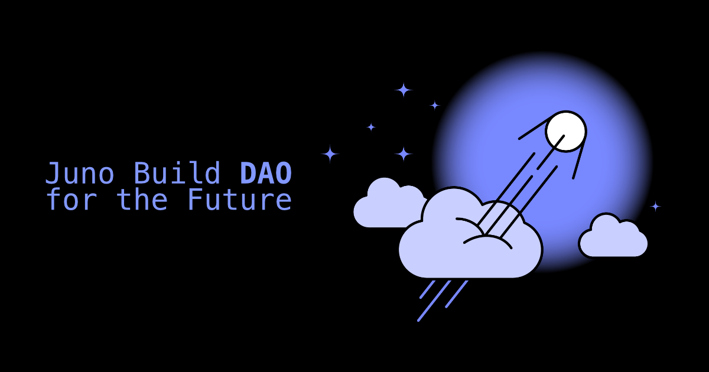

---

Hey everyone 👋

I hope you’re all doing well! I’m excited to share some big news with you today. Over the next few weeks, we’re taking some significant steps toward shaping the future of Juno, and I wanted to keep you in the loop about what’s coming.

As you may know, Juno is a blockchain-as-a-service ecosystem that empowers developers to build decentralized apps efficiently. One of its strengths is that it gives developers full and sole control over their work. For this reason, it would be paradoxical to continue operating the platform with a centralized model—i.e., with me being the sole controller of services, such as the administration console or our CDN. That’s why I’m thrilled to unveil that, in the upcoming weeks, I’m aiming to fix this bias by proposing that Juno becomes a Decentralized Autonomous Organization (DAO).

While this potential shift is on the horizon, there are a few key steps you can take to stay informed and involved in the process. Here’s how you can help shape the future of developing on Web3:

---

## 1. Sign Up to Join the Party

To ensure you don’t miss any crucial updates, I encourage you to sign up for our newsletter. The journey to proposing a DAO and making it a reality involves multiple steps, each requiring your participation. By signing up, you’ll receive timely notifications whenever there’s an opportunity to get involved and make a real impact.

import NewsletterForm from "@site/src/components/NewsletterForm";

<NewsletterForm />

---

## 2. Get Informed

I’ve put together a [white paper](/docs/white-paper/intro) that outlines the reasoning and vision I have for a Juno Build DAO. I highly recommend giving it a read to fully understand what I’m aiming to achieve.

If you have any questions, feel free to reach out on [Discord](https://discord.gg/wHZ57Z2RAG), [Twitter/X](https://x.com/junobuild), [OpenChat](https://oc.app/community/vxgpi-nqaaa-aaaar-ar4lq-cai/?ref=xanzv-uaaaa-aaaaf-aneba-cai) or also the DFINITY forum (as requested per their guidelines).

Questions are always welcome at any time, but if you’re looking to engage directly, I’ll be hosting a Juno Live session on 9 September at 3:00 PM CET. Join the livestream on [YouTube](https://youtube.com/live/jDmj8ypjoyM) to interact in real-time.

---

## 3. Cast Your Vote

While I typically avoid relying on third parties for core features, transforming Juno into a DAO without leveraging such services would be an immense task. That’s why I’m proposing to use the Internet Computer’s built-in solution for creating and maintaining DAOs, known as [SNS](https://internetcomputer.org/how-it-works/sns/).

To kickstart the process of transforming our ecosystem, this framework requires submitting a proposal to the Internet Computer’s governance, known as [NNS](https://internetcomputer.org/how-it-works/network-nervous-system-nns/). This step ensures a decentralized and democratic process. It also prepares for the handover of control of the smart contracts and allows all participants to review the parameters involved.

Once this proposal is live, your voice will be crucial! You’ll have the opportunity to vote on whether to accept or reject it.

Without your approval, the ICO won’t even start.

---

## 4. Participate in the ICO

:::info[Disclaimer]

Please note that the following does not constitute financial advice.

:::

If the proposal is approved, an initial decentralization swap will be kicked off. The goal here is to raise the initial funds for the DAO and to decentralize the voting power. Think of it like crowdfunding, where people contribute ICP tokens. In return, participants are rewarded with staked tokens, giving them a share of the DAO's voting power.

For the swap to succeed, it requires at least 100 participants and 200,000 ICP tokens. Otherwise, the entire journey of transforming Juno into a DAO fails. So, if you’re excited about being part of this adventure, this could be the step where you make a real difference — if you decide on your own will to do so.

---

## 5. Outcome

If the swap **fails**, it will mark the beginning of the end. While the platform won’t be deprecated immediately, I will gradually phase it out over the course of, let's say, a year. During this time, Juno will stop accepting new developers, and I will no longer develop new features, promote the eco-system, or invest in it beyond maintenance.

For those already using Juno, I want to reassure you that I won’t leave you stranded. I’m committed to offering support to help you transition and find suitable alternatives. I’m not, I hope, that an a-hole. I try to maintain good karma.

On a personal note, I’ll also be deprecating all of my personal projects, such as [proposals.network](https://proposals.network), as I have no intention of using any developer tooling other than Juno for my own Web3 projects.

If the swap is **successful**, hooray! Juno will officially become a DAO, allowing you to actively participate in the governance of the project and start using the new JUNOBUILD token, among other exciting developments.

This will mark the beginning of an exciting new chapter, with the community at the heart of Juno's future.

To infinity and beyond, 
David

---

**Useful Links**:

- [Juno White Paper](/docs/white-paper/intro) - Understand the vision and details behind the proposed DAO.
- [Sign Up to the Newsletter](/newsletter) - Stay updated on all the latest news and steps.
- [Discord](https://discord.gg/wHZ57Z2RAG) or [OpenChat](https://oc.app/community/vxgpi-nqaaa-aaaar-ar4lq-cai/?ref=xanzv-uaaaa-aaaaf-aneba-cai) - Join the community and ask your questions.
- [Twitter/X](https://x.com/junobuild) - Follow for real-time updates.
- DFINITY Forum Thread - Engage in discussions and share your thoughts.
- [YouTube Livestream](https://youtube.com/live/jDmj8ypjoyM) - Participate in the Juno Live session on 9 September at 3:00 PM CET.
