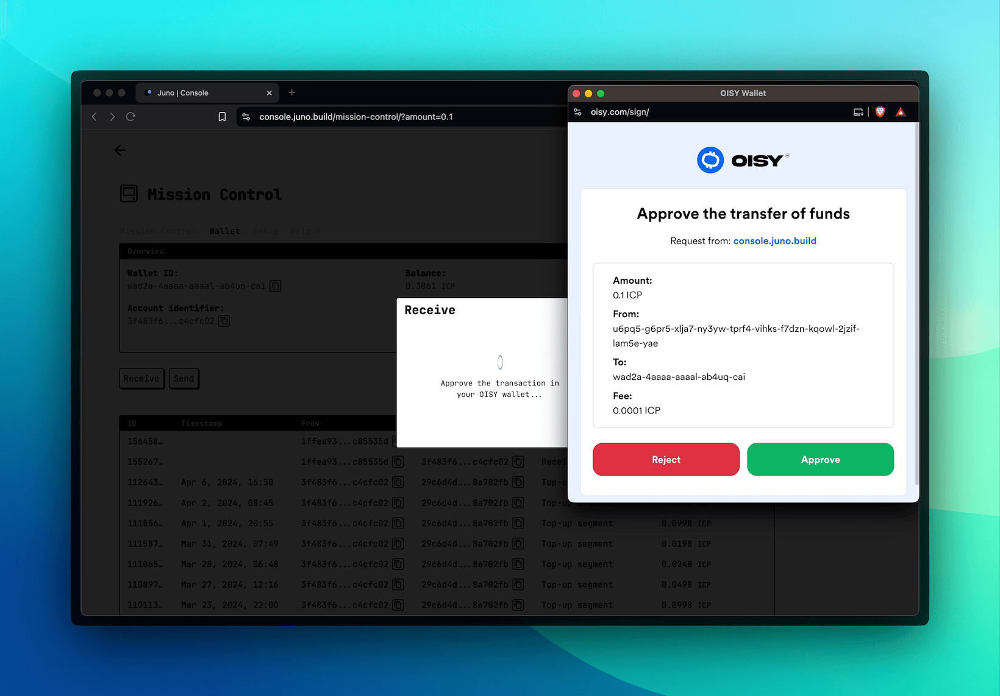
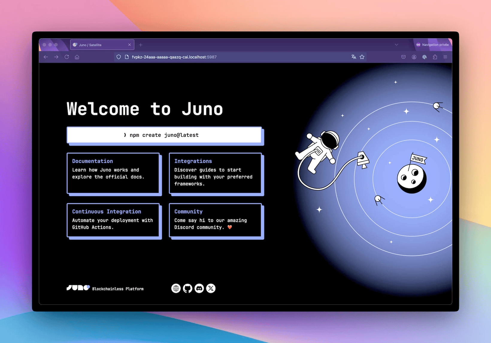
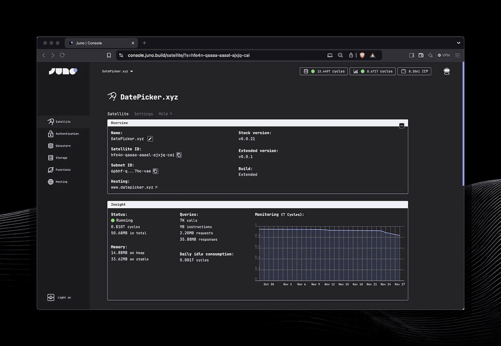

Hey everyone 👋

November’s been an exciting month, especially since I’ve officially started working full-time on Juno — thanks to the recently [announced](/blog/a-new-chapter-awakens) funding! This shift has already led to delivering some fantastic new features for developers, like automated backups (finally!!!), support for large WASM modules, the ability to buy cycles with Stripe, and a few other goodies.

These updates are all about making development smoother and more efficient, whether you’re building dapps, smart contracts, or managing your projects. Let’s dive into what’s new!

---

## Backups

To kick things off, I’d like to highlight the introduction of backups—a feature I’ve been waiting for forever!

This addition brings a crucial layer of security for developers, letting you safeguard your modules and restore them whenever needed.


Here’s how it works: Currently, one backup per module is supported. You can manage backups manually via both the Console UI and the CLI, with options to create, restore, or delete them. Additionally, backups are automatically created during the upgrade process, taking a snapshot before transitioning to a new version. For those who prefer full control, advanced options let you skip creating a backup or avoid overwriting an existing one.

For anyone who, like me, feels a bit tense whenever it’s time to execute an upgrade, this feature is a huge relief. It’s really a great addition!

---

## Buy Cycles with Stripe

Getting cycles has become more straightforward, particularly for newcomers and non-crypto-native users, with the ability to buy cycles directly through Stripe, thanks to our friends at [cycle.express](https://cycle.express).


With this integration, developers can simply make a payment, and the cycles are added directly to their module.

---

## Get ICP directly from the OISY Wallet

This was both a useful feature, as it makes it easy to transfer ICP from [OISY](https://oisy.com) to the developer's wallet on Juno, and an opportunity for me to try out the integration with various ICRC standards I implemented for the foundation.



I also used the opportunity to improve the UI/UX of the Receive feature by displaying wallet addresses with a QR code. This update wraps up a few related tasks, such as adding support for sending ICP to the outside world.


---

## Support for Large WASM Modules

Support for larger WASM modules (over 2MB) has been added. While none of Juno's stock modules—such as Satellites, Mission Control, or Orbiter (Analytics)—come close to this size when gzipped, this limit could quickly be reached by developers using serverless functions.


By extending this limit, developers have more flexibility to embed additional third-party libraries and expand their module capabilities.

This support has been implemented across the CLI, the Console UI, and even local development environments using Docker, ensuring a consistent experience for all workflows.

---

## Default Web Page

Until recently, new Satellites launched lacked a default page for web hosting. This meant that developers opening their project right after creation would just see a blank page in the browser.

That’s why every new Satellite now comes with a sleek, informative default web page—delivering a great first impression right out of the box! ✨



---

## Pre- and post-deploy scripts

Another handy tool introduced this month is support for pre- and post-deploy scripts in the CLI. With this feature, developers can now define a list of commands to be executed at specific stages of the deployment process.

The pre-deploy scripts are perfect for automating tasks like:

- Compiling assets.
- Running tests or linters.
- Preparing production-ready files.

Likewise, post-deploy scripts come in handy for follow-up tasks, such as:

- Sending notifications or alerts to administrators.
- Cleaning up temporary files.
- Logging deployment information for auditing.

```typescript
import { defineConfig } from "@junobuild/config";

/** @type {import('@junobuild/config').JunoConfig} */
export default defineConfig({
  satellite: {
    id: "ck4tp-aaaaa-aaaaa-abbbb-cai",
    source: "build",
    predeploy: ["npm run lint", "npm run build"],
    postdeploy: ["node hello.mjs"]
  }
});
```

---

## Darker Dark Theme

Maybe not the most groundbreaking update, but the dark theme got even darker. 🧛‍♂️🦇 Perfect for those late-night coding sessions—or if you just enjoy the vibe!



---

## Improved Documentation

Another area that saw improvement is the documentation. I aimed to make it more intuitive and useful for both newcomers and experienced developers. That’s why I revamped the [guides](https://juno.build/docs/category/guides-and-examples) section. Now, when you visit, you’ll be greeted with a simple question: “What are you looking to do? Build or Host?” 🎯. This approach should hopefully make onboarding smoother and more straightforward for developers.

The [CLI](https://juno.build/docs/reference/cli) documentation also received an upgrade. Updating it manually was a hassle, so I automated the process. Now, CLI help commands generate markdown files that are automatically embedded into the website every week. No more manual updates for me, and it’s always up to date for you! 😄

I also dedicated time to documenting all the [configuration](https://juno.build/docs/miscellaneous/configuration) options in detail, ensuring every setting is clearly explained.

And as a finishing touch, I refreshed the [landing page](https://juno.build/). 👨‍🎨

I hope these features get you as excited as they got me! I’m already looking forward to what’s next. Speak soon for more updates!

David

---

Stay connected with Juno by following us on [X/Twitter](https://twitter.com/junobuild).

Reach out on [Discord](https://discord.gg/wHZ57Z2RAG) or [OpenChat](https://oc.app/community/vxgpi-nqaaa-aaaar-ar4lq-cai/?ref=xanzv-uaaaa-aaaaf-aneba-cai) for any questions.

⭐️⭐️⭐️ stars are also much appreciated: visit the [GitHub repo](https://github.com/junobuild/juno) and show your support!
