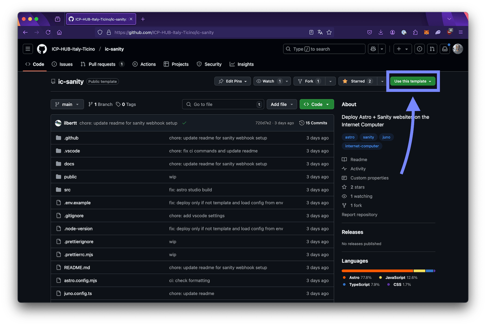
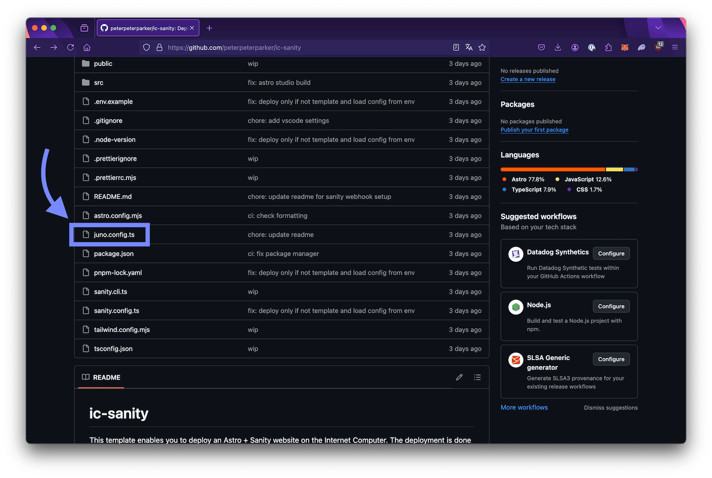
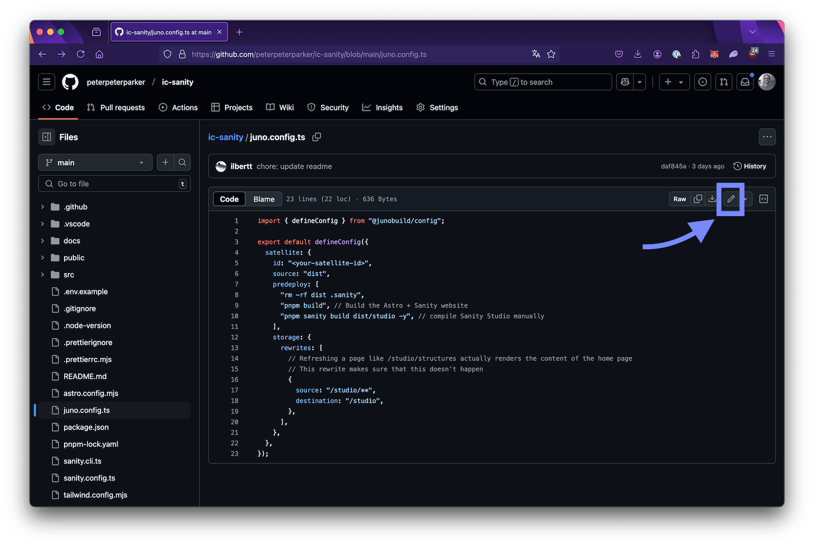
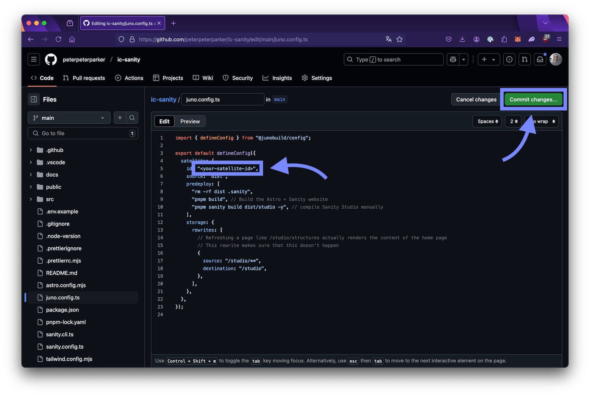

---

:::info TL;DR

Get started deploying on the Internet Computer using Sanity CMS and Juno with the help of this template: [ic-sanity](https://github.com/ICP-HUB-Italy-Ticino/ic-sanity).

:::

People have often been asking for ways to use CMS platforms on the Internet Computer, similar to WordPress or Wix. If you've been looking for an option, here’s one: a community-developed template that lets you deploy a Sanity CMS site with Astro using Juno.

---

## What is Sanity?

[Sanity](https://www.sanity.io/) provides a flexible, headless content management system that allows you to manage structured content. While its infrastructure operates on Web2, its editing interface, Sanity Studio, is open-source and allows to publish the generated content elsewhere.

---

## Why Deploy on the Internet Computer with Juno?

The [Internet Computer](https://internetcomputer.org/) (ICP) provides decentralized hosting, meaning your site isn't tied to traditional cloud providers. Juno simplifies the process of deploying to the IC without needing to worry about the underlying blockchain details.

Some benefits include:

- Data ownership without compromise.
- Pay only for what you use.
- No infrastructure management.
- Open source and transparent.

---

## About the Template

This template is brought to you by our friends at [ICP HUB Italy & Ticino](https://x.com/icphub_it), the Italian hub for Web3 education and acceleration on the Internet Computer.

This template combines [Astro](https://astro.build/), a lightweight framework best suited for websites, with Sanity CMS for content management. It's set up to work with Juno, making deployment straightforward.

### What’s Included:

- Astro + Sanity integration ready to go.

- GitHub Actions for automated deployment.

- Sanity webhooks to update content automatically.

- Hosting on the Internet Computer.

---

## Getting Started

The following steps have been designed to minimize the required technical know-how. However, if you are an experienced developer, feel free to follow your own workflow. The template's [README](https://github.com/ICP-HUB-Italy-Ticino/ic-sanity) provides more technical details on deploying with GitHub Actions or even without using the Juno CLI on your local machine.

Once you complete these setup steps, Sanity will be connected to your project and deployments will happen automatically. No further configuration will be required.

:::tip Prerequisites

You'll need a [GitHub](https://github.com) account.

:::

### 1. Fork the Template on GitHub

Go to the template [repository](https://github.com/ICP-HUB-Italy-Ticino/ic-sanity) on GitHub and click on **"Use this template"**, then select **"Create a new repository"** to get started.



You can use the default settings or choose the repository owner and provide a new repository name. Once done, click **"Create repository"** to finalize the process.

This will create your own repository, effectively setting up your project that connects Sanity CMS with Web3.

### 2. Create a Satellite

Head over to the Juno [Console](https://console.juno.build) and create a new Satellite. If you need assistance, refer to this [guide](/docs/create-a-satellite). Once the Satellite is created, copy the Satellite ID — you'll need it in the next step.

### 3. Configure the Satellite ID

The template is preconfigured, but your project needs to know where to deploy your website on the blockchain. To do this, navigate to your repository (the one created in step 1) and locate the `juno.config.ts` file.



Click on the file to open it, then click the pencil icon in the upper right corner to start editing.



Find the placeholder `<your-satellite-id>` and replace it with the Satellite ID you copied in the previous step. Once done, click **"Commit changes"**.



You'll be asked to confirm the changes—simply click **"Commit changes"** to finalize the update.

### 4. Grant GitHub Deployment Permissions

While your project now has a repository linked to your Satellite on chain, you still need to grant GitHub permission to push files to it. Naturally, not just anyone can deploy files 😉.

Follow this [guide](/docs/guides/github-actions#1-add-a-secret-token-for-automation) to create a controller with "Read+Write" scope and add a secret token for automation in your GitHub repository.

Once this step is complete, you're all set with the Juno and Web3 configuration. Your project is now ready to deploy content seamlessly.

### 5. Set Up Your Sanity Project

To manage your content, create a new project with a dataset on Sanity. Follow the official [Sanity guide](https://www.sanity.io/docs/getting-started-with-sanity) to set up your project.

Once the setup is complete, copy your **Project ID** and **Dataset name**, and configure these as GitHub Action variables by following this [guide](https://docs.github.com/en/actions/writing-workflows/choosing-what-your-workflow-does/store-information-in-variables#creating-configuration-variables-for-a-repository).

### 6. Set Up Sanity Deployments

To ensure your website updates automatically whenever you save content in Sanity, you now need to configure Sanity to trigger deployments on GitHub.

Unlike the previous steps where GitHub was configured to access an external service, here you will configure an external service—Sanity—to access GitHub.

To do this, you'll need to obtain a GitHub personal access token. Follow the guide [Authenticating with a personal access token](https://docs.github.com/en/rest/authentication/authenticating-to-the-rest-api?apiVersion=2022-11-28#authenticating-with-a-personal-access-token), and ensure you grant **Read and Write** permissions for [contents](https://docs.github.com/en/rest/authentication/permissions-required-for-fine-grained-personal-access-tokens?apiVersion=2022-11-28#repository-permissions-for-contents).

### 7. Create a Webhook in Sanity

Once you have generated the token, you can configure a webhook in Sanity to trigger deployments.

a. Go to the API settings** of your Sanity project and click on **+ Create webhook\*\*

b. Configure the webhook\*\* with the following settings:

- **Name**: Choose a descriptive name like _"Deploy Website on Juno"_
- **URL**: `https://api.github.com/repos/<your-github-username>/<your-repo>/dispatches`
- **Dataset**: Select the datasets you want to trigger the deployment on.
- **Trigger on**: Choose all available options: _Create_, _Update_, _Delete_
- **URL**: `https://<your-satellite-id>.icp0.io/.netlify/functions/sanity`
- **Projection**:

  ```json
  {
    "event_type": "website-deploy: sanity update"
  }
  ```

  The value in the `event_type` field can be customized and will appear as the workflow run name in the GitHub Actions section of your repository.

- **HTTP method**: POST
- **HTTP headers**:
  | Name | Value |
  | --- | --- |
  | `Content-Type` | `application/vnd.github+json` |
  | `Authorization` | `Bearer <your-github-token>` |
  | `X-GitHub-Api-Version` | `2022-11-28` (change this if needed) |

Leave all other fields empty or with default values.

c. Save the webhook.

### 8.You're All Set!

Once the webhook is saved, every time you publish content on Sanity, a deployment will be triggered and reflected in the GitHub Actions section of your repository 🥳.

---

### Need help?

If you encounter any issues while setting up your project or have questions, feel free to reach out to ICP HUB Italy & Ticino through one of their channels—they're more than happy to help!

- **X/Twitter:** [https://x.com/icphub_IT](https://x.com/icphub_IT)
- **Telegram:** [t.me/ICP_Italia](t.me/ICP_Italia)
- **Website:** [icpitalia.io](https://icpitalia.io)

---

### What's Next?

Now that your project is set up and ready to go, it's a good idea to take a couple of extra steps to ensure everything runs smoothly.

We recommend enabling [monitoring](/docs/management/monitoring) to keep your Satellite operational by automatically refilling cycles when they run low. This helps prevent unexpected downtime, allowing you to focus on building your website and growing your brand.

Additionally, transferring a small amount, such as 1-2 ICP, to your [wallet](/docs/miscellaneous/wallet) can be helpful to ensure the monitoring feature is able to generate cycles when needed.

Finally, when you launch your site, don't forget to tag [ICP HUB Italy & Ticino](https://x.com/icphub_IT) and [Juno](https://x.com/junobuild) in your announcement — we'll be happy to reshare it! 😃
