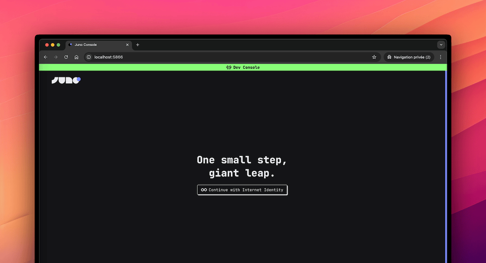

---

Until now, running a local project meant spinning up an emulator with just enough to build with a single default Satellite container for your app.

That worked. But it wasn’t the full picture.

With the latest changes, local development now mirrors the production environment much more closely. You don’t just get a simplified setup — you get the actual Console UI, orchestration logic, and almost a full infrastructure that behaves like the real thing.

This shift brings something most cloud serverless platforms don't offer: production-level parity, right on your machine.

---

## 🤔 Why This Matters

Local development isn’t just about getting things to run. It’s about understanding how your project behaves, how it scales, and how it integrates with the platform around it.

With this shift, you build with confidence that what works locally will work in production. You don’t need to guess how things will behave once deployed — you’re already working in an environment that mirrors it closely.

It also helps you gradually get familiar with the tools that matter, like the Console UI. You learn to use the same workflows, patterns, and orchestration logic that apply when your app goes live.

This removes a lot of friction when switching environments. There's less surprise, less debugging, and a lot more flow.

It’s local development, but it finally feels like the real thing.

---

## 📦 What’s Included

The new local environment is powered by the `junobuild/skylab` Docker image, now used by default in templates and tooling.

It brings together everything you need to build and test your project in a real setup:

- Console UI — the same interface used in production on https://console.juno.build

- More preinstalled services — including Internet Identity, ICP Ledger and Index, NNS Governance and Cycles minting (CMC)

- Live reload — serverless functions written in Rust or TypeScript automatically reload on change

- Orchestration logic — the flow of creating Satellites, managing configurations, and testing behaviors mirrors production

No custom scripts. No extra setup. Everything is handled by the tooling.

---

## 🧪 What About CI?

Not every project needs a UI.

That’s why the lightweight `junobuild/satellite` image still exists — and still works just as it always has. It’s ideal for CI pipelines, isolated app testing, or local startup when you don’t need the Console and more infrastructure.

This shift in approach isn’t a breaking change. It adds a new default, but doesn’t remove what was already there.

Looking ahead, there's an intention to simplify scripting even further by allowing Datastore and Storage definitions directly in the main `juno.config` file. The goal is to eventually phase out `juno.dev.config` and unify configuration — but that’s for the future.

For now, everything remains compatible. You choose what fits best.

---

## 🚀 How to Get Started

There are two ways to start using the new local environment — whether you’re beginning fresh or updating an existing project.

### 🆕 Starting from Scratch

Everything is already set up in the templates. Just run:

```bash
npm create juno@latest
```

This will scaffold your project with the latest configuration, using the `junobuild/skylab` image and the updated local workflow.

### 🔄 Migrating an Existing Project

If you already have a project configured for local development and want to switch to the new approach:

1. Update the CLI:

```bash
npm i -g @junobuild/cli
```

2. Remove your `juno.dev.config.ts` (or the JavaScript or JSON equivalent)

3. Update your `docker-compose.yml` to use the `junobuild/skylab` image (adjust paths as needed for your project):

```yaml
services:
  juno-skylab:
    image: junobuild/skylab:latest
    ports:
      # Local replica used to simulate execution
      - 5987:5987
      # Little admin server (e.g. to transfer ICP from the ledger)
      - 5999:5999
      # Console UI (like https://console.juno.build)
      - 5866:5866
    volumes:
      # Persistent volume to store internal state
      - juno_skylab:/juno/.juno
      # Your Juno configuration file.
      # Notably used to provide your development Satellite ID to the emulator.
      - ./juno.config.mjs:/juno/juno.config.mjs
      # Shared folder for deploying and hot-reloading serverless functions
      # For example, when building functions in TypeScript, the output `.mjs` files are placed here.
      # The container then bundles them into your Satellite WASM (also placed here),
      # and automatically upgrades the environment.
      - ./target/deploy:/juno/target/deploy/

volumes:
  juno_skylab:
```

That’s it — you’re good to go.

---

✅ Closing Thoughts

This shift removes a lot of friction between idea and execution.

You build in the same structure, use the same tools, and follow the same workflows you'd use in production — but locally, and instantly.

Local development finally feels like you're already in production, just without the pressure.

---

Stay connected with Juno by following us on [X/Twitter](https://twitter.com/junobuild).

Reach out on [Discord](https://discord.gg/wHZ57Z2RAG) or [OpenChat](https://oc.app/community/vxgpi-nqaaa-aaaar-ar4lq-cai/?ref=xanzv-uaaaa-aaaaf-aneba-cai) for any questions.

⭐️⭐️⭐️ stars are also much appreciated: visit the [GitHub repo](https://github.com/junobuild/juno) and show your support!
