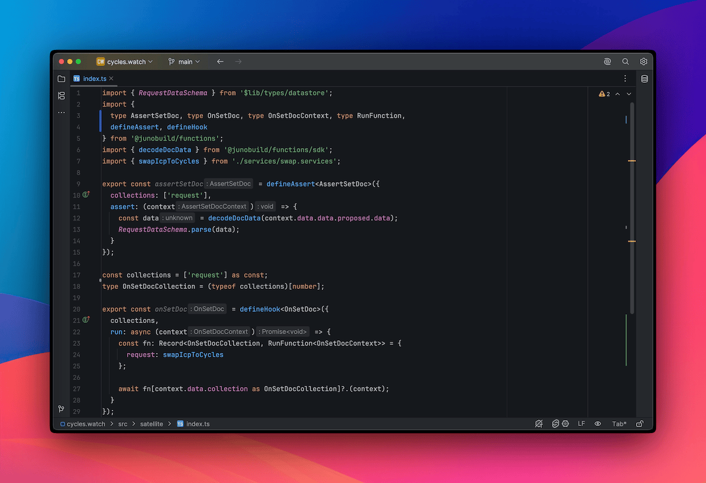
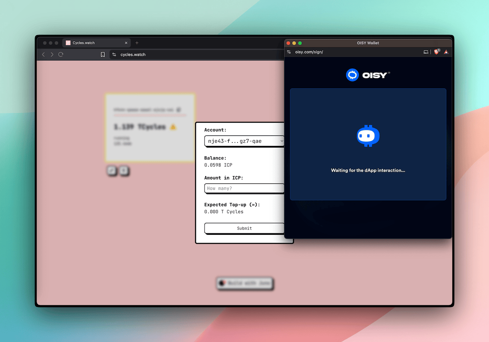

---

One of the goals with Juno has always been to make building decentralized, secure apps feel like something you're already used to. No weird mental models. No boilerplate-heavy magic. Just code that does what you expect, without touching infrastructure.

And with this release, we're taking another step in that direction:
You can now write **serverless functions in TypeScript**.

If you're a JavaScript developer, you can define backend behavior right inside your container. It runs in a secure, isolated environment with access to the same hooks and assertions you'd use in a typical Juno Satellite.

No need to manage infrastructure. No need to deploy a separate service. Just write a function, and Juno takes care of the rest.

Cherry on top: the structure mirrors the Rust implementation, so everything from lifecycle to data handling feels consistent. Switching between the two, or migrating later, is smooth and intuitive.

---

## ✨ Why TypeScript?

Rust is still the best choice for performance-heavy apps. That's not changing.

But let's be real: sometimes you just want to ship something quickly. Maybe it's a prototype. Maybe it's a feature you want to test in production. Or maybe you just want to stay in the JavaScript world because it's what you know best.

Now you can.

You get most of the same tools, like:

- Hooks that react to document or asset events (`onSetDoc`, `onDeleteAsset`, etc.)
- Assertions to validate operations (`assertSetDoc`, etc.)
- Utility functions to handle documents, storage, and even call other canisters on ICP

The JavaScript runtime is intentionally lightweight. While it doesn't include full Node.js support, we're adding polyfills gradually based on real-world needs. Things like `console.log`, `TextEncoder`, `Blob`, and even `Math.random` — already covered.

---

## 🔁 Designed for Interop

The approach to writing serverless functions in Rust and TypeScript is aligned by design. That means if you outgrow your TS functions, migrating to Rust won't feel like starting from scratch. The APIs, structure, and flow all carry over.

Start scrappy, scale gracefully.

---

## 👀 A Taste of It

Here's how simple it is to react to a document being created or updated:

```typescript
import { defineHook, type OnSetDoc } from "@junobuild/functions";

export const onSetDoc = defineHook<OnSetDoc>({
  collections: ["posts"],
  run: async (context) => {
    const data = context.data.data.after.data;
    console.log("New post created:", data);
  }
});
```

And here's for example how you'd validate a document before accepting it — using Zod for a clean, readable schema:

```typescript
import { z } from "zod";
import { defineAssert, type AssertSetDoc } from "@junobuild/functions";
import { decodeDocData } from "@junobuild/functions/sdk";

const postSchema = z.object({
  title: z.string().min(5, "Title must be at least 5 characters long")
});

export const assertSetDoc = defineAssert<AssertSetDoc>({
  collections: ["posts"],
  assert: (context) => {
    const data = decodeDocData(context.data.data.proposed.data);
    postSchema.parse(data);
  }
});
```

That's it. No APIs to expose, no infra to manage. Just code that runs where your data lives.

---

## 🖥️ Local-First Development

Alongside TypeScript support, we've rethought the local development experience.

Instead of providing a partial local environment, the mindset shifted to mimicking production as closely as possible.

You still get a self-contained image with your Satellite, but now you also get the full Console UI included. That means you can manage and test your project locally just like you would on mainnet.

See this other [blog post](/blog/a-production-like-local-dev-environment) for all the details.

---

## 🧰 Zero Tooling, Just Code

Here's the beautiful part: even though your serverless functions are written in TypeScript, they're bundled and embedded into a Satellite module that's still compiled in Rust behind the scenes.

But you don't need to install Rust. Or Cargo. Or ic-wasm. Or anything that feels complicated or overly specific.

All you need is Node.js and Docker. The container takes care of the rest: building, bundling, embedding metadata and gives you a ready-to-run Satellite that runs locally and is ready to deploy to production.

In short: just code your functions. The container does the heavy lifting.

---

## 📡 Already in the Wild

This isn’t just a feature announcement — serverless functions in TypeScript are already live and powering real functionality.

I used them to build the ICP-to-cycles swap on [cycles.watch](https://cycles.watch), including all the backend logic and assertions. The whole process was documented over a few livestreams, from setup to deployment.

If you're curious, the code is on [GitHub](github.com/peterpeterparker/cycles.watch/), and there’s a [playlist on YouTube](https://www.youtube.com/watch?v=dtcQVwh4wCA&list=PLfZci1pMwtjJsd0sacU1iWA1rPxhn8iV0) if you want to follow along and see how it all came together.



---

## ▶️ Try It Out

We've put together [docs](/docs/build/functions/) and [guides](/docs/guides/typescript) to help you get started. If you're already using the Juno CLI, you're just one `juno dev eject` away from writing your first function or start fresh with `npm create juno@latest`.

To infinite and beyond,<br/>
David

---

Stay connected with Juno by following us on [X/Twitter](https://twitter.com/junobuild).

Reach out on [Discord](https://discord.gg/wHZ57Z2RAG) or [OpenChat](https://oc.app/community/vxgpi-nqaaa-aaaar-ar4lq-cai/?ref=xanzv-uaaaa-aaaaf-aneba-cai) for any questions.

⭐️⭐️⭐️ stars are also much appreciated: visit the [GitHub repo](https://github.com/junobuild/juno) and show your support!
