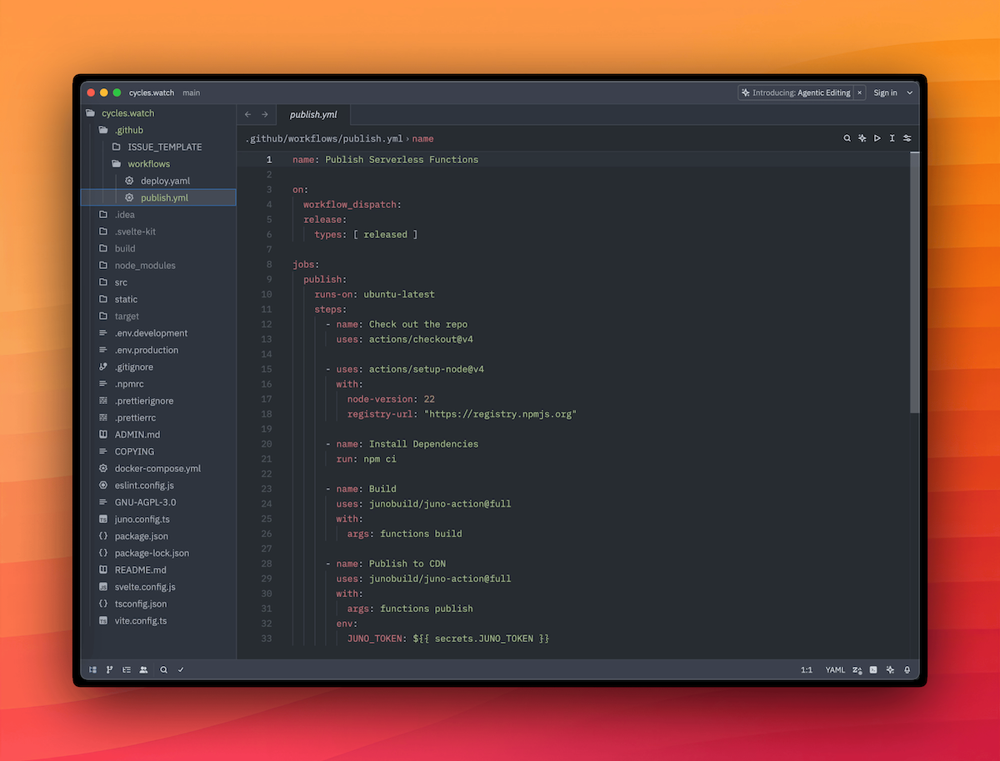

---

One of the principles that shaped Juno from day one was the idea of building apps with full ownership — no hidden infrastructure, no opaque servers.

No hypocrisy either.

If developers are encouraged to deploy code in containers they control, it feels inconsistent to rely on centralized infrastructure — like AWS or other Web2 cloud providers — to manage deployment pipelines or run the platform. With the exception of email notifications, Juno currently runs entirely on the Internet Computer — and that's a deliberate choice.

That doesn't mean being stubborn for the sake of it. It just means trying to push things forward without falling back on the old way unless absolutely necessary.

At the same time, developer experience matters — a lot. It shouldn't take a degree in DevOps to ship a backend function. Developers who would typically reach for a serverless option should be able to do so here too. And for those who prefer to stay local, it shouldn't feel like a downgrade — no one should be forced into CI automation if they don't want to.

That's why the new GitHub Actions for serverless functions are now generally available — for those who want automation, not obligation.

---

## 🚀 Automated Deployments, No Compromise

With the latest release, it's now possible to:

- Build serverless functions written in TypeScript or Rust
- Automatically publish them to a Satellite
- Optionally propose or directly apply upgrades

All within a GitHub Actions workflow. No manual builds, no extra setup — just code, commit, and push.

This makes it easier to fit Juno into an existing CI/CD pipeline or start a new one from scratch. The logic is bundled, metadata is embedded, and the container is ready to run.

---

## 🔐 What About Security?

You might ask yourself: _"But what about the risk of giving CI full control over my infrastructure?"_

That's where the improved access key (previously named _"Controllers"_) roles come in.

Instead of handing over the master key, you give CI just enough access to do its job — and nothing more.

Here's how the roles break down in plain terms:

- **Administrator** – Full control. Can deploy, upgrade, stop, or delete any module. Powerful, but risky for automation. Might be useful if you're spinning up test environments frequently.

- **Editor** (Write) – Ideal for CI pipelines that deploy frontend assets or publish serverless functions. Can't upgrade those or stop and delete modules. A good default.

- **Submitter** 🆕 – The safest option. Can propose changes but not apply them. Someone still needs to review and approve in the Console or CLI. No surprises, no accidents.

Use Editor for most CI tasks — it gives you automation without opening the blast radius.

Prefer an extra layer of review? Go with Submitter and keep a human in the loop.

---

## 🧰 Local or CI: Your Choice

Nothing changes in the approach for developers who prefer local development. The CLI remains a first-class tool for building and deploying.

All the new capabilities — from publishing functions to proposing or applying upgrades — are available not just in GitHub Actions or the Console UI, but also fully supported in the CLI.

In fact, the CLI has been improved with a neat addition: you can now append `--mode development` to interact with the emulator. This allows you to fully mimic production behavior while developing locally. And of course, you can also use any mode to target any environment.

```bash
juno functions upgrade --mode staging
juno deploy --mode development
```

---

## 🛰️ Satellite's CDN

While building serverless functions was never an issue, enabling GitHub Actions to publish and deploy without giving away full control introduced a challenge. How do you let CI push code without handing it the keys to everything?

That's where the idea of a sort of CDN came in.

Each Satellite now has a reserved collection called `#_juno/releases`. It's like a staging area where CI can submit new WASM containers or frontend assets. If the access key has enough privileges, the submission is deployed right away. If not, it's stored as a pending change — waiting for someone to approve it manually via the Console or CLI.

This builds on the change-based workflow that was added to the Console last year. Funny enough, it brought the Console so close to being a Satellite itself that it became… basically a meta example of what you can build with Juno.

And here's the cherry on top: because there's now a CDN tracking versions, developers can rollback or switch between different function versions more easily. A new CDN tab in the Console UI (under Functions) gives you access to all past versions and history.

---

## 🖼️ Frontend Deployments, Too

Frontend deployment now benefits from the same change-based workflow. By default, when you run `juno deploy` or trigger a GitHub Action, the assets are submitted as pending changes — and applied automatically (if the access key allows it).

Want to skip that workflow? You still can. The immediate deployment path remains available — handy if something fails, or if you just prefer to keep things simple.

---

## 🛠️ GitHub Actions for Serverless Functions

Alright, enough chit-chat — here's how to publish your serverless functions on every push to main, straight from CI:

```yaml title="publish.yml"
name: Publish Serverless Functions

on:
  workflow_dispatch:
  push:
    branches: [main]

jobs:
  publish:
    runs-on: ubuntu-latest
    steps:
      - name: Check out the repo
        uses: actions/checkout@v4

      - uses: actions/setup-node@v4
        with:
          node-version: 22
          registry-url: "https://registry.npmjs.org"

      - name: Install Dependencies
        run: npm ci

      - name: Build
        uses: junobuild/juno-action@full
        with:
          args: functions build

      - name: Publish
        uses: junobuild/juno-action@full
        with:
          args: functions publish
        env:
          JUNO_TOKEN: ${{ secrets.JUNO_TOKEN }}
```

---

## 🌸 One Action, Two Flavors

Noticed the `@full` in the previous step?

That's because the GitHub Action now comes in two flavors:

- `junobuild/juno-action` or `junobuild/juno-action@slim` – perfect for common use cases like deploying frontend assets or running simpler CLI tasks. No serverless build dependencies included, so it's faster and more "lightweight" (relatively, it still uses Docker underneath...).

- `junobuild/juno-action@full` – includes everything you need to build and publish serverless functions, with Rust and TypeScript support. It's heavier, but it does the job end to end.

The right tool for the right job. Pick what fits.

---

## 🧭 Where This Is Going

This release isn't just about smoother deployments — it's a step toward making Juno feel like real infrastructure. Though, what is “real infrastructure” anyway? Whatever it is, this one doesn't come with the usual baggage.

Developers get to choose **how** they ship — locally or through CI. They get to decide **what** gets deployed and **who** can do it. They're not **forced** to rely on some big tech platform for their infra if they don't want to. And thanks to the new CDN and access control model, fast iteration and tight control can finally go hand in hand.

If you've been waiting for a way to ship backend logic without giving up on decentralization — or if you just like things working smoothly — this one's for you.

Go ahead.
Build it.
Push it.
Submit it.
Ship it.

To infinity and beyond,  
David
