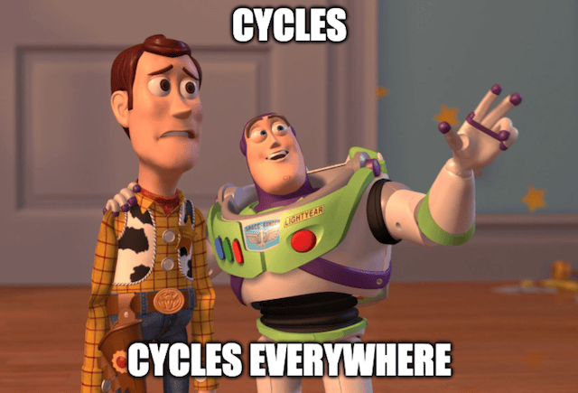

Happy New Year 🥳

We're kicking off 2026 with a major [release](https://github.com/junobuild/juno/releases/tag/v0.0.63) that ships significant changes in the architecture and design of the Juno Console with a single goal: making the DX more straightforward and comprehensive.

---

## Mission Control and Monitoring merged

Mission Control was originally designed as a dedicated control center for developers — a place to create and manage projects (Satellites) and analytics (Orbiters). Over time, it was also extended to include Monitoring.

The original idea was simple: the Console would only know a developer's identity and their Mission Control ID — nothing else.

While this approach had advantages, it also introduced significant drawbacks.

On every new sign-up, the Console had to automatically create a Mission Control. This meant that when a developer signed in and created their first (free) project, Juno had to provision **two containers instead of one**, increasing infrastructure costs.

It also led to a confusing user experience. Mission Control could not be hidden from the UI because modules must be provisioned with resources (cycles) to avoid being decommissioned. As a result, it was always visible, and many developers were unsure what Mission Control was or why it existed.

For these reasons, Mission Control and Monitoring have now been merged:

- A Mission Control is created **only when a developer explicitly enables Monitoring**
- Monitoring is now treated as a dedicated microservice

This architectural change brings clear benefits:

- **For developers:** a clearer, more straightforward experience and simpler long-term maintenance
- **For Juno:** acquisition costs for new developers are effectively cut in half

There are a few trade-offs to note:

- The Juno Console now keeps track of all containers created by developers (Satellites, Orbiters, and Mission Controls), whereas previously it only knew the Mission Control ID.
- When Monitoring is enabled, module metadata must be duplicated inside the Mission Control so it knows what to monitor. This introduces a risk of inconsistencies if a bug causes a mismatch between the Console and Monitoring data. To mitigate this, a Console feature is planned to compare and verify this information.

---

## Deprecate ICP, use only Cycles

Over the past year, I've been refining both the platform and its communication to reinforce Juno's vision: a platform to build, deploy, and run applications in WASM containers, with ownership and zero DevOps.

As part of this effort, I've aimed to remove all blockchain and crypto-slangs.

While merging Mission Control and Monitoring, a new wallet ID - derived from the developer's sign-in - had to be introduced.

During this work, it became really clear again that the onboarding for new developers was just confusing:

> Why do I need ICP to get cycles?

Since this release already introduced breaking changes, it felt like the right moment to simplify the model further.

As a result, **ICP is now deprecated in favor of using cycles only**.

This significantly simplifies the user journey:

- You start using Juno for free
- You learn about cycles as the resource that powers your containers and services
- When you need more resources or want to spin up additional modules, you acquire cycles

To support this, the primary call to action for acquiring cycles now points to [cycle.express](https://cycle.express), which allows developers to convert dollars directly into cycles. Third-party wallets like [OISY](https://oisy.com) remain supported, but are now positioned as secondary options for users already familiar with them.

Together with the other changes in this release, this should make both the developer experience and the mental model of how Juno works much more approachable.

---

## Price increase

Previously, creating new Satellites or Orbiters cost 0.4 ICP. In practice, this was undervalued: each module is provisioned with 1.5 T cycles, while 0.4 ICP corresponds to roughly 0.93 T cycles—effectively a significant bonus.

Going forward:

- Additional Satellites and Orbiters cost 3 T cycles (roughly $4).
- Enabling Monitoring (which spins up a Mission Control) requires the same fee.

:::note

See the [Pricing](/docs/pricing) documentation for more details.

:::

---

I believe these changes represent a significant step forward in making Juno more accessible and easier to understand. Whether you're just getting started or have been with us for a while, I hope these improvements make your development experience that much better.

To infinity and beyond David
