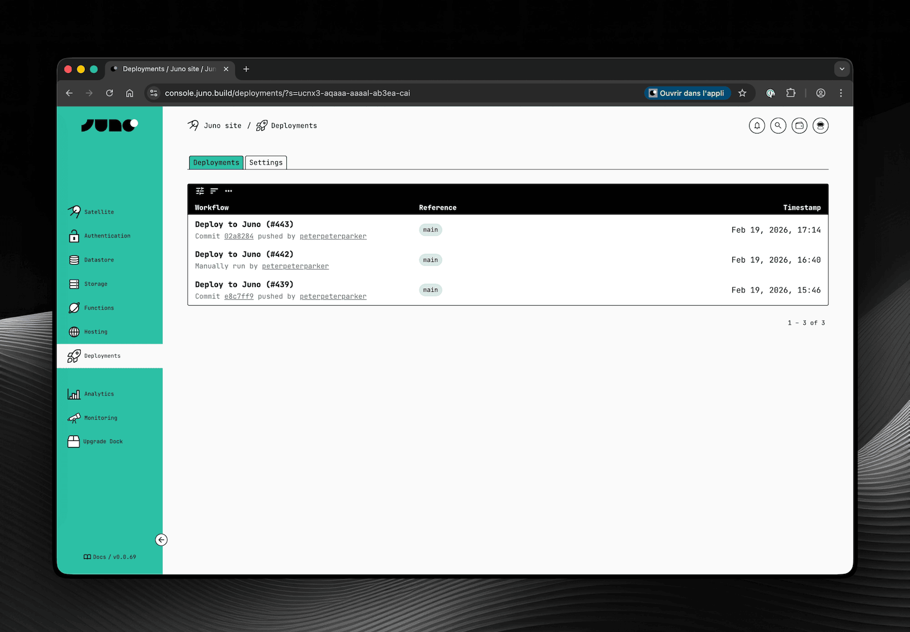

Like it or not, GitHub is where most developers already live - it's where code is written, reviewed, and shipped with or without AI. So rather than asking you to adapt your workflow to Juno, I've been working on bringing Juno closer to yours.

Two new features ship in that direction: a new recommended approach for automating deployments via GitHub Actions, and support for GitHub authentication in your applications 🚀.

---

## Automation Without Secrets

Until now, setting up GitHub Actions to deploy your frontend or publish serverless functions required storing a `JUNO_TOKEN` in your GitHub secrets. It worked, but it came with the usual headaches, tokens to generate, rotate, and keep out of the wrong hands.

The new recommended approach uses OpenID Connect (OIDC). Instead of a static token, GitHub and your Satellite establish a trust relationship, and each workflow run gets short-lived credentials (access keys) automatically. Once the run is done, the credentials are gone.

No tokens to rotate. No secrets to manage. And if a workflow is ever compromised, there's nothing long-lived to steal.

To support this, a new **Deployments** screen has been added to the Console. This is where you configure which repositories are allowed to deploy to your Satellite and where you can review past deployments.

:::tip

Obviously and as always, you can also configure the same options with your CLI if you prefer.

:::

👉 [Documentation](/docs/guides/github-actions/)

---

## GitHub Authentication

You can now add GitHub authentication to your application, letting your users sign in with their GitHub account, a natural fit for developer-facing apps.

Unlike other providers, GitHub does not natively support OpenID Connect. That's why this authentication requires a small proxy that handles the OAuth exchange securely to avoid exposing a client secret directly within your Satellite.

Juno provides an open-source API for this: [github.com/junobuild/api](https://github.com/junobuild/api). You self-host it, point your configuration to it, and from there the flow is straightforward, the user signs in, the proxy issues a JWT, your Satellite verifies it, and a session is created.

One thing to be aware of though: because the proxy signs JWTs with RSA keys, your Satellite needs access to those public keys to verify them. Rather than having each Satellite make HTTPS outcalls to your proxy on every request, Juno uses a shared infrastructure module called Observatory to fetch and cache those keys. Since you're self-hosting the proxy, you'll also need to deploy your own Observatory instance and configure it to point to your proxy's JWKS endpoint.

It's a bit tricky to set up but worth the effort if you're targeting developers. Reach out if you have questions, always happy to help!

👉 [Documentation](/docs/build/authentication/github)

---

One could argue that instead of improving the integration with GitHub, I should spin up custom infrastructure and provide the entire CI/CD for building and deploying. I wouldn't disagree. If the goal were to compete with cloud providers like AWS, Vercel, you name it, that would probably be the path. But devops is not really my thing, and that would be quite an effort both in terms of development and maintenance for the sole developer I am, who already takes care of a gigantic codebase 😅. Maybe someday, but honestly it feels unlikely as I doubt Juno will ever become a company.

Until then, I think this is a great step in the right direction - a tighter integration between Juno and the tools you already use day to day. Hope you find it useful too!

To infinity and beyond David
