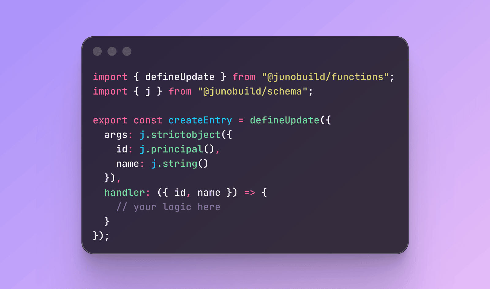

The idea behind Juno's serverless functions is that you should be able to write them in either Rust or TypeScript following the same pattern and mental model. Parts of those, hooks, have been available in TypeScript for a while and are handy for reacting to events. But developers also often want to define their own functions, akin to adding custom endpoints to an HTTP API. That wasn't supported in TypeScript, until now 🚀.

---

## Custom Functions

Custom functions let you define callable endpoints directly inside your Satellite, which can be explicitly invoked from your frontend or from other services.

There are two kinds.

A **query** is read-only. It returns data without touching any state, and it's fast. Use it when you just need to fetch something.

An **update** can read and write. Use it when your logic needs to persist data, trigger side effects, or when you need an absolute tamper-proof guarantee on the result.

```typescript
import { defineQuery } from "@junobuild/functions";

export const ping = defineQuery({
  handler: () => "pong"
});
```

The functions can be described with optional arguments and results. They are strongly typed both at runtime and at build time thanks to a new type system, and their handlers can be synchronous or asynchronous.

```typescript
import { defineUpdate } from "@junobuild/functions";
import { j } from "@junobuild/schema";

const ArgsSchema = j.strictObject({
  name: j.string()
});

const ResultSchema = j.strictObject({
  message: j.string()
});

export const myUpdate = defineUpdate({
  args: ArgsSchema,
  result: ResultSchema,
  handler: async ({ name }) => {
    // your logic here
    return { message: `Saved ${name}.` };
  }
});
```

---

## Auto-generated Bindings

Another part that makes this genuinely fun to use: when you build your project, a type-safe client API is automatically generated based on your function definitions. No glue code, no manual wiring, no thinking about serialization. Your functions are simply available through the `functions` namespace.

```typescript
import { functions } from "../declarations/satellite/satellite.api.ts";

await functions.ping();
await functions.myUpdate({ name: "David" });
```

Define the shape on the backend, call it from the frontend with full type safety. That's it.

---

## Schema Types

Arguments and return types are optional, but when you need them, Juno provides a type system built on top of [Zod](https://zod.dev) to let you define their shapes.

```typescript
import { j } from "@junobuild/schema";
```

Those schemas are validated at runtime and used at build time to generate all the necessary bindings. You define the shape once, you get safety everywhere.

```typescript
const Schema = j.strictObject({
  name: j.string(),
  age: j.number()
});
```

Since you will likely need some environment-specific types, `j` extends Zod with `j.principal()` and `j.uint8array()`.

```typescript
const Schema = j.strictObject({
  owner: j.principal(),
  data: j.uint8array()
});
```

And when your function needs to handle multiple distinct input shapes, reach for `discriminatedUnion`:

```typescript
import { defineUpdate } from "@junobuild/functions";
import { j } from "@junobuild/schema";

const Schema = j.discriminatedUnion("type", [
  j.strictObject({ type: j.literal("cat"), indoor: j.boolean() }),
  j.strictObject({ type: j.literal("dog"), breed: j.string() })
]);

export const registerPet = defineUpdate({
  args: Schema,
  handler: ({ args }) => {
    if (args.type === "cat") {
      // handle cat
    } else {
      // handle dog
    }
  }
});
```

Long story short, `j` is Zod with a few extras and everything you need to strongly type your functions.

---

## References

Following sections of the documentation have been updated:

- [Development](/docs/build/functions/development/)
- [Guides](/docs/guides/typescript)
- [References (SDK, schema, etc.)](/docs/reference/functions/typescript)

---

I'm genuinely excited about these improvements and can totally see myself not using Rust for writing serverless functions in most of my projects in a near future. Not entirely there yet, HTTPS outcalls support in TypeScript is still coming, but getting there.

To infinity and beyond<br />David
