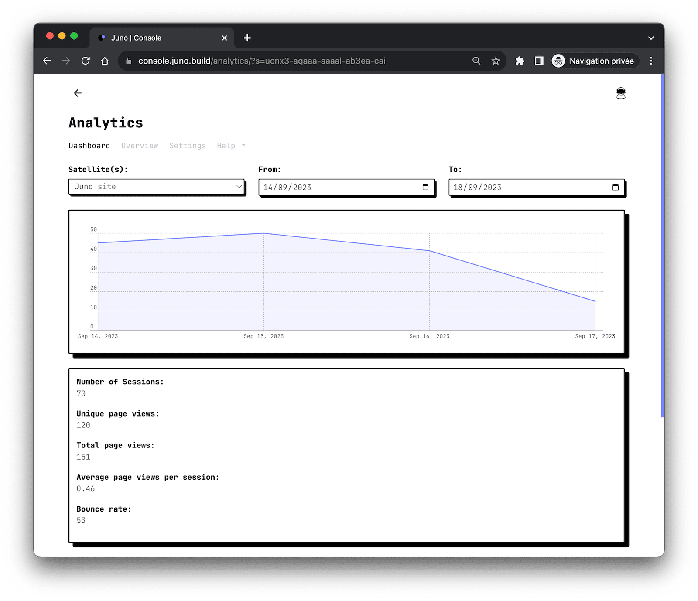

# Analytics

Juno Analytics, a simple, performant, and open-source web3 analytics solution that respects your users' privacy and doesn't use cookies, ensuring anonymity while providing valuable user insights.



---

## Features

Juno Analytics offers several advantages for developers:

### No cookie banners required

Just like all of Juno's features, Analytics prioritizes privacy. It conducts dapp and site measurements entirely anonymously, without using cookies or collecting personal data. There are no persistent identifiers, cross-site tracking, or cross-device tracking. Your analytics data is not used for any other purposes.

### Performance-Optimized Script

Juno's JavaScript library for statistics is optimized for performance. It consists of a minimal main script that seamlessly integrates with your application's UI and a dedicated worker responsible for handling logic and cryptography. This design ensures that adding analytics won't impact your application's performance, including its boot time, and per extension preserving your customer acquisition rate.

### Track goal conversions and campaigns

Beyond standard page views, you can gain valuable insights into your visitors by creating custom events to track conversions and attribution.

### Gather and aggregate performance metrics

In addition to tracking user interactions, the Analytics can also automatically collect key performance metrics using [Web Vitals](https://web.dev/articles/vitals). These metrics are essential for measuring user experience accurately, aligning with how they are captured by Chrome and reported to other Google tools. This enhancement is valuable for developers aiming to optimize the UI performance of their applications, ensuring a smoother and more responsive user experience.

### Transparent and fully open source

Juno is fully open source, including all its Analytics features, setting it apart from proprietary tools like Google Analytics.

Furthermore, unlike any other analytics alternative or solution, Juno's long-term vision is to evolve into a decentralized organization (DAO), embracing a new paradigm in the analytics industry.

---

## Considerations

In deploying Juno Analytics, it's important to understand various aspects that can affect its use and compliance.

### GDPR and PECR compliance

Juno Analytics refrains from generating persistent identifiers. Temporary anonymous data is stored in IndexedDB until it is synchronized with the smart contract. It employs a random unique string to calculate unique visitor sessions on a website with each new visit.

While we are not legal experts and the responsibility for adding analytics to your project ultimately rests with you, the above approach aligns our analytics with various cookie laws and privacy regulations, including GDPR and PECR.

### Hosted on the blockchain

All tracked data is securely stored on the blockchain without any specific geolocation. Currently, Analytics is not guaranteed to be located in Europe.

### No cross-dapp tracking

Juno Analytics does not follow users across websites and applications they visit. All data remains isolated to a single satellite.

### You 100% own your data

As with all services provided by Juno, you are the sole controller of your smart contracts, and your data belongs exclusively to you.

You have the capability to delete all collected data within your Analytics at any time by utilizing the [CLI] to reset your smart contract.

---

## How does it work?

To gather analytics for your dapps, you need to create an [orbiter]. Creating an Orbiter requires ICP, and its price is defined in the [transaction costs](../pricing#transaction-costs).

Each orbiter is used to collect analytics for one or multiple [satellites].

Page views are collected anonymously and saved with a unique random ID for attribution. This data is organized based on its collection timestamp.

You can also collect custom tracking events, which are organized in the same manner.

Additionally, a unique random session ID is generated for all data. Each time a visitor visits your dapps, a new session is created.

---

## Limitation

Currently, an orbiter can store up to 400 GB of data.

:::caution

Similar to other analytics services in the Web2 environment, an Orbiter accepts data submitted from any source as long as the requested payload matches the expected format, and the targeted satellite is configured to accept analytics. This is because the origin of the HTTP request cannot be accessed, for a valid reason – to prevent tracking. Therefore, calls cannot be limited to the domain of your dapps.

Consequently, this leaves the canister open to potential attacks that can pollute the data and consume cycles. For this reason, we recommend the following:

1. Avoid topping up the smart contract with excessive cycles; instead, adopt a lean approach.
2. Utilize the [monitoring](../miscellaneous/monitoring.md) feature to stay informed about the status.
3. Interpret the statistics provided by this feature with some reservation, similar to any other analytics data, considering potential inaccuracies.

:::

---

## Getting started

Before integrating Juno Analytics into your app or website, you need to create an orbiter. Here's a step-by-step guide to help you get started:

1. Sign in to the Juno [console](https://console.juno.build).
2. Navigate to "Analytics" in the astronaut entry menu at the top right of your screen.
3. Click on **Get started**
4. Confirm by selecting **Create analytics**

The platform will then create your orbiter smart contract and provision its resources. Once the process is complete, click "Close" to terminate the creation wizard.

At this point, you have successfully created the analytics; however, you have not yet listed which satellites are eligible to track page views and events.

5. To complete the configuration, proceed to the Analytics/**Settings** page to configure them.

## Install the SDK and initialize the Orbiter

To start using Juno Analytics, follow these steps:

1. Install Juno's analytics library using npm:

```bash
npm i @junobuild/analytics
```

2. Initialize the orbiter in your web app or website:

If you are using the [Next.js](../miscellaneous/plugins.md#nextjs-plugin) or [Vite](../miscellaneous/plugins.md#vite-plugin) plugins, simply initialize the orbiter in your application, preferably as soon as possible when your app starts.

```typescript
import { initOrbiter } from "@junobuild/analytics";

await initOrbiter();
```

If you are not using the plugins, you will also need to provide the `satelliteId` and `orbiterId` manually as configuration.

```typescript
import { initOrbiter } from "@junobuild/analytics";

// TODO: Replace the following satelliteId and orbiterId with the effective ID.
await initOrbiter({
  satelliteId: "aaaaa-bbbbb-ccccc-ddddd-cai",
  orbiterId: "eeeee-fffff-ddddd-11111-cai"
});
```

3. Copy the pre-packaged web worker provided by the library to your `public` or `static` folder, where your project's static assets are located.

- You can achieve this by adding a post-install script to your `package.json`. Here's an example of an inline command:

```json
{
  "scripts": {
    "postinstall": "node -e \"require('fs').cpSync('node_modules/@junobuild/analytics/dist/workers/', './static/workers', {recursive: true});\""
  }
}
```

- Alternatively, you can create a script, e.g., `copy-juno-workers.mjs`, at the root of your project with the following code:

```javascript
import { cp } from "node:fs";
import { extname } from "node:path";

await cp(
  "node_modules/@junobuild/analytics/dist/workers/",
  "./static/workers",
  {
    recursive: true
  },
  (err) => {
    if (err === null) {
      return;
    }

    console.error(err);
  }
);
```

Finally, add a command to your `package.json` that executes the script:

```json
{
  "scripts": {
    "postinstall": "node ./scripts/copy-juno-workers.mjs"
  }
}
```

4. Once configured, run `npm run postinstall` manually to trigger the initial copy. Every time you run `npm ci`, the post-install target will execute, ensuring the worker is copied.

:::info

- The above example assumes that `/static` is the folder holding your static assets (e.g., images, favicons, etc.). Adjust the path according to your application. For example with React, the static folder might sometimes be called `/public`.

- If you prefer to specify a custom path for the worker, you can use the `initOrbiter` function with the additional parameter `{worker?: {path?: string}}` for this purpose.

:::

---

## Page views

Page views, such as when a visitor opens your website or navigates to a subpage, are automatically tracked once you have configured, initialized, and deployed your application with the analytics module.

There's **no need** for additional development work!

---

## Track custom events

Custom events can be tracked using the `trackEvent` function. You need to provide a `name` for the event, and you can include up to 10 custom `metadata` fields.

:::note

This is an option. As explained in the previous chapter, the library will take care of gathering insightful anonymous data as soon as it is configured and initialized.

Custom events are useful if you want to take an extra step and collect your own specific information.

:::

Here's an example of how to use it:

```javascript
import { trackEvent } from "@junobuild/analytics";

await trackEvent({
  name: "Your custom event",
  metadata: {
    your_key: "A value",
    your_other_key: "Another value"
  }
});
```

This allows you to track specific events and gather data relevant to your application.

:::note

For scalability and optimization reasons, the data collected must adhere to certain rules, particularly regarding their length. For instance, a randomly generated key should not exceed 36 bytes in length.

For detailed information about these rules, please refer to Juno's GitHub [repository](https://github.com/junobuild/juno).

:::

---

## Performance Metrics with Web Vitals

Juno Analytics also tracks performance metrics using [Web Vitals](https://github.com/GoogleChrome/web-vitals) with no additional setup required. Once you configure and initialize the orbiter, these metrics are automatically collected, providing valuable insights into your application's performance.

### Key Metrics

The following Web Vitals are tracked:

- **Time to First Byte <small>(TTFB)</small>**: Measures the time it takes for the first byte of data to reach the user's browser, indicating server responsiveness.
- **First Contentful Paint <small>(FCP)</small>**: Marks the time when the first piece of content is rendered, helping assess initial loading speed.
- **Largest Contentful Paint <small>(LCP)</small>**: Tracks the time when the largest content element becomes visible, indicating when the main content is likely fully loaded.
- **Cumulative Layout Shift <small>(CLS)</small>**: Quantifies unexpected layout shifts during loading, reflecting visual stability.
- **Interaction to Next Paint <small>(INP)</small>**: Measures the latency of interactions, such as clicks, to evaluate application responsiveness.

### Opting Out

While these metrics are gathered automatically, developers have the option to opt out during the initialization of the Orbiter. To opt out, simply modify the `initOrbiter` function. If you choose to opt out, the Web Vitals library will not be loaded, ensuring that no additional resources are used.

Here's an example of how to opt out:

```typescript
import { initOrbiter } from "@junobuild/analytics";

await initOrbiter({
  satelliteId: "aaaaa-bbbbb-ccccc-ddddd-cai",
  orbiterId: "eeeee-fffff-ddddd-11111-cai",
  options: {
    performance: false
  }
});
```

[CLI]: ../miscellaneous/cli.md
[satellites]: ../terminology.md#satellite
[orbiter]: ../terminology.md#orbiter
[controllers]: ../terminology.md#controller
