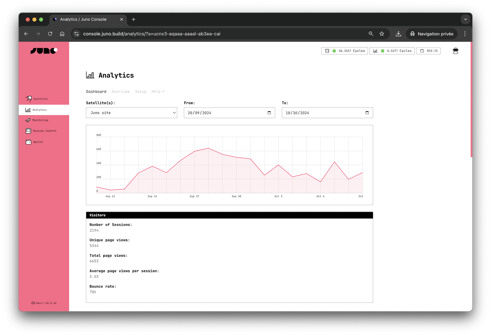

# Analytics

Juno Analytics, a simple, performant, and open-source analytics solution that respects your users' privacy and doesn't use cookies, ensuring anonymity while providing valuable user insights.

---

## Features

Juno Analytics offers several advantages for developers:

### 🍪 No Cookie Banners Needed

Just like all of Juno's features, Analytics prioritizes privacy. It conducts dapp and site measurements entirely anonymously, without using cookies or collecting personal data. There are no persistent identifiers, cross-site tracking, or cross-device tracking. Your analytics data is not used for any other purposes.

### ⚡️ Tiny & Blazing Fast

Juno’s analytics library is built for speed and simplicity. It’s a tiny JavaScript snippet (under 3KB gzipped) that integrates seamlessly with your application’s UI without affecting performance or boot time. This lightweight design ensures that analytics tracking won’t interfere with your user experience or your conversion rates.

### 🎯 Track What Matters

Beyond standard page views, you can gain valuable insights into your visitors by creating custom events to track conversions and attribution.

### 📣 Understand Campaign Performance

Measure the impact of your campaigns using `utm` parameters. See how people find your app — whether through ads, newsletters, or social posts — and track which sources drive the most traffic, all from your dashboard.

### 📊 Web Vitals Insights Built-In

In addition to tracking user interactions, the Analytics can also automatically collect key performance metrics using [Web Vitals](https://web.dev/articles/vitals). These metrics are essential for measuring user experience accurately, aligning with how they are captured by Chrome and reported to other Google tools. This enhancement is valuable for developers aiming to optimize the UI performance of their applications, ensuring a smoother and more responsive user experience.

### 🔍 Transparent & Open Source

Juno is fully open source, including all its Analytics features, setting it apart from proprietary tools like Google Analytics.

### 🧑‍🚀 Built for the Future

Unlike any other analytics alternative or solution, Juno's long-term vision is to evolve into a decentralized organization (DAO), embracing a new paradigm in the analytics industry.

---

## Considerations

In deploying Juno Analytics, it's important to understand various aspects that can affect its use and compliance.

### GDPR and PECR compliance

Juno Analytics refrains from generating persistent identifiers. It employs a random unique string to calculate unique visitor sessions on a website with each new visit.

While we are not legal experts and the responsibility for adding analytics to your project ultimately rests with you, the above approach aligns our analytics with various cookie laws and privacy regulations, including GDPR and PECR.

### Hosted on the blockchain

All tracked data is securely stored on the [Internet Computer](https://internetcomputer.org/) blockchain, without any specific geolocation by default. However, if you select a European subnet when creating the Orbiter for Analytics, your data will be stored in Europe. This gives you flexibility based on your data residency needs.

### No cross-dapp tracking

Juno Analytics does not follow users across websites and applications they visit. All data remains isolated to a single satellite.

### You 100% own your data

As with all services provided by Juno, you are the sole controller of your containers, and your data belongs exclusively to you.

You have the capability to delete all collected data within your Analytics at any time by utilizing the [CLI].

---

## How does it work?

To gather analytics for your dapps, you need to create an [orbiter]. Creating an Orbiter requires ICP, and its price is defined in the [transaction costs](../../pricing#transaction-costs).

Each orbiter is used to collect analytics for one or multiple [satellites].

Page views are collected anonymously and saved with a unique random ID for attribution. This data is organized based on its collection timestamp.

You can also collect custom tracking events, which are organized in the same manner.

Additionally, a unique random session ID is generated for all data. Each time a visitor visits your dapps, a new session is created.

---

## Limitation

Currently, an orbiter can store up to 500 GB of data.

:::caution

Similar to other analytics services, an Orbiter accepts data submitted from any source as long as the requested payload matches the expected format, and the targeted satellite is configured to accept analytics. This is because the origin of the HTTP request cannot be accessed, for a valid reason – to prevent tracking. Therefore, calls cannot be limited to the domain of your dapps.

Consequently, this leaves the canister open to potential attacks that can pollute the data and consume cycles. For this reason, we recommend the following:

1. Avoid topping up with excessive cycles; instead, adopt a lean approach.
2. Enable [monitoring](../../management/monitoring.md) to ensure your modules are automatically refueled and stay online.
3. Interpret the statistics provided by this feature with some reservation, similar to any other analytics data, considering potential inaccuracies.

:::

[CLI]: ../../reference/cli.mdx
[satellites]: ../../terminology.md#satellite
[orbiter]: ../../terminology.md#orbiter
