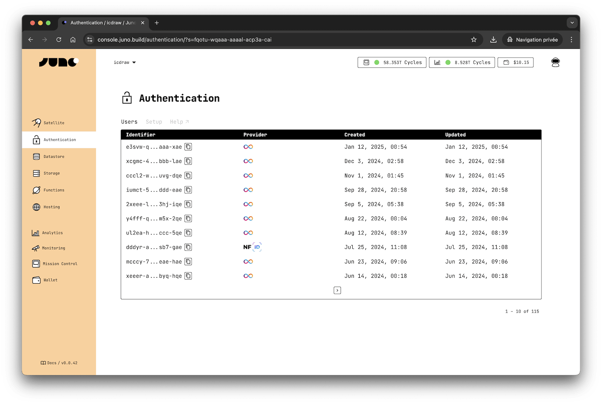

# Authentication

Juno lets you securely identify users without passwords, without tracking, and without managing sensitive data.

You can authenticate users using one or more of these providers:

- [Google](google.md) - secure and familiar login
- [Internet Identity](internet-identity.md) - decentralized, privacy-preserving authentication
- [Passkeys](passkeys.md) - passwordless, device-native authentication using WebAuthn

Authentication works hand-in-hand with other Juno services like [Datastore](../datastore/index.mdx) and [Storage](../storage/index.mdx).

You can see and manage your users anytime in the [authentication](https://console.juno.build/authentication) view of the Console.

---

## User Identity

When someone signs in to your app, they get an identity.

That identity is what ties them to the data they create and the actions they take.

Identities are:

- **Anonymous**: they don't expose personal info.
- **Scoped to your app**: users can't be tracked across other sites or services.

Together, this makes authentication privacy-friendly by default and predictable for developers.

---

## Domain-Based Identity

For privacy reasons and to prevent tracking across sites, a user's identity is tied to the domain where they sign in.

### Passkeys

With Passkeys, the identity is linked to the hostname the user signs in on. It works for that domain and its subdomains.

For example, a passkey created on `hello.com` will also work on `www.hello.com`, but not on a different domain like `world.com`.

You can change this in the sign-up options if you want it to cover a different domain than the one read from the browser's URL. For example, you may want to use the top-level domain when signing in on a subdomain. You cannot specify a totally different domain.

---

## Choosing a Provider

Each authentication method has its strengths. The right choice depends not only on your app's technical needs, but also on what your users expect and feel comfortable with.

- **Google**:
  - ✅ Familiar and frictionless login with a trusted provider.
  - ✅ Works across devices and browsers - no domain scoping required.
  - ✅ Supports account recovery and multi-device sync.
  - 🤔 Relies on Google’s infrastructure and policies.
  - ❌ Not decentralized - users authenticate via Google’s identity layer.

- **Internet Identity**:
  - ✅ Fully decentralized and privacy-preserving.
  - ✅ Prevents tracking between domains.
  - 🤔 Requires a brief context switch to an external window.
  - ❌ Domain scoping requires correct configuration.
  - ❌ Less known outside the Internet Computer ecosystem.

- **Passkeys**:
  - ✅ Passwordless and device-native (Face ID, Touch ID, etc.).
  - ✅ Familiar Web2-like UX with strong cryptographic security.
  - 🤔 Users must distinguish between sign-up and sign-in flows.
  - ❌ Passkeys stored locally can be lost if the browser or device is reset.
  - ❌ Sync depends on Apple or Google password managers.

> 💡 **Tip:** Many developers combine multiple providers - for example, offering Google as the default and Internet Identity or Passkeys as privacy-first alternatives.
