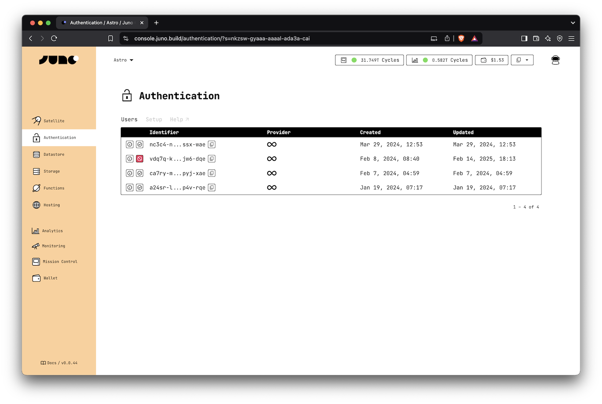

# Management

This page provides an overview of the administrative functions available in the Juno Console related to user management.

---

## Banning Users

The built-in authentication feature allows developers to ban or unban users within their dapps. When a user is banned, they lose access to key services such as Datastore and Storage, preventing them from creating, updating, or deleting any data. This feature helps developers prevent misuse, spam, or abusive behavior in their applications.

:::note

A ban is not a deletion. The user's authentication entry remains in the system, and they can be unbanned at any time.

:::

### How to Ban a User

To ban a user, follow these steps:

- Navigate to the Authentication section in the [console](https://console.juno.build).
- Find the user you want to ban in the users' table.
- Click on the Active / Ban button at the start of the row.
- Confirm the action.

Once banned, the user will not be able to sign in, create, update, or delete data in Datastore or Storage.

---

## Setup

The Authentication tab in the Console (or the CLI config) lets you customize how users sign in to your app and who's allowed to access it. Here are the available options:

---

### Main Domain ("Derivation Origin")

This setting helps you control how users are identified when signing in with Internet Identity. It makes sure users get the same identity across different domains or subdomains of your app.

For example, if you set it to "hello.com", a user signing in at https://hello.com will receive the same identifier (principal) as when signing in at https://www.hello.com. In other words, the user will be recognized as the same person.

This is useful because, by design, it creates a different identity for each domain to protect user privacy and prevent tracking.

Use this if your app runs on multiple subdomains and you want a consistent user experience.

---

### Max Updates Per Minute

This lets you limit how many new users can sign up per minute. It's helpful to prevent abuse or unexpected spikes (like bots flooding your app).

For example, setting this to `10` means only `10` new users can be created per minute.

Default is `100`.

---

### Authorized Users

This option gives you full control over who's allowed to use your app.

If you enable this, only the identities you list (in user key, format, like `bj4r4-5cdop-...`) will be allowed to sign in or use any features like Datastore or Storage.

- If someone's not on the list, they can't even register.
- If they are, they can use the app just like any other user (unless they're banned).

Use this if you want to limit access to a private group — for example, for internal testing or early access users.

#### How to Get the User Identities

There are two common ways to manage the list of authorized users:

1. After sign-in

You can share your app link with a few users, let them sign in, and then add their keys to the authorized list. The user table will show their identity once they've signed in at least once.

2. Before sign-in

If you want to block all sign-ins except for those explicitly allowed before hand, start by adding your own developer ID (shown in the Console) to the list.

This activates the restriction: once at least one identity is listed, only those identities can sign in. If the list is empty, then everyone can sign in.

You can then share the app link with others. When they attempt to sign in and are blocked, you can show a message that displays their user key (e.g. using the `unsafeIdentity` function from `@junobuild/core`).

They can send you their key, and you can add them to the list manually to grant access.
