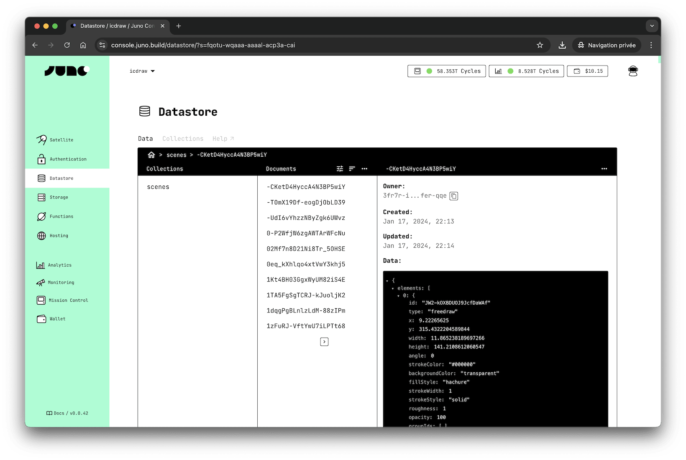

# Datastore

The Juno Datastore offers a simple key-value model, organized by collections containing documents, for managing structured data.

Use it for structured data like user profiles, tasks, settings, or other data of your app stored as documents inside collections.

:::tip

For binary files like images or files, use the [Storage](../storage/index.mdx) instead.

:::

---

## How does it work?

Each [satellite] you create has a "Datastore", which can have as many [collections](./collections.md) as you wish.

A collection contains a list of documents, each identified by a textual key that you define.

Each document is a record that holds the data you want to persist, along with timestamps (created and last updated), an associated owner (the creator of the document), and a version.

The version is used to prevent data from being overwritten, and the associated owner is used to grant read and write permissions.

Each document is identified by a `key` (unique within a collection).

In essence, a "Datastore" functions as a keypair store.

---

## Limitation

Each satellite has specific memory limits. For detailed information, please refer to the related [documentation](../../miscellaneous/memory.md) page.

As for documents, they can be up to 2MB in size. However, larger files can be saved in the [storage](build/storage/index.mdx).

---

## Configuration

The Datastore supports various configuration options to fine-tune its behavior, such as resource limits and operational constraints. For a detailed explanation of all available options, see the [configuration](../../reference/configuration.mdx#datastore) section.

[satellite]: ../../terminology.md#satellite

---

## Datastore vs Storage

import DatastoreVsStorage from "../components/datastore-storage.md";

<DatastoreVsStorage />
