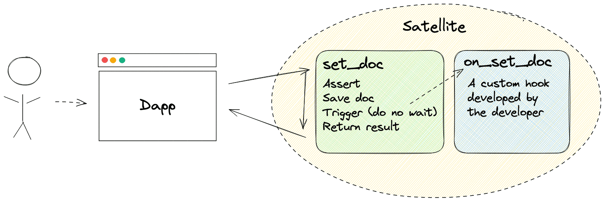
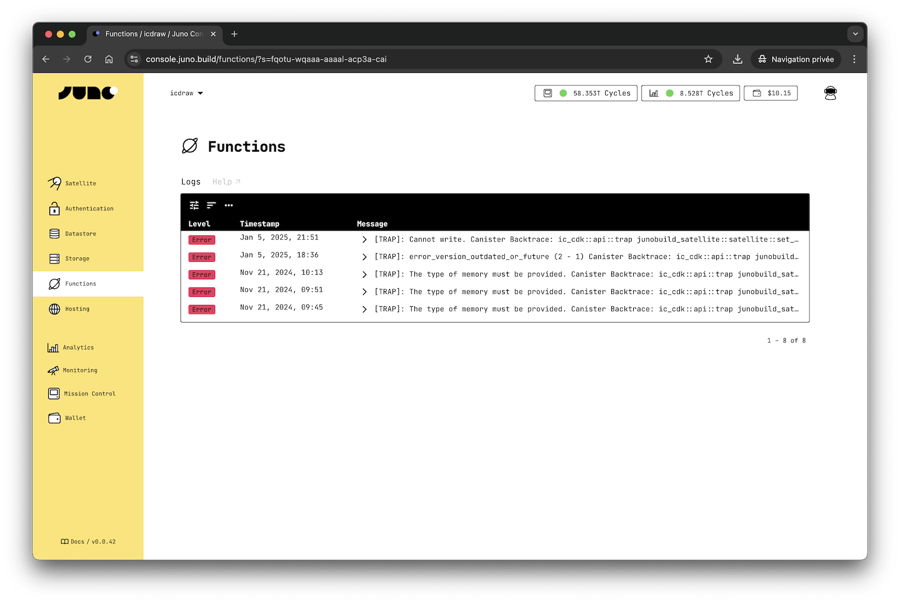

# Functions

Functions are a set of Rust-based features enabling developers to extend the native capabilities of Satellites. Functions facilitate the creation and management of serverless behaviors within smart contracts, or [Satellites](../terminology.md#satellite). Triggered by specific events like document and asset operations, they allow developers to embed custom logic directly into the blockchain environment.

---

## How does it work?

Functions in Juno are defined using hooks that automatically handle event triggers related to documents and assets. These hooks include creating, updating, and deleting operations, allowing for a wide range of features within your Satellite.

A naive schema representation of a hook that is triggered when a document is set:



### Asynchronous Hook Spawning

When a Function is triggered, it spawns hooks asynchronously, operating independently of the caller's action. This means that the execution of the hooks is initiated without waiting for a synchronous response, ensuring that the flow of update calls to the Satellite remains unhindered. Consequently, callers may receive feedback on their actions before the corresponding hooks have commenced their execution.

### Error-Resilient Execution

Hooks are initiated only when there are no errors in the preceding operations. This ensures a robust and dependable execution flow, promoting reliability and consistency in the functioning of Functions.

### Optional

In the stock Satellite, custom hooks are not active by default. Developers should opt-in to activate these hooks to enable event-driven execution of custom logic if they wish to.

---

## Available Hooks

| Hook                         | Provider  | Description                                                     |
| ---------------------------- | --------- | --------------------------------------------------------------- |
| `on_set_doc`                 | Datastore | Triggered when a document is created or updated.                |
| `on_set_many_docs`           | Datastore | Activated for operations involving multiple documents.          |
| `on_delete_doc`              | Datastore | Invoked when a document is deleted.                             |
| `on_delete_many_docs`        | Datastore | Used when multiple documents are deleted.                       |
| `on_delete_filtered_docs`    | Datastore | Invoked when documents are deleted according filters.           |
| `on_upload_asset`            | Storage   | Triggered during asset upload.                                  |
| `on_delete_asset`            | Storage   | Activated when an asset is deleted.                             |
| `on_delete_many_assets`      | Storage   | Used for deleting multiple assets.                              |
| `on_delete_filtered_asserts` | Storage   | Invoked when assets are deleted according filters.              |
| `on_init`                    | Satellite | Called during the initialization of the satellite.              |
| `on_post_upgrade`            | Satellite | Invoked after the satellite has been upgraded to a new version. |

---

## Assertions

In addition to hooks, developers have the option to expand the native rule set of their Satellites by creating custom assertions. These assertions can be implemented similarly to hooks, with the key difference being that they are synchronous and must return a result indicating the outcome of the assertion.

| Assertion             | Provider  | Description                                   |
| --------------------- | --------- | --------------------------------------------- |
| `assert_set_doc`      | Datastore | Ensures a document can be created or updated. |
| `assert_delete_doc`   | Datastore | Verifies that a document can be deleted.      |
| `assert_upload_asset` | Storage   | Confirms an asset upload can be committed.    |
| `assert_delete_asset` | Storage   | Checks that an asset can be deleted.          |

---

## Getting Started

Incorporating custom Functions into a Juno Satellite requires developers to prepare their project with the necessary Rust environment. This foundational step ensures the capability to develop tailored logic within the Satellite.

### Initial Setup

To start developing Functions, at the root of your dApp's source code, execute the `juno dev eject` command via the CLI. This command configures your project with the required Rust setup, including a `Cargo.toml` for dependencies and a `lib.rs` file for defining your Functions.

### Developing Functions

Once your project is scaffolded, proceed to define Rust functions and annotate them with Juno-specific macros to indicate the custom behavior of your Functions. Utilize the CLI to build your Functions by executing `juno dev build`.

### Local Development

For local development and testing, a sandbox environment is essential. With Docker installed and using the CLI, you can establish this environment by running `juno dev start`. Alternatively, manual setup instructions are available in the [documentation](../guides/local-development.md) for a more customized approach.

:::info

The Docker container for the local sandbox environment supports hot reloading. This means that the container will automatically redeploy your local Satellite each time `juno dev build` is executed and a new version is produced. This feature streamlines the development process, allowing for immediate feedback and faster iteration of your Functions.

:::

### Deployment

After finalizing and testing your Functions, the next step is to deploy your modified Satellite to the mainnet. The `juno dev build` command produces a compressed WASM file (`satellite.wasm.gz`) that includes both the optimized code and necessary metadata. This file is located at `./target/deploy/satellite.wasm.gz` relative to your project's root directory. To deploy your Satellite, use the following CLI command from the same root directory:

```bash
juno upgrade -t s -s target/deploy/satellite.wasm.gz
```

This process updates your Satellite with the custom Functions, making them live on the mainnet for real-world application and interaction.

### Summary

| CLI Command                                              | Short description                                                            |
| -------------------------------------------------------- | ---------------------------------------------------------------------------- |
| `juno dev eject`                                         | Initializes your project to extend a Satellite.                              |
| `juno dev start`                                         | Starts the local development environment using Docker.                       |
| `juno dev build`                                         | Compiles your custom Satellite's code. Changes are automatically redeployed. |
| `juno upgrade -t s -s ./target/deploy/satellite.wasm.gz` | Upgrades your Satellite in production.                                       |

---

## Implementation

When you're ready to implement Functions within your Juno Satellite, you'll have a variety of event-driven macros at your disposal, enabling custom logic execution in response to specific actions. Here's how to implement each available Function:

:::note

Running `juno dev eject` not only prepares your environment for the serverless development but also scaffolds a default `lib.rs` module. This module is pre-configured with the necessary structure and examples to get started with all the Functions features listed below.

:::

### on_set_doc

Triggered when a document is created or updated in the datastore.

```rust
#[on_set_doc]
async fn on_set_doc(context: OnSetDocContext) -> Result<(), String> {
    // Custom logic for handling document creation or updates
    Ok(())
}
```

When no attributes are provided, the hook is triggered for any document set within any collection.
You can scope the events to a particular list of collections.

```rust
#[on_set_doc(collections = ["demo"])]
async fn on_set_doc(context: OnSetDocContext) -> Result<(), String> {
    // Custom logic for handling document creation or updates
    Ok(())
}
```

The attributes accept a list of comma-separated collections. If the attribute array is left empty, the hook will never be called.

### on_set_many_docs

Activated for batch operations involving multiple document creations or updates.

```rust
#[on_set_many_docs]
async fn on_set_many_docs(context: OnSetManyDocsContext) -> Result<(), String> {
    // Custom logic for handling multiple document creations or updates
    Ok(())
}
```

Similarly to [on_set_doc](#on_set_doc), the hook can scope the events to a particular list of collections or be left empty if it should never fire.

### on_delete_doc

Invoked when a document is deleted from the datastore.

```rust
#[on_delete_doc]
async fn on_delete_doc(context: OnDeleteDocContext) -> Result<(), String> {
    // Custom logic for handling document deletion
    Ok(())
}
```

Similarly to [on_set_doc](#on_set_doc), the hook can scope the events to a particular list of collections or be left empty if it should never fire.

### on_delete_many_docs

Used when multiple documents are deleted in a batch operation.

```rust
#[on_delete_many_docs]
async fn on_delete_many_docs(context: OnDeleteManyDocsContext) -> Result<(), String> {
    // Custom logic for handling the deletion of multiple documents
    Ok(())
}
```

Similarly to [on_set_doc](#on_set_doc), the hook can scope the events to a particular list of collections or be left empty if it should never fire.

### on_delete_filtered_docs

Invoked when documents are deleted according to specified filters in the datastore.

```rust
#[on_delete_filtered_docs]
async fn on_delete_filtered_docs(context: OnDeleteFilteredDocsContext) -> Result<(), String> {
    // Custom logic for handling the deletion of filtered documents
    Ok(())
}
```

Similarly to [on_set_doc](#on_set_doc), the hook can scope the events to a particular list of collections or be left empty if it should never fire.

### on_upload_asset

Triggered during the process of uploading an asset.

```rust
#[on_upload_asset]
async fn on_upload_asset(context: OnUploadAssetContext) -> Result<(), String> {
    // Custom logic for handling asset uploads
    Ok(())
}
```

Similarly to [on_set_doc](#on_set_doc), the hook can scope the events to a particular list of collections or be left empty if it should never fire.

### on_delete_asset

Activated when an asset is removed from the datastore.

```rust
#[on_delete_asset]
async fn on_delete_asset(context: OnDeleteAssetContext) -> Result<(), String> {
    // Custom logic for handling asset deletion
    Ok(())
}
```

Similarly to [on_set_doc](#on_set_doc), the hook can scope the events to a particular list of collections or be left empty if it should never fire.

### on_delete_many_assets

Used for operations that involve deleting multiple assets in a batch.

```rust
#[on_delete_many_assets]
async fn on_delete_many_assets(context: OnDeleteManyAssetsContext) -> Result<(), String> {
    // Custom logic for handling the deletion of multiple assets
    Ok(())
}
```

Similarly to [on_set_doc](#on_set_doc), the hook can scope the events to a particular list of collections or be left empty if it should never fire.

### on_delete_filtered_assets

Invoked when assets are deleted according to specified filters in the storage.

```rust
#[on_delete_filtered_assets]
async fn on_delete_filtered_assets(context: OnDeleteFilteredAssetsContext) -> Result<(), String> {
    // Custom logic for handling the deletion of filtered assets
    Ok(())
}
```

Similarly to [on_set_doc](#on_set_doc), the hook can scope the events to a particular list of collections or be left empty if it should never fire.

### on_init

Called during the initialization of the satellite. This hook is invoked when the satellite is first deployed and can be used to set up initial configurations or resources.

```rust
#[on_init]
fn on_init() -> Result<(), String> {
    // Custom logic for initialization
    Ok(())
}
```

Unlike datastore or storage hooks, `on_init` cannot be scoped to specific collections or assets, as it is meant to handle global initialization logic.

This feature is not enabled by default. To use it, you’ll need to opt in by updating your `Cargo.toml` file.

```toml
[dependencies]
junobuild-satellite = { version = "*", features = ["default", "on_init"] }
```

### on_post_upgrade

Invoked after the satellite has been upgraded to a new version. This hook is typically used to manage migration tasks, or starting custom processes like timers.

```rust
#[on_post_upgrade]
fn on_post_upgrade() -> Result<(), String> {
    // Custom logic for post-upgrade tasks
    Ok(())
}
```

Similar to `on_init`, the `on_post_upgrade` hook cannot be scoped to collections or assets. It operates globally to handle upgrade-related operations.

This feature is not enabled by default. To use it, you’ll need to opt in by updating your `Cargo.toml` file.

```toml
[dependencies]
junobuild-satellite = { version = "*", features = ["default", "on_post_upgrade"] }
```

### assert_set_doc

Ensures a document can be created or updated.

```rust
#[assert_set_doc]
fn assert_set_doc(_context: AssertSetDocContext) -> Result<(), String> {
    // Custom logic for asserting a document's creation or update is possible
    Ok(())
}
```

### assert_delete_doc

Verifies that a document can be deleted.

```rust
#[assert_delete_doc]
fn assert_delete_doc(context: AssertDeleteDocContext) -> Result<(), String> {
    // Custom logic for asserting a document can be deleted
    Ok(())
}
```

### assert_upload_asset

Confirms an asset upload can be committed.

```rust
#[assert_upload_asset]
fn assert_upload_asset(_context: AssertUploadAssetContext) -> Result<(), String> {
    // Custom logic for asserting an asset upload is possible
    Ok(())
}
```

### assert_delete_asset

Checks that an asset can be deleted.

```rust
#[assert_delete_asset]
fn assert_delete_asset(_context: AssertDeleteAssetContext) -> Result<(), String> {
    // Custom logic for asserting an asset can be deleted
    Ok(())
}
```

### Including the Satellite

After defining your Functions, at the very end of your `lib.rs` module, include the Satellite to ensure that your custom logic and the default features or Juno are properly registered and executable within the Juno ecosystem.

```rust
include_satellite!();
```

---

## Additional Notes

WebAssembly (Wasm) binaries serve as the compilation target for the Satellites. While Juno's CLI automatically specifies this target for you, manual execution of certain `cargo` commands necessitates explicitly providing this target.

For instance:

```bash
cargo clippy --target=wasm32-unknown-unknown
```

---

## Write and view logs

Logging is a crucial tool for debugging and monitoring your code. Serverless Functions offer you the option to utilize loggers to report status effectively.



### How does it work?

Logs are stored in stable memory, accommodating up to 100 entries. Once this limit is reached, the oldest entry is discarded. It's important to note that since logs are saved in memory, your hooks should return a success—meaning they should not trap—otherwise, the information cannot be preserved.

:::note

In the future, errors and unsuccessful calls to functions will be automatically logged.

:::

### Available loggers

| Logger            | Level   | Description                                                    |
| ----------------- | ------- | -------------------------------------------------------------- |
| `log`             | Info    | Logs a message.                                                |
| `log_with_data`   | Info    | Logs a message with additional serialized data.                |
| `info`            | Info    | Logs an informational message.                                 |
| `info_with_data`  | Info    | Logs an informational message with additional serialized data. |
| `debug`           | Debug   | Logs an debug-level message.                                   |
| `debug_with_data` | Debug   | Logs a debug-level message with additional serialized data.    |
| `warn`            | Warning | Logs a warning message.                                        |
| `warn_with_data`  | Warning | Logs a warning message with additional serialized data.        |
| `error`           | Error   | Logs an error message.                                         |
| `error_with_data` | Error   | Logs an error message with additional serialized data.         |
