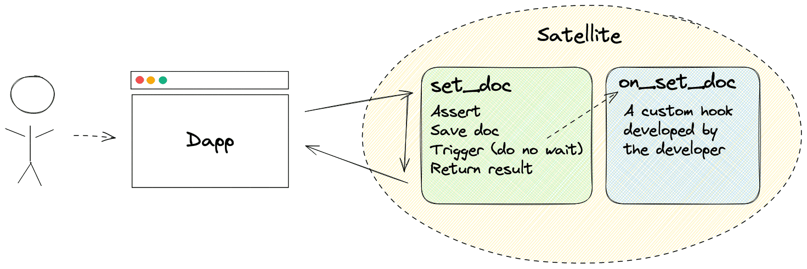

# Functions

Functions are a set of features enabling developers to extend the native capabilities of [Satellites](../../terminology.mdx#satellite) using Rust or TypeScript. They let you define serverless behaviors directly within your containerized environment.

There are two types of functions:

- [Event-driven functions](#event-driven-functions): triggered automatically in response to actions such as a document being created or an asset being uploaded.
- [Callable functions](#callable-functions): explicitly invoked from your frontend or from other services.

---

## Event-driven Functions

Event-driven functions respond to actions occurring in your Satellite. They are triggered automatically and never invoked directly.

### Hooks

Hooks respond to specific actions within your Satellite. They run asynchronously, independently of the caller's request - meaning the caller may receive a response before the hook has finished executing.

:::note

Hooks are only initiated when the preceding operation completes without errors.

:::

| Hook                        | Provider  | Description                                                     |
| --------------------------- | --------- | --------------------------------------------------------------- |
| `on_set_doc`                | Datastore | Triggered when a document is created or updated.                |
| `on_set_many_docs`          | Datastore | Activated for operations involving multiple documents.          |
| `on_delete_doc`             | Datastore | Invoked when a document is deleted.                             |
| `on_delete_many_docs`       | Datastore | Used when multiple documents are deleted.                       |
| `on_delete_filtered_docs`   | Datastore | Invoked when documents are deleted according filters.           |
| `on_upload_asset`           | Storage   | Triggered during asset upload.                                  |
| `on_delete_asset`           | Storage   | Activated when an asset is deleted.                             |
| `on_delete_many_assets`     | Storage   | Used for deleting multiple assets.                              |
| `on_delete_filtered_assets` | Storage   | Invoked when assets are deleted based on filters.               |
| `on_init`                   | Satellite | Called during the initialization of the Satellite.              |
| `on_post_upgrade`           | Satellite | Invoked after the Satellite has been upgraded to a new version. |

### Assertions

Assertions run synchronously before an operation is executed. They allow you to validate or reject actions before any data is written.

| Assertion             | Provider  | Description                                   |
| --------------------- | --------- | --------------------------------------------- |
| `assert_set_doc`      | Datastore | Ensures a document can be created or updated. |
| `assert_delete_doc`   | Datastore | Verifies that a document can be deleted.      |
| `assert_upload_asset` | Storage   | Confirms an asset upload can be committed.    |
| `assert_delete_asset` | Storage   | Checks that an asset can be deleted.          |

---

## Callable Functions

Callable functions are explicitly invoked — from your frontend or from other services. They expose query and update endpoints directly from your Satellite.

:::tip

This is conceptually similar to exposing your own endpoints on an API.

:::

| Type     | Description                                                     |
| -------- | --------------------------------------------------------------- |
| `query`  | A read-only function that returns data without modifying state. |
| `update` | A function that can read and write state.                       |

---

## Rust vs. TypeScript

You can write serverless functions in either [Rust](./development/rust.mdx) or [TypeScript](./development/typescript.mdx), depending on your needs and project goals.

Rust will always be more performant than TypeScript because TypeScript code is evaluated by the Rust runtime under the hood. This means that, no matter how optimized, functions written in Rust will consume fewer cycles and execute faster. That said, not every project needs maximum performance from day one. For smaller apps, rapid prototypes, or internal tools, TypeScript can be a perfect fit.

The Rust ecosystem is also more mature, having been supported on the Internet Computer from the beginning. It benefits from better compatibility with libraries that support `wasm32-unknown-unknown`.

TypeScript support was introduced on Juno in April 2025. While developer-friendly, it currently lacks Node.js polyfills, which means many npm libraries may not work out of the box. That said, we’re actively improving this — and if there's a specific package or feature you'd like to use, reach out. We're happy to explore adding support.

Furthermore, a key advantage of TypeScript is the ability to share the same `j` schema types — built on Zod — across both your frontend and your Satellite functions, providing a single strongly typed source of truth for your data shapes with full type safety end-to-end.

It is worth noting that in both environments, there is no standard library or file system access. Functions like reading from or writing to disk aren’t available. Instead, e.g. Juno provides purpose-built features such as Storage.

Despite their differences, Rust and TypeScript serverless functions are designed with interoperability in mind. The API surface and structure are intentionally aligned, so migrating from TypeScript to Rust later should feel intuitive and straightforward.

### Summary

| Feature / Consideration | Rust                                       | TypeScript                                                  |
| ----------------------- | ------------------------------------------ | ----------------------------------------------------------- |
| **Performance**         | ✅ Highest, runs natively in WASM          | ⚠️ Interpreted by Rust, slower                              |
| **Library Support**     | ✅ Many crates                             | ⚠️ Limited (only few Node.js polyfills currently supported) |
| **Ease of Use**         | ✅ Developer-friendly (with or without AI) | ✅ Developer-friendly (with or without AI)                  |
| **Shared Types**        | —                                          | ✅ Share `j`/Zod schemas across frontend and backend        |
| **Migration Path**      | —                                          | ✅ Can migrate to Rust easily                               |
| **Recommended For**     | Production apps, performance-critical code | Prototypes, smaller tools, quick dev cycles                 |
