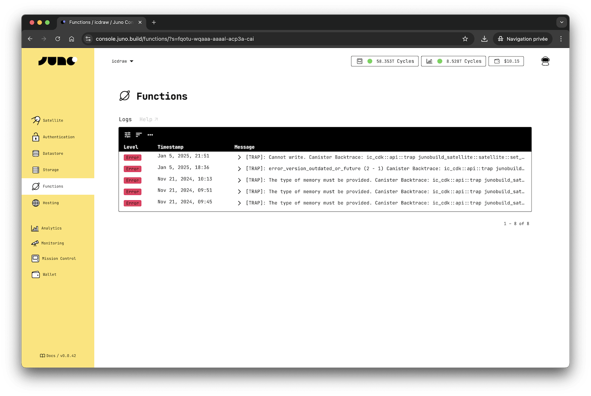

# Logs

Writing and viewing logs is a crucial tool for debugging and monitoring your code. Serverless Functions offer you the option to utilize loggers to report status effectively.

### How does it work?

Logs are stored in stable memory, accommodating up to 100 entries. Once this limit is reached, the oldest entry is discarded. It's important to note that since logs are saved in memory, your hooks should return a success—meaning they should not trap—otherwise, the information cannot be preserved.

:::note

In the future, errors and unsuccessful calls to functions will be automatically logged.

:::

### Available loggers

| Logger            | Level   | Description                                                    |
| ----------------- | ------- | -------------------------------------------------------------- |
| `log`             | Info    | Logs a message.                                                |
| `log_with_data`   | Info    | Logs a message with additional serialized data.                |
| `info`            | Info    | Logs an informational message.                                 |
| `info_with_data`  | Info    | Logs an informational message with additional serialized data. |
| `debug`           | Debug   | Logs an debug-level message.                                   |
| `debug_with_data` | Debug   | Logs a debug-level message with additional serialized data.    |
| `warn`            | Warning | Logs a warning message.                                        |
| `warn_with_data`  | Warning | Logs a warning message with additional serialized data.        |
| `error`           | Error   | Logs an error message.                                         |
| `error_with_data` | Error   | Logs an error message with additional serialized data.         |
