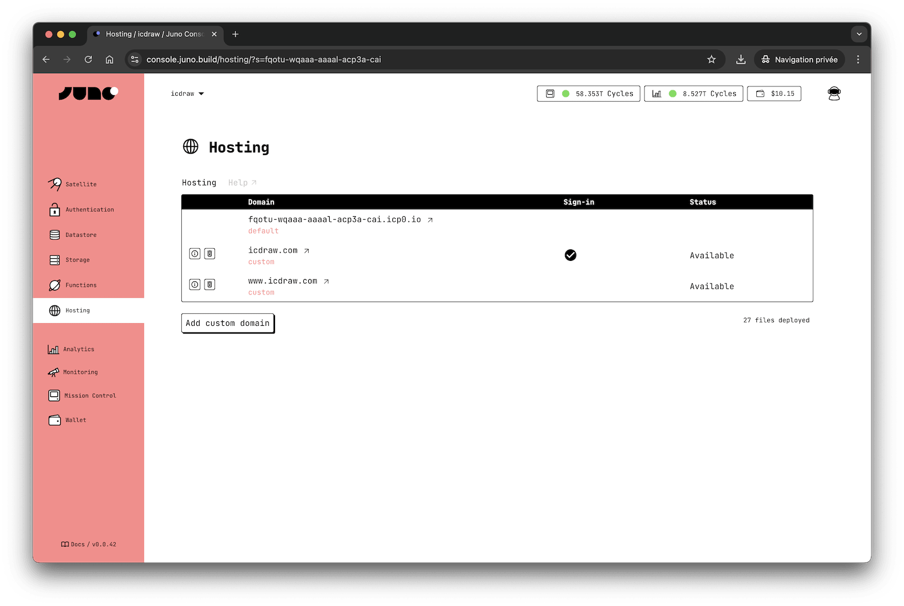

# Hosting

Juno Hosting offers fast and secure hosting powered by 100% blockchain technology.

With just one [CLI] command, you can effortlessly deploy your web applications, static, and dynamic content to your [satellite].

---

## Using your Custom Domain

You can maintain your unique brand identity with Juno Hosting. Use your custom domain, such as "yolo.com" or "hello.world.com", instead of the default domain name provided by Juno.

Our infrastructure automatically provisions an SSL certificate for each of your domains, ensuring secure connections for your users.

[CLI]: ../../miscellaneous/cli.mdx
[satellite]: ../../terminology.md#satellite
[console]: ../../terminology.md#console
