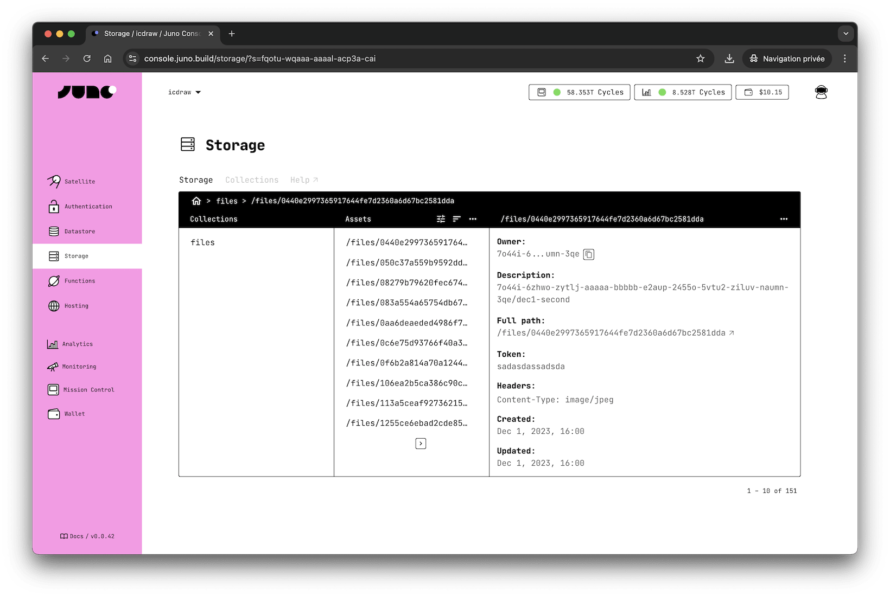

# Storage

Juno Storage is for files — like images or other user-generated content.

It provides a simple way to upload, serve, and delete files, with support for multiple encodings and custom headers.

:::tip

For structured data, use the [Datastore](../datastore/index.md) instead.

:::

---

## How does it work?

Each [satellite] you create includes a "Storage" provider, which can store assets (images, documents, etc.) that are automatically made available on the internet.

Assets are stored in [collections](./collections.md), and you can create as many as you need.

Each asset within a collection is identified by a `path` -- e.g. `/images/a-user-image.jpg` -- unique within all collections.

Those assets hold the data you want to persist on chain, along with metadata (the "owner" or creator of the asset).

:::caution

Unless you use the optional [`token` parameter](development.mdx#protected-asset) to persist an asset in your satellite and make its URL difficult to guess, any asset stored in Juno Storage will be publicly available on the internet.

:::

---

## Limitation

Each satellite has specific memory limits. For detailed information, please refer to the related [documentation](../../miscellaneous/memory.md) page.

There is no specific limit on the size of assets (files) that can be uploaded to Juno, unless you choose to set an optional [rule](./collections.md#permissions) to restrict it.

---

## Configuration

The Storage system offers various configuration options to fine-tune its behavior, including HTTP headers, redirects, and iFrame support. These settings help optimize how stored files are accessed and delivered.

If you're configuring the hosting behavior of your site, start by checking out the [Hosting Configuration](../hosting/configuration.mdx) section, as Storage is an integral part of the hosting system.

For a complete list of available Storage options, refer to the [configuration](../../reference/configuration.mdx) section.

[satellite]: ../../terminology.md#satellite
