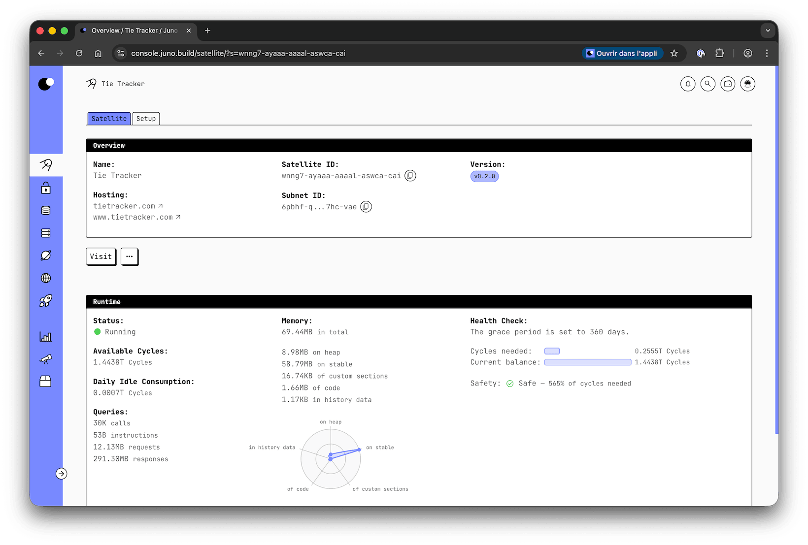

# GitHub Actions

You can leverage the Juno [CLI] to perform tasks within GitHub Actions.

This guide will show you how to set up and deploy your decentralized app to Juno satellites using the action [junobuild/juno-action](https://github.com/junobuild/juno-action).

---

## 1. Add a Secret Token for Automation

Before you can effectively implement automation, it is necessary to add a secret token to your GitHub repository or organization. This token will enable the CI (Continuous Integration) to deploy to your [satellite].

Follow the steps below to generate a new controller:

1. Go to the Juno's [console](https://console.juno.build).
2. Select your satellite.
3. On the satellite's dashboard, navigate to the "Setup" tab.
4. Click on "Add a controller".
5. Generate a new controller (default option) with a permission scope set to "Read-write".
6. Click "Submit".
7. Upon successful creation, a new controller will be generated, and a "Secret token" will be displayed. Copy the token value and save it as an [encrypted secret](https://docs.github.com/en/actions/security-guides/encrypted-secrets) in your repository or organization, using the key `JUNO_TOKEN`.

:::info

While you can generate a controller with administrative permission, we strongly recommend using the "Read-write" scope. This ensures that GitHub does not have the capability to operate your smart contract, such as stopping or deleting your satellite. By opting for the "Read-write" scope, you maintain full control over your decentralized app and minimize the risk of unwanted interference from GitHub.

:::

---

## 2. Configure your project

If you already have a `juno.config` file at the root of your project, you can skip to the next chapter. Otherwise, you need to create one [manually](#configuration-file-example) or by running:

```bash
npx @junobuild/cli init --minimal
```

The configuration file can be a TypeScript, JavaScript, or JSON file (`juno.config.ts`, `juno.config.js|.mjs`, or `juno.config.json`), depending on your preference.

At a minimum, the configuration file must include the following:

- **Satellite ID**: A unique identifier for your satellite.
- **Source**: The directory containing the built assets for your satellite. This is typically the output folder of your build process, generated after running a command like `npm run build`.

### Satellite ID

Your Satellite ID can be found in the 'Overview' tab.



### Source

import Examples from "../build/components/source-examples.mdx";

<Examples />

### Configuration File Example

Here’s an example of configuration file:

```javascript
import { defineConfig } from "@junobuild/config";

export default defineConfig({
  satellite: {
    id: "qsgjb-riaaa-aaaaa-aaaga-cai", // Replace with your satellite ID
    source: "dist", // Replace with your build output directory
    predeploy: ["npm run build"] // Adjust based on your package manager
  }
});
```

For detailed information about all available configuration options, refer to the [configuration](../reference/configuration.mdx) section.

---

## 3. Create the GitHub Action

To configure the action, follow these steps:

1. Create a `deploy.yml` file in the `.github/workflows` subfolder of your repository. If the folder doesn't exist, create it.
2. Paste the following code into a new `deploy.yml` file.

```yaml
name: Deploy to Juno

on:
  workflow_dispatch:
  push:
    branches: [main]

jobs:
  publish:
    runs-on: ubuntu-latest
    steps:
      - name: Check out the repo
        uses: actions/checkout@v4

      - uses: actions/setup-node@v4
        with:
          node-version: 22
          registry-url: "https://registry.npmjs.org"

      - name: Install Dependencies
        run: npm ci

      - name: Deploy to Juno
        uses: junobuild/juno-action@main
        with:
          args: deploy
        env:
          JUNO_TOKEN: ${{ secrets.JUNO_TOKEN }}
```

Whenever code is pushed to your `main` branch, this action performs the following tasks: it checks out your repository, installs dependencies. It then utilizes the [junobuild/juno-action](https://github.com/junobuild/juno-action) GitHub Action to build and deploy your dapp.

That's it—your pipeline is set! 🥳

:::note

If your `juno.config` file does not build your application using a `predeploy` field, you might need to add an additional step to your YAML file to do so:

```yaml
- name: Build
  run: npm run build
```

:::

---

## Optimization & Best Practices

Below are key considerations to ensure efficient and cost-effective deployment of your project.

### Build Reproducibility

Only new resources will be deployed to your satellite. Changes are detected through sha256 comparison. Therefore, ensuring the build reproducibility of your application is crucial to accurately identify and deploy the necessary updates.

### Deployment Costs

Deploying new assets consumes [cycles], and the cost increases with both the frequency of deployments and the number of items to deploy. While the above code snippet demonstrates a more frequent lifecycle, as a general recommendation, consider minimizing your deployment expenses with less frequent deployments. For instance, you can trigger the action on releases instead.

```yaml
on:
  release:
    types: [released]
```

---

## Environment Variables

When using the Actions, you can configure the following environment variables:

| Environment Variable | Mandatory | Description                                                                                                                                                                                |
| -------------------- | --------- | ------------------------------------------------------------------------------------------------------------------------------------------------------------------------------------------ |
| `JUNO_TOKEN`         | Yes       | The token to use for authentication. It can be generated through Juno's [Console](https://console.juno.build). Prefer a controller with "Read-write" permission rather than administrator. |
| `PROJECT_PATH`       | No        | The path to the folder containing the `juno.config` file if it doesn't exist at the root of your repository. e.g. `./my-app-subfolder`.                                                    |

[CLI]: ../reference/cli.mdx
[satellite]: ../terminology.md#satellite
[cycles]: ../terminology.md#cycles
