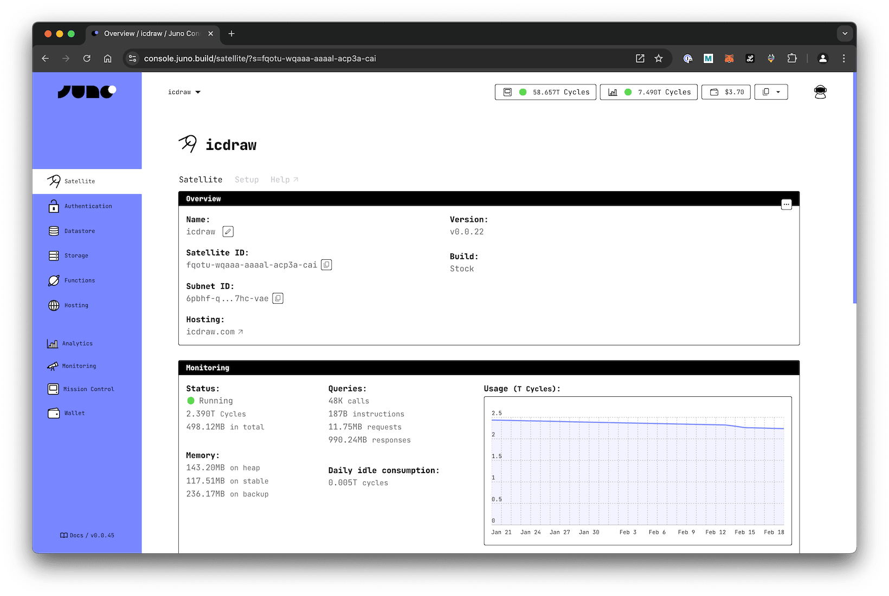

# GitHub Actions

You can leverage the Juno [CLI] to perform tasks within GitHub Actions.

This guide will show you how to use the [junobuild/juno-action](https://github.com/junobuild/juno-action) to deploy your frontend assets, build and publish serverless functions, and optionally upgrade your WASM container.

---

## 1. Add a Secret Token for Automation

Before you can effectively implement automation, it is necessary to add a secret token to your GitHub repository or organization. This token will enable the CI (Continuous Integration) to interact with your [satellite].

Follow the steps below to generate a new controller:

1. Go to the Juno's [console](https://console.juno.build).
2. Select your satellite.
3. On the satellite's dashboard, navigate to the "Setup" tab.
4. Click on "Add an access key".
5. Generate a new key (default option) and assign it an appropriate role based on your workflow. [Learn more about the available roles and their permissions](../miscellaneous/controllers.md) to choose the appropriate level of access for your use case.
6. Click "Submit".
7. Upon successful creation, a new access key will be generated, and a "Secret token" will be displayed. Copy the token value and save it as an [encrypted secret](https://docs.github.com/en/actions/security-guides/encrypted-secrets) in your repository or organization, using the key `JUNO_TOKEN`.

---

## 2. Configure your project

If you already have a `juno.config` file at the root of your project, you can skip to the next chapter. Otherwise, you need to create one [manually](#configuration-file-example) or by running:

```bash
npx @junobuild/cli init --minimal
```

The configuration file can be a TypeScript, JavaScript, or JSON file (`juno.config.ts`, `juno.config.js|.mjs`, or `juno.config.json`), depending on your preference.

At a minimum, the configuration file must include the following:

- **Satellite ID**: A unique identifier for your satellite.
- **Source**: The directory containing the built assets for your satellite. This is typically the output folder of your build process, generated after running a command like `npm run build`.

### Satellite ID

Your Satellite ID can be found in the 'Overview' tab.



### Source

import Examples from "../build/components/source-examples.mdx";

<Examples />

### Configuration File Example

Here’s an example of configuration file:

```javascript
import { defineConfig } from "@junobuild/config";

export default defineConfig({
  satellite: {
    ids: {
      production: "qsgjb-riaaa-aaaaa-aaaga-cai" // Replace with your satellite ID
    },
    source: "dist", // Replace with your build output directory
    predeploy: ["npm run build"] // Adjust based on your package manager
  }
});
```

For detailed information about all available configuration options, refer to the [configuration](../reference/configuration.mdx) section.

---

## 3. Create the GitHub Action

You can use GitHub Actions to automate different parts of your Juno deployment workflow:

- 🪄 Deploy frontend assets to your Satellite. [Learn how.](#a--deploy-frontend-assets)
- 🛠️ Build and publish serverless functions (TypeScript or Rust). [Learn how.](#b-%EF%B8%8F-build-and-publish-serverless-functions)
- ⚠️ Optionally upgrade your Satellite's WASM container. [Learn how.](#c-%EF%B8%8F-upgrade-serverless-functions-optional)

Each task can be performed independently or combined, depending on your project setup.

---

### a) 🪄 Deploy Frontend Assets

To configure an action to deploy your frontend assets, follow these steps:

1. Create or edit a `deploy.yml` file in the `.github/workflows` subfolder of your repository. If the folders do not exist, create those.
2. Paste the following code into the file:

```yaml title="deploy.yml"
name: Deploy Frontend to Juno

on:
  workflow_dispatch:
  push:
    branches: [main]

jobs:
  deploy:
    runs-on: ubuntu-latest
    steps:
      - name: Check out the repo
        uses: actions/checkout@v4

      - uses: actions/setup-node@v4
        with:
          node-version: 22
          registry-url: "https://registry.npmjs.org"

      - name: Install Dependencies
        run: npm ci

      - name: Deploy to Juno
        uses: junobuild/juno-action@main
        with:
          args: deploy
        env:
          JUNO_TOKEN: ${{ secrets.JUNO_TOKEN }}
```

Whenever code is pushed to your `main` branch, this action performs the following tasks: it checks out your repository, installs dependencies. It then utilizes the [junobuild/juno-action](https://github.com/junobuild/juno-action) GitHub Action to build and deploy your dapp.

That's it—your pipeline is set! 🥳

:::note

If your `juno.config` file does not build your application using a `predeploy` field, you might need to add an additional step to your YAML file to do so:

```yaml
- name: Build
  run: npm run build
```

:::

---

#### Optimization & Best Practices

Below are key considerations to ensure efficient and cost-effective deployment of your project.

##### Build Reproducibility

Only new resources will be deployed to your satellite. Changes are detected through sha256 comparison. Therefore, ensuring the build reproducibility of your application is crucial to accurately identify and deploy the necessary updates.

##### Deployment Costs

Deploying new assets consumes [cycles], and the cost increases with both the frequency of deployments and the number of items to deploy. While the above code snippet demonstrates a more frequent lifecycle, as a general recommendation, consider minimizing your deployment expenses with less frequent deployments. For instance, you can trigger the action on releases instead.

```yaml
on:
  release:
    types: [released]
```

---

### b) 🛠️ Build and Publish Serverless Functions

To configure an action to build and publish serverless functions, follow these steps:

1. Create or edit `publish.yml` in `.github/workflows/`.
2. Paste the following code into the file:

```yaml title="publish.yml"
name: Publish Serverless Functions

on:
  workflow_dispatch:
  push:
    branches: [main]

jobs:
  publish:
    runs-on: ubuntu-latest
    steps:
      - name: Check out the repo
        uses: actions/checkout@v4

      - uses: actions/setup-node@v4
        with:
          node-version: 22
          registry-url: "https://registry.npmjs.org"

      - name: Install Dependencies
        run: npm ci

      - name: Build
        uses: junobuild/juno-action@main
        with:
          args: functions build

      - name: Publish
        uses: junobuild/juno-action@main
        with:
          args: functions publish
        env:
          JUNO_TOKEN: ${{ secrets.JUNO_TOKEN }}
```

This action will build and publish your serverless function bundle.

If your access key has a **write** role, the changes will be automatically deployed to your Satellite's CDN.

If your key only has a **submit** role, the release will be submitted as a pending change for manual approval. To avoid errors in submit-only workflows, you can explicitly use the `--no-apply` flag to skip auto-application.

```yaml
- name: Publish
  uses: junobuild/juno-action@main
  with:
    args: functions publish --no-apply
  env:
    JUNO_TOKEN: ${{ secrets.JUNO_TOKEN }}
```

---

#### Optimization & Best Practices

Below are key considerations to ensure efficient and cost-effective publication of your functions.

##### Triggering on Release

You can adjust the trigger to publish your serverless function only on releases, which helps reduce unnecessary CI runs and deployments.

```yaml
on:
  release:
    types: [released]
```

This ensures that your function bundle is built and published only when a GitHub release is published.

---

### c) 🛠️ Upgrade Serverless Functions (Optional)

:::caution

We do not recommend upgrading your container directly from CI in **production**.
This approach hands over control to automation, which may not be suitable for critical environments.
Prefer a change workflow and executing the upgrade with your CLI or in the Console UI.

:::

To configure an action to upgrade your Satellite container, follow these steps:

1. Create an `upgrade.yml` file in the `.github/workflows` subfolder of your repository.
2. Paste the following code into the file:

```yaml title="upgrade.yml"
name: Upgrade Satellite Container

on:
  workflow_dispatch:

jobs:
  upgrade:
    runs-on: ubuntu-latest
    steps:
      - name: Check out the repo
        uses: actions/checkout@v4

      - uses: actions/setup-node@v4
        with:
          node-version: 22
          registry-url: "https://registry.npmjs.org"

      - name: Install Dependencies
        run: npm ci

      - name: Build
        uses: junobuild/juno-action@main
        with:
          args: functions build

      - name: Upgrade
        uses: junobuild/juno-action@main
        with:
          args: functions upgrade
        env:
          JUNO_TOKEN: ${{ secrets.JUNO_TOKEN }}
```

---

## Environment Variables

When using the Actions, you can configure the following environment variables:

| Environment Variable | Mandatory | Description                                                                                                                                                                                |
| -------------------- | --------- | ------------------------------------------------------------------------------------------------------------------------------------------------------------------------------------------ |
| `JUNO_TOKEN`         | Yes       | The token to use for authentication. It can be generated through Juno's [Console](https://console.juno.build). Prefer a controller with "Read-write" permission rather than administrator. |
| `PROJECT_PATH`       | No        | The path to the folder containing the `juno.config` file if it doesn't exist at the root of your repository. e.g. `./my-app-subfolder`.                                                    |

[CLI]: ../reference/cli.mdx
[satellite]: ../terminology.md#satellite
[cycles]: ../terminology.md#cycles
