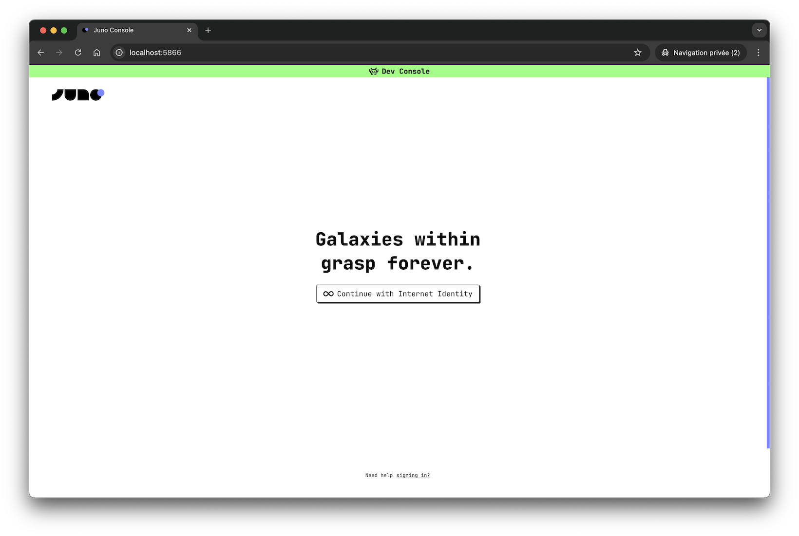
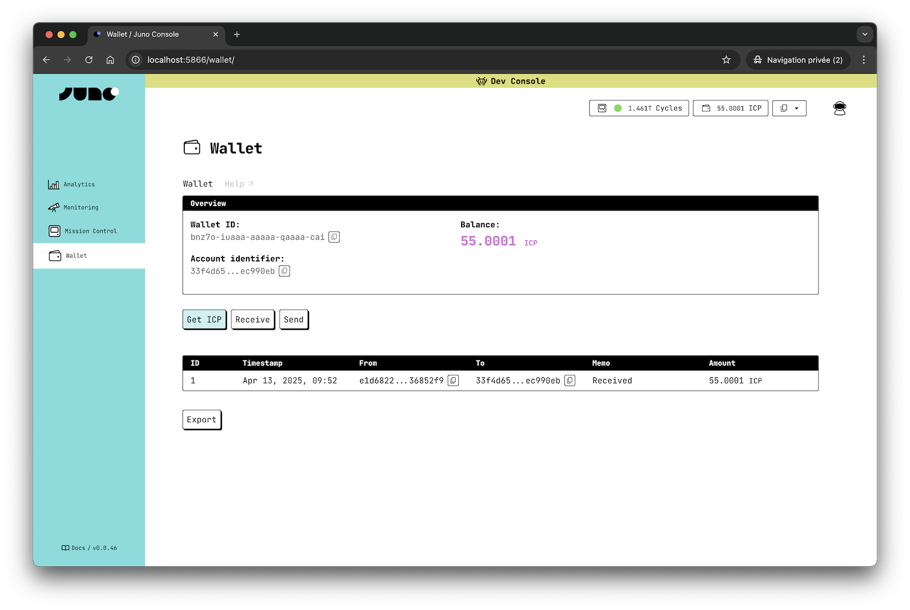

# Local Development

Juno offers something most platforms don’t: a full local development environment that closely mirrors production.

## TL;DR

| What              | How                                            |
| ----------------- | ---------------------------------------------- |
| Runtime supported | Docker or Podman                               |
| Start emulator    | `juno dev start`                               |
| Stop emulator     | `juno dev stop`                                |
| Console UI URL    | [http://localhost:5866](http://localhost:5866) |

---

## What the Emulator Includes

When you develop locally, you're running an emulator that includes the well known infrastructure services — including the actual administration Console UI.

This enables:

- A development experience that mirrors mainnet, helping you build with confidence
- A smooth dev loop, from prototype to deployment
- A unique way to build, debug, and validate smart contract logic and frontend behavior — all in one place



---

## Before you begin

The emulator is a self-contained local environment that runs in a container managed entirely by Juno — using either [Docker](https://www.docker.com/) or [Podman](https://podman.io/) under the hood.

Make sure your preferred runtime is installed on your machine:

- [Docker: Windows](https://docs.docker.com/desktop/install/windows-install/)
- [Docker: macOS](https://docs.docker.com/desktop/install/mac-install/)
- [Docker: Linux](https://docs.docker.com/desktop/install/linux-install/)
- [Podman: Installation guide](https://podman.io/getting-started/installation)

:::important

For MacBooks with M-series processors, if you aim to use **Docker**, it is important to install Docker Desktop **version 4.25.0 or later**, ideally the latest available version.

For **Podman**, we are not aware of any particular version requirements at this time.

:::

---

## Getting Started

To run the emulator for local development, you need to have the Juno CLI installed.

If you haven’t installed it yet, run:

import Cli from "./components/cli.mdx";

<Cli />

Then, in your project folder, start the local emulator with:

```bash
juno dev start
```

This will launch the emulator along with all the services needed to develop your project.

We recommend running this in a dedicated terminal window or tab, while your frontend project (e.g. using Vite or Next.js) runs separately using npm run dev or similar.

To stop the emulator, run:

```bash
juno dev stop
```

:::note

While you could technically start the emulator using `docker run` or `podman run`, we recommend using the Juno CLI to manage the emulator lifecycle. It handles important checks, sets the correct configuration, and ensures everything runs as expected.

:::

---

## Available Images

Juno supports two main environments for running your project locally, each tailored to different use cases.

| Image                 | Description                                  | Includes Console UI | Best for                    |
| --------------------- | -------------------------------------------- | ------------------- | --------------------------- |
| `junobuild/skylab`    | All-in-one local environment like production | ✅                  | End-to-end dev, exploration |
| `junobuild/satellite` | Lightweight setup running a single Satellite | ❌                  | CI, focused app testing     |

Both variants run on a local network, services and support live-reloading for serverless functions written in Rust or TypeScript.

- Use **Skylab** for the full experience, including the Console UI and supporting infrastructure.
- Use **Satellite** when you want a faster, minimal setup for a specific app or automated tests.

The table below shows which modules are available in each image and helps clarify what’s included when running locally with Skylab or Satellite.

| Module                                      | Skylab ✅ | Satellite ✅ |
| ------------------------------------------- | --------- | ------------ |
| Console (Backend)                           | ✅        | ❌           |
| Console (UI)                                | ✅        | ❌           |
| Create Satellites / Orbiters via Console UI | ✅        | ❌           |
| Default (auto-deployed) Satellite           | ❌        | ✅           |
| Observatory                                 | ✅        | ❌           |
| Internet Identity                           | ✅        | ✅           |
| ICP Ledger                                  | ✅        | ✅           |
| ICP Index                                   | ✅        | ✅           |
| NNS Governance                              | ✅        | ❌           |
| Cycles Minting (CMC)                        | ✅        | ❌           |

:::note

The default (auto-deployed) Satellite is available with a predefined canister ID `jx5yt-yyaaa-aaaal-abzbq-cai`.

:::

---

## Console UI

When using the `junobuild/skylab` image, the Console UI becomes available by default at:

```bash
http://localhost:5866/
```

Once the emulator is running (`juno dev start`), visit this URL in your browser to explore the Console — where you can create and manage Satellites, and explore features like Datastore, Authentication, Storage, and more.

---

## Hot Reload

The local container supports live reloading. When you modify your [configuration](../reference/emulator/satellite#configuration) or build custom [Functions](../build/functions/index.md) to enhance Juno's capabilities with serverless features, those changes will be automatically redeployed.

---

## Configuration Options

To customize the behavior of the local emulator—such as changing ports, setting a persistent volume name, or overriding the runner image — refer to the [Emulator Configuration](../reference/configuration.mdx#emulator-configuration) section.

There you'll find detailed information about available options including:

- ⚙️ Runner settings (e.g. image, platform, volume)
- 🔌 Custom port mappings
- 📁 Shared folders and hot reloading
- 🧪 CI and test environment tips

---

## Usage

During local development, your app connects to the local emulator (container) by default — no extra configuration needed.

This is handled automatically when using the [plugins](../reference/plugins.mdx), or when starting from a template.

If needed, you can opt out of the container behavior by explicitly setting `container: false`.

### Manual Initialization

If you're not using a plugin and are initializing Juno manually, here's how to configure it to use the local container:

```javascript
import { initSatellite } from "@junobuild/core";

const container = import.meta.env.DEV === true;

await initSatellite({
  satelliteId: container
    ? "jx5yt-yyaaa-aaaal-abzbq-cai"
    : "aaaaa-bbbbb-ccccc-ddddd-cai",
  container
});
```

The SDK will automatically detect the container in local development. If you want to disable that behavior and connect directly to a remote canister (e.g. in CI or production testing), you can do:

```javascript
await initSatellite({
  satelliteId: "aaaaa-bbbbb-ccccc-ddddd-cai",
  container: false
});
```

---

## Administration

The admin server running on port `5999` provides a variety of internal management. Below are some tips and example scripts to make use of this little server.

### Get ICP

If you're using the full environment, the Console UI includes a "Get ICP" button in the wallet. It’s a quick way to get ICP out of the box.



You might want to transfer some ICP from the ledger to a specified principal, which can be particularly useful when you're just getting started developing your app and no users currently own ICP. This can be achieved by querying:

```
http://localhost:5999/ledger/transfer/?to=$PRINCIPAL
```

For example, you can use the following script:

```bash
#!/usr/bin/env bash

# Check if a principal is passed as an argument; otherwise, prompt for it
if [ -z "$1" ]; then
  read -r -p "Enter the Wallet ID (owner account, principal): " PRINCIPAL
else
  PRINCIPAL=$1
fi

# Make a transfer request to the admin server
curl "http://localhost:5999/ledger/transfer/?to=$PRINCIPAL"
```
