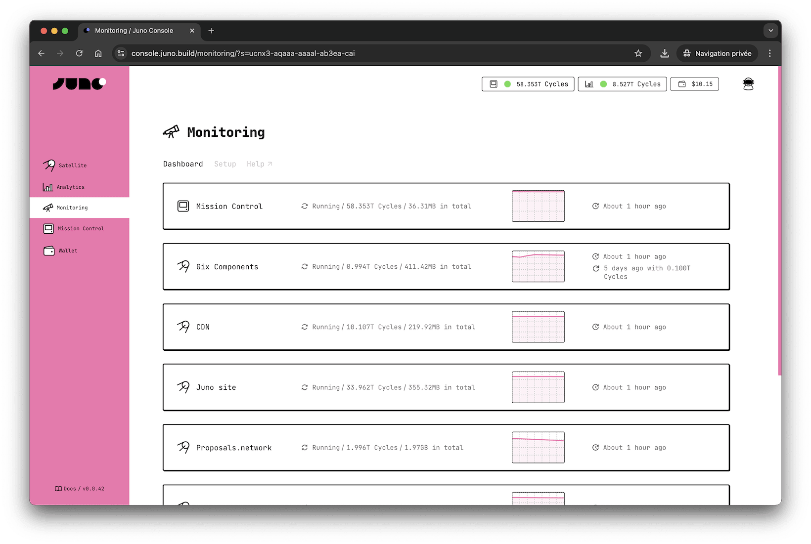

# Monitoring

Keeping your modules running smoothly is essential for any application. The monitoring feature ensures your [Mission Control] (your wallet) and modules — Satellites and Orbiter (Analytics) — stay operational by automatically refilling cycles when they run low. This helps prevent unexpected downtime, allowing you to focus on building and growing your product without worrying about cycle balances.

---

## Features

- **Cycle refilling**: Monitored modules are automatically topped up when their balance falls below what's needed to stay active.
- **Self-Monitoring**: Your Mission Control ensures that both your wallet and modules maintain sufficient cycles, with full control remaining in your hands at all times.
- **Automatic ICP Conversion**: Can mint new cycles from the ICP in your wallet, ensuring your canisters stay adequately funded.
- **Hourly Checks**: The system evaluates balances once an hour.

---

## Why Enable Monitoring?

When a smart contract runs out of [cycles] on the [Internet Computer](https://internetcomputer.org), it stops functioning, which can disrupt your application or service. Enabling monitoring provides peace of mind by automating the management of cycles, ensuring your modules are always ready to perform. It also saves a little time by eliminating the need for manual top-ups.

It's important to note that if your smart contracts — whether it's your wallet or a module — run out of cycles, they will enter a grace period. During this time, the module stops working but can still be restored. If no action is taken, the module eventually gets deleted, resulting in the permanent loss of its data and functionality.

---

## How does it work?

Monitoring runs hourly within your Mission Control, which acts as the central hub for managing all monitored modules. The process follows these steps:

---

### Periodic Balance Checks

Your Mission Control evaluates the cycle balances of all modules you've enabled for monitoring, including itself. Monitoring cannot be enabled without also observing Mission Control (your wallet), as it serves as the source for auto-refills.

The system compares the cycle balance of each module (and Mission Control) against the sum of the grace period requirement and the trigger threshold you've configured.

For example:

- Grace Period Requirement: 0.5T Cycles
- Trigger Required Amount: 0.5 T Cycles
- => Total Required: 1.0T Cycles
- Current Balance: 0.8 T Cycles

Since the balance is 0.2 T Cycles below the required amount in this example, the system will attempt an auto-refill.

---

### Auto Refilling

When a module is eligible for refill, Mission Control attempts to top it up by following these rules:

#### a. Topping up from Mission Control's cycles

If Mission Control has enough cycles above its own required amount, it uses them to refill the module.

For example:

- Mission Control Balance: 10 T Cycles
- Mission Control Required Amount: 3 T Cycles
- Module Required Amount: 1 T Cycles
- Current Module Balance: 0.5 T Cycles
- Top-Up Amount (Configured): 2 T Cycles

In this case, Mission Control deducts 2 T Cycles to top up the module, leaving:

- Mission Control Balance: 8 T Cycles
- Module Balance: 2.5 T Cycles

#### b. When Mission Control cannot top up

If Mission Control's balance is below its own required amount, it cannot top up the module.

For example:

- Mission Control Balance: 10 T Cycles
- Mission Control Required Amount: 12 T Cycles

In this example, Mission Control's balance is already below its own requirement; therefore, no top-up can be performed unless it also holds ICP.

#### c. Minting Cycles from ICP

If Mission Control's balance is insufficient but it holds ICP, it can mint cycles to refill the module.

For example:

- Mission Control Balance: 10 T Cycles
- Mission Control Required Amount: 12 T Cycles
- ICP Balance: 1 ICP

Mission Control uses part of its ICP to mint cycles:

- Mission Control Balance (after minting): 10 T Cycles
- Module Balance: 2.5 T Cycles
- ICP Balance (after minting): ~0.75 ICP

:::important

Mission Control can only refill itself by minting new cycles with ICP.

:::

#### d. When no top-up is possible

If Mission Control doesn't have enough cycles or ICP to perform a refill, the top-up fails.

---

### Notifications

After each successful top-up, developers who have opted-in will receive an email notification. These notifications provide details such as the module that was refilled and the amount of cycles added.

In the case of failed attempts (e.g., when Mission Control or a module could not be refilled), a single email notification is sent per day to avoid spamming developers in the event of repeated failures.

---

## Configuration

To enable monitoring, go to the [Monitoring Section](https://console.juno.build/monitoring) in the Juno Console. Start the wizard by clicking **Enable Auto-Refill** and follow the prompts to select the modules you want to monitor, choose a pre-defined strategy or create a custom one, and enable the feature.

The wizard simplifies the setup process, making it easy to configure monitoring according to your needs.

[Analytics]: ../build/analytics/index.md
[Satellites]: ../terminology.md#satellite
[Mission Control]: ../terminology.md#mission-control
[cycles]: ../terminology.md#cycles
[console]: ../terminology.md#console
