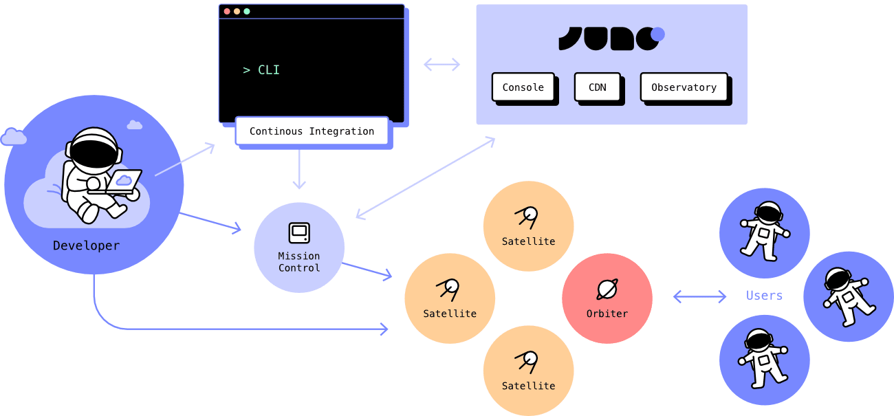

# Architecture

Juno is your own self-contained execution space. Everything your app needs — frontend, backend logic, storage — gets bundled into a single deployable WebAssembly (WASM) container called a Satellite.

One artifact. One push. That's your app.

No DevOps. No backend boilerplate. No surprise complexity.

Juno's architecture is designed to give developers complete control and ownership. It combines familiar developer workflows with an environment that runs independently once deployed — without Juno's intervention.

 

---

## How It Works

A typical Juno development flow looks like this:

1. **Build your frontend** using Next.js, React, SvelteKit, Vue or any other framework you love (or none).
2. **Add backend logic** (if needed) via serverless functions written in Rust or TypeScript.
3. **Bundle everything into a Satellite** — a single WebAssembly container that holds your entire application, including its logic, state, and storage.
4. **Deploy using the CLI or GitHub Actions.** No servers to configure. No infrastructure to manage.

Once deployed, your Satellite runs independently in an unstoppable environment, entirely under your control.

---

## Platform Services

Juno provides supporting services to manage your projects, while keeping everything under your ownership:

### Console

The Console is a platform for managing your projects. It runs as its own container, combining a user interface with orchestration logic.

It only holds one piece of data: a keypair linking each developer's anonymous ID to their Mission Control ID.

When you sign in, the Console returns your Mission Control ID. From there, all project management happens under your control. The Console does not have access to your apps, your data, or your infrastructure.

It provides services such as:

- Creating, upgrading, and deleting Satellites.
- Managing authentication, storage, data, and application state.
- Monitoring logs from serverless functions.
- Setting custom domains.
- Spinning up and reviewing analytics.

You can access the Console at [console.juno.build](https://console.juno.build).

:::note

The Console is not decentralized. It is maintained by Juno to provide a stable management platform and up-to-date developer experience. However, all applications, data, and infrastructure you deploy through it remain under your control.

In the future, there is a strong will to resolve this dependency by making the Console self-hostable or governed by a DAO, aligning it with the same principles of ownership and autonomy as the rest of the platform.

It is worth noting that Juno is fully open source. Anyone can review its source code at any time. And while not formally documented, the Console is already self-hostable today — offering anyone who wants full control over the entire stack the option to do so.

:::

### Observatory

The Observatory is a proxy service used solely for developer notifications. When monitoring is enabled in a developer's Mission Control, events such as automatic top-up successes or failures trigger a message sent through the Observatory to notify the developer via email.

This setup ensures that each Mission Control does not need to maintain its own notification infrastructure. The Observatory only forwards messages — it does not monitor, modify, or access any application logic or data.

### CDN

Juno maintains a CDN that stores libraries, templates, and pre-built WASM code. These pre-built WASM containers are official module versions shipped by Juno. When a new release is available, it is uploaded to the CDN, allowing developers to upgrade e.g. their Satellites using the latest version.

While it functions as a CDN, technically it's not a traditional content delivery network. It is itself a Satellite.

---

## Developer-Owned Spaces

### Mission Control

Mission Control is your personal management container. It tracks your Satellites and Orbiters, and it acts as your wallet.

You use it for example to spin up new containers or provide [cycles](../terminology.md#cycles) to keep your modules running. It serves as your central hub for managing projects and resources.

Mission Control belongs to you. No one else can access it — not Juno, not the Console, not any other service.

### Satellites

Satellites are your applications. Each one is a self-contained unit that bundles:

- Frontend assets
- Default backend features
- Custom serverless functions
- Data and storage
- Permissions and access control

### Orbiters

Orbiters provide analytics — a decentralized alternative to services like Google Analytics. Orbiters collect traffic, page views, and device information, under your ownership and without exposing user data to third parties.

---

## CI/CD and Deployment

You can deploy and upgrade your Satellites using GitHub Actions or the Juno CLI.

- Deployment automation is opt-in.
- Juno does not control or interfere with your deployed app.
- Once live, your apps remain running independently.

Each Satellite uses a role-based permission system managed via [access keys](./access-keys.md), letting you decide whether to retain full access, delegate writable access, or allow third parties to solely propose changes.

---

## Libraries, Tools, and Emulator

Juno provides many JavaScript libraries, Rust crates, templates and tooling to get started and integrate with your workflow. You can find all the code in the [Juno GitHub organization](https://github.com/junobuild).

It also provides an emulator for [local development](../guides/local-development.mdx) that mimics as closely as possible the experience you get in production.
