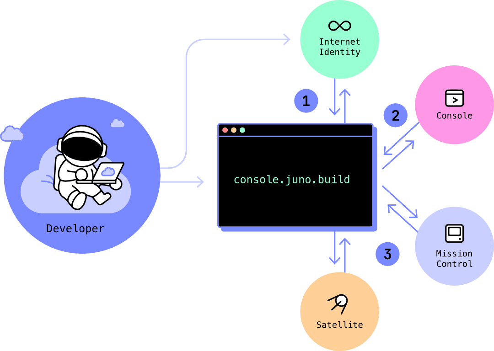

# Controllers

Controllers play a crucial role in granting permissions to mission controls and satellites within Juno.

An administrative controller can perform tasks such as configuring or deploying an app, topping up a mission control or satellite, creating a new collection in the [datastore](../build/datastore/index.md) or [storage](build/storage.md), or configuring a custom domain in the [hosting](build/hosting.mdx).

When you sign in to Juno's [console] using [Internet Identity](https://internetcomputer.org/internet-identity) (1), you - **and no one else** (including not Juno) - become the controller of your own [mission control] (2). This information is then sent back to your browser, where you can manage your modules (3).

When you create a [satellite], you and your mission control become its controllers. Per extension, you - **and no one else** (including not Juno) - own your satellite.

One "controller" is identified by a [principal](../terminology.md#principal).

## Adding Controllers

You can add additional controllers. When doing so, you can choose to grant them administrative privileges or restrict their scope to reading and writing data.

:::note

You have the ability to add up to 10 administrative controllers, as per the limitation set by the [Internet Computer](https://internetcomputer.org/docs/current/references/ic-interface-spec#ic-create_canister).

:::

When creating a new satellite, it is highly likely that you will need to assign controllers to enable its operation from your local machine or continuous integration setup.

To accomplish this, you have two available options.

### Reuse an existing controller

When setting up an additional satellite, you might prefer to use an existing controller configuration you've already established on your local machine. To do this, simply run `juno login` and follow the provided instructions.

:::note

When you run `juno login`, the command checks for an existing controller on your machine. If one is found, you'll be given the option to either create a new sign-in, which generates a fresh controller, or reuse the existing one. If you opt to reuse it, the CLI will guide you through the process.

:::

### Generate a new controller

To **generate a new controller** and attach it to your desired mission controls and satellites, you can execute a new `juno login` command using the CLI. The console will guide you through the process.

However, please note that this action will overwrite the previously saved controller that was used for configuring your CLI locally.

It is generally recommended to use this method if you wish to generate a completely new controller and apply it to all your components.

:::note

You also have the option to generate new controllers directly in the console. This feature is particularly beneficial if you intend to configure [GitHub Actions](../guides/github-actions) to automate the deployment of your application.

:::

[console]: ../terminology.md#console
[satellite]: ../terminology.md#satellite
[mission control]: ../terminology.md#mission-control
