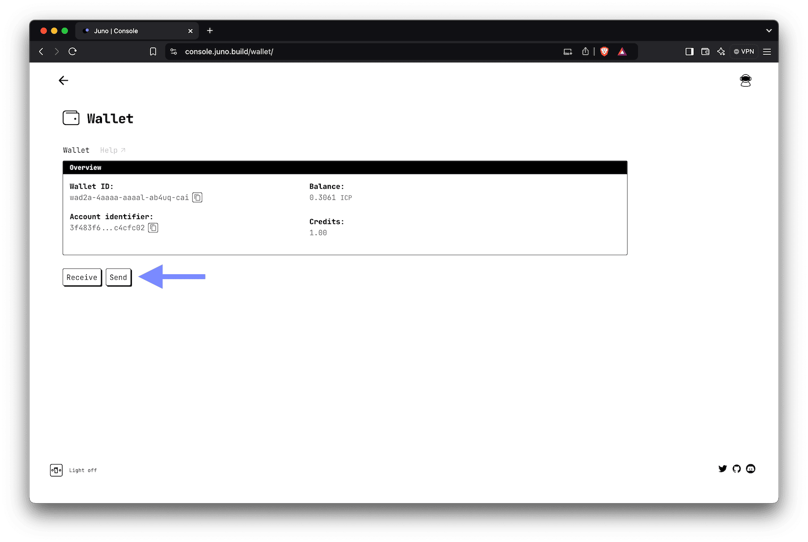
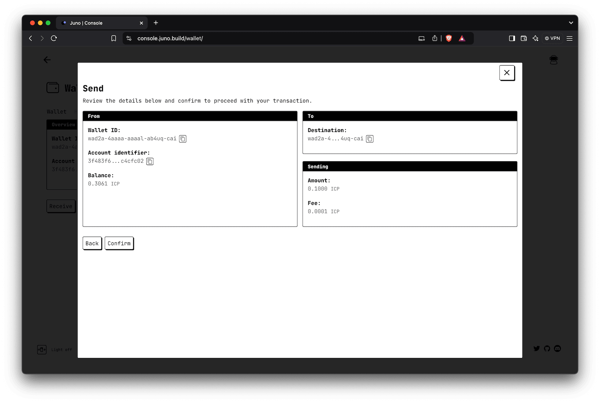

# Wallet

This section provides guidance on managing your cycles with your wallet (your account), which are essential for maintaining and providing enough resources for your modules in the Juno ecosystem.

:::important

Just like your modules, your wallet is under your control — Juno cannot access, move, or recover the cycles held inside.

Because of this model, there are no refunds, reversals, or recovery options. Always double-check destination addresses before sending funds.

As a best practice, we recommend not holding large amounts of cycles unless necessary. Use it as a utility for fueling your modules — not as a long-term vault.

We also recommend enabling [monitoring](../management/monitoring.md) to ensure your projects and analytics stay alive and responsive at all times.

:::

---

## What are Cycles?

Cycles are used to pay for infrastructure usage. Your Satellite, Mission Control or Orbiter consume cycles while they are active.

import Cycles from "../components/cycles.md";

<Cycles />

---

## Buying Cycles

The easiest way to purchase cycles — and get the best deal — is through [Cycle.express](https://cycle.express), which lets you pay with a credit card via Stripe.

The service is integrated directly into the Juno Console. From your wallet, click "Buy" and follow the steps.

:::note

The default purchase amount is $1 USD. You can change this amount on Stripe's payment page (maximum $100).

:::

**TODO SCREENSHOT**

---

## Receiving Cycles

If you already hold cycles or want to swap some, you can use the [OISY Wallet](https://oisy.com).

To initiate a transaction manually, you will need to provide a destination address. To find it in the [console], open the shortcut to your [wallet](https://console.juno.build/wallet) and click "Receive" select "Wallet ID".

**TODO SCREENSHOT**

You can also connect OISY to Juno's console to initiate the transaction and proceed with the approval. This eliminates the need to copy, paste, or scan any addresses.

**TODO SCREENSHOT**

---

## Send Cycles

Sending Cycles to the ecosystem or the outside world can be initiated from your wallet in Juno's [console]. To start a transaction, click "Send".

:::important

Sending cycles transfers them to another wallet. To add manually cycles (resources) to your modules (Satellites, Orbiters, or Mission Control), use the **Top-up** feature instead.

:::

**TODO SCREENSHOT**

Enter the destination wallet ID or account identifier where you want to send cycles, along with the amount.

**TODO SCREENSHOT**

Review the transaction details and confirm to execute it.

**TODO SCREENSHOT**

---

## Legacy Support

For backwards compatibility with Mission Control that operated in ICP, the wallet features still support those tokens. You can receive and send ICP if needed.

However, using cycles is now the recommended approach for all operations.

[console]: https://console.juno.build
