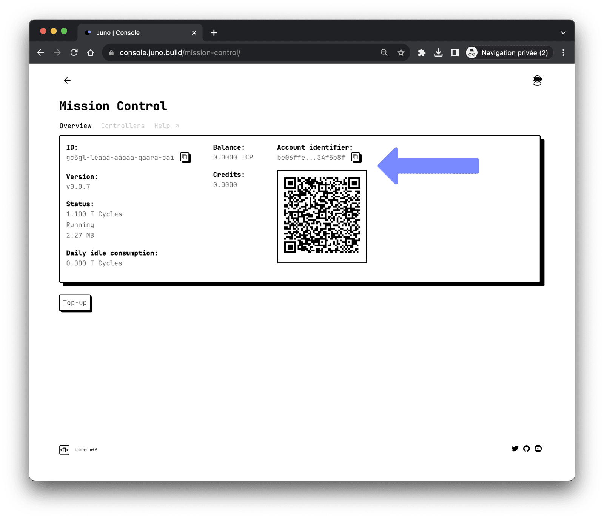

# Pricing

There are two types of costs associated with using Juno.

1. Operating costs for your [mission control] or satellites
2. Costs for executing transactions with Juno

:::note

Last update: June 15, 2023

:::

## Operating costs

As the owner of your mission control or satellites, you are responsible for their operating costs.

To ensure that your infrastructure usage is covered, you must maintain a minimum balance of [cycles](terminology.md#cycles).

You can top up your cycle balance in the Juno [console](https://console.build.com) using ICP from your mission control or from anywhere else on the [Internet Computer](https://internetcomputer.org/).

## Transaction costs

New developers joining Juno are given credits to create a mission control and their first [satellite].

To create additional satellites, a fee of 0.5 ICP is required, in addition to the costs required by the infrastructure to create the smart contract.

Please note that further transaction fees may be required in the future and prices and models are subject to change.

## Cost examples

Here are a few examples of costs provided for explanatory purposes only and without guarantee. Please note also that these cost estimates are subject to change and may vary depending on network conditions and usage patterns.

### Storage

The estimated cost of holding 1 gigabyte of data in a smart contract is $5 per year, as stated on the Internet Computer [website](https://internetcomputer.org/social-media-dapps/).

### Deployment

Based on our experimentation, deploying an entire website on-chain, such as the website http://juno.build, which consists of 273 files and is approximately 17 MB in size, is estimated to cost around 0.16 ICP ($0.64).

It's important to note that subsequent deployments of your project can have significantly lower costs if the build consistency of your application is maintained. Juno only uploads new files to your satellites, which helps reduce costs compared to initial deployments.

### Data

Querying data on the Internet Computer is currently free, so there are no additional costs to expect when reading data.

In terms of persisting data, based on our experience, storing 100 instances of a JSON sample data with approximately 90 fields, totaling around 900 bytes, costs approximately 0.0005 TCycles or 0.00017 ICP ($0.000675). This means that the cost for a single transaction of this nature would be approximately 0.000005 TCycles or 0.0000017 ICP ($0.00000675).

## Sending ICP to Your Mission Control

To send ICP to your mission control, you can use most cryptocurrency exchange platforms (refer to this [list](https://coinranking.com/fr/coin/aMNLwaUbY+internetcomputerdfinity-icp/exchanges) of major ones) or wallets such as the [NNS dapp](https://nns.internetcomputer.org/).

To initiate the transaction, you will need to provide a destination address where the ICP should be sent. This destination address corresponds to the [Account Identifier](./terminology.md#account-identifier) of your mission control.

You can find the destination address in Juno's console. After signing in, navigate to your personal [mission control administration page](https://console.juno.build/mission-control/) and copy your **Account Identifier** or use the QR code.

:::info

You are the owner of your mission control, and Juno has no control or access to it. Therefore, any [ICP](terminology.md#icp) transferred to your mission control belongs to you and only you.

:::

[mission control]: terminology.md#mission-control
[satellite]: terminology.md#satellite
