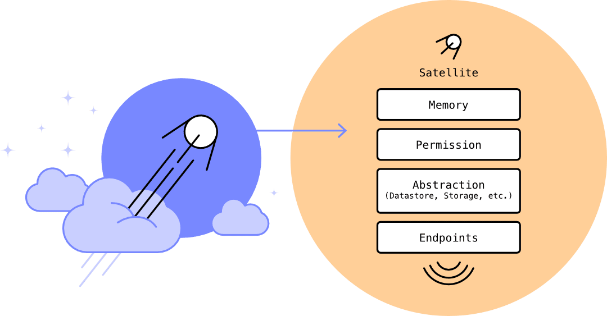

# Terminology

In Juno, we use some terms that may be unfamiliar to some. This page provides a summary of the most commonly used terms.

## Account Identifier

An "Account Identifier" is an address, serving as the textual representation of an account on the Internet Computer (ICP) ledger. It can represent an account owned by an individual or a smart contract.

## Canister

A canister is the term for a smart contract on the Internet Computer. It includes both logic and state (memory), bundled together and deployed as a WebAssembly (WASM) container.

All [modules](#modules) in Juno — such as [satellites](#satellite), [mission controls](#mission-control), and [orbiters](#orbiter) — are canisters under the hood.

## Console

The "console" refers to Juno's administration application, located at [https://console.juno.build](https://console.juno.build).

## Controller

On the Internet Computer, a controller is a [principal](#principal) (such as a user or service) that has full administrative control over a deployed module.

In earlier versions of Juno, the term _controller_ was used to describe access permissions to [mission controls], [satellites] and [orbiters]. This concept has since been replaced by access keys, which provide more flexibility and support for different roles.

For current usage and setup, refer to the [Access Keys documentation](miscellaneous/access-keys.md).

## Cycles

Cycles are used to pay for [infrastructure] usage. Your [mission control] or [satellite] consumes cycles while it's active.

The amount of cycles available determines whether a module will be active, inactive, or eventually decommissioned (deleted).

This ensures that related costs cannot surpass the amount of cycles available.

Think of cycles like prepaid mobile data:

- Just like your mobile plan allows you to make calls and browse the internet, cycles enable your containers to process computations and store data.
- When your data (cycles) runs out, your service becomes inactive.
- To keep your modules running smoothly, you need to top up your cycles regularly (manually or automatically).
- If you don’t top it up, after some time, it will be decommissioned, similar to losing your prepaid number due to prolonged inactivity.

Learn more about [computation and storage costs](https://internetcomputer.org/docs/current/developer-docs/gas-cost).

## Doc

"doc" is a commonly used shorthand in Juno for a "document of the Datastore". Wherever you see the term "doc" in the codebase or documentation, it refers specifically to a document entity managed by the [Datastore](build/datastore/index.mdx). This abbreviation is used for brevity and consistency throughout the project.

## ICP

The ICP token is the cryptocurrency used to pay for transactions on Juno's [infrastructure].

It can also be converted into cycles, which are used to pay for computation and storage. Unlike the market price of ICP, the price of cycles remains constant, ensuring predictable costs for infrastructure usage.

## Internet Identity

[Internet Identity](https://internetcomputer.org/internet-identity) is a decentralized authentication provider that offers a secure blockchain login experience with a user-friendly Web2 interface.

It is free and passwordless. It integrates WebAuthn for maximum compatibility and, unlike other Web3 authentication solutions, it does not require you to save a private key on your device or in an application.

## Mission control

Mission control is the command center for your project. It is under your exclusive control, allowing it, for example, to hold ICP and perform various operations such as topping up your modules.

Think of it like the command center for a space mission. Just as NASA's mission control coordinates spacecraft and satellites, your mission control manages all your [satellites] or [orbiters](#orbiter).

Because it can hold ICP and is only controlled by you, your mission control also functions as your [wallet](#wallet).

For a schematic representation, refer to the [Architecture](miscellaneous/architecture.md) documentation page.

## Modules

A module — such as a Satellite, Mission Control, or Orbiter — is a container compiled into WebAssembly (WASM) and deployed on the Internet Computer with Juno.

It acts as a comprehensive entity, encompassing memory, permission checks, and other Juno abstractions. These serve as endpoints that developers and users can query for various functionalities.

## Orbiter

An orbiter is an optional module you can enable for analytics. It helps you gather valuable, anonymous insights about your users.

## Principal

Principals are generic identifiers for the [console], [mission controls], [satellites], and users.

They consist of a public-private key pair. When displayed or used as a configuration value, the public ID of the principal is used.

Learn more about [principals](https://internetcomputer.org/docs/current/references/ic-interface-spec#principal).

## Satellite

A satellite is a container for your application. It holds your project’s data, storage, application bundle, and assets.

Each satellite is commonly dedicated to a single application.

## Subnet

A subnet is like a group of programs working together on the Internet Computer. These groups, or subnets, are designed to distribute the workload across the network. By having multiple subnets, the Internet Computer can handle more activity, process data faster, and ensure the system remains efficient and secure.

When you create a module, like a Satellite, it's deployed on the same subnet as the Juno Console by default: [6pbhf-qzpdk-kuqbr-pklfa-5ehhf-jfjps-zsj6q-57nrl-kzhpd-mu7hc-vae](https://dashboard.internetcomputer.org/subnet/6pbhf-qzpdk-kuqbr-pklfa-5ehhf-jfjps-zsj6q-57nrl-kzhpd-mu7hc-vae).

Communicating between modules on different subnets takes longer due to the extra steps required for coordination (about 4 additional consensus rounds in the best case). This is why placing all your interacting modules on the same subnet can lead to significant performance improvements.

Think of it like a huge playground with lots of groups of kids playing different games. Each group has its own area to play, and that area is called a subnet.

If you want to play with kids in your own group, it’s super fast and easy because you’re all together. But if you want to play with a kid in a different group, it might take a little longer since you have to cross the playground to reach them.

By picking the right group (or subnet), everyone can play faster and have more fun.

## Wallet

A wallet is your secure repository for managing and storing crypto money. Your wallet is controlled exclusively by you, ensuring that no one, including Juno, can ever access it.

Think of it like a digital vault:

- It securely stores your ICP tokens.
- It acts as your gateway for transactions within the Juno ecosystem.
- It allows you to top up your modules with cycles.

Because your wallet is also your [mission-control](#mission-control), which requires resources to stay alive, we recommend holding a reasonable amount of tokens. Think of it like a day-to-day wallet for frequent operations rather than one for savings.

[console]: terminology.md#console
[satellite]: terminology.md#satellite
[satellites]: terminology.md#satellite
[orbiters]: terminology.md#orbiter
[mission control]: terminology.md#mission-control
[mission controls]: terminology.md#mission-control
[infrastructure]: miscellaneous/infrastructure.md
