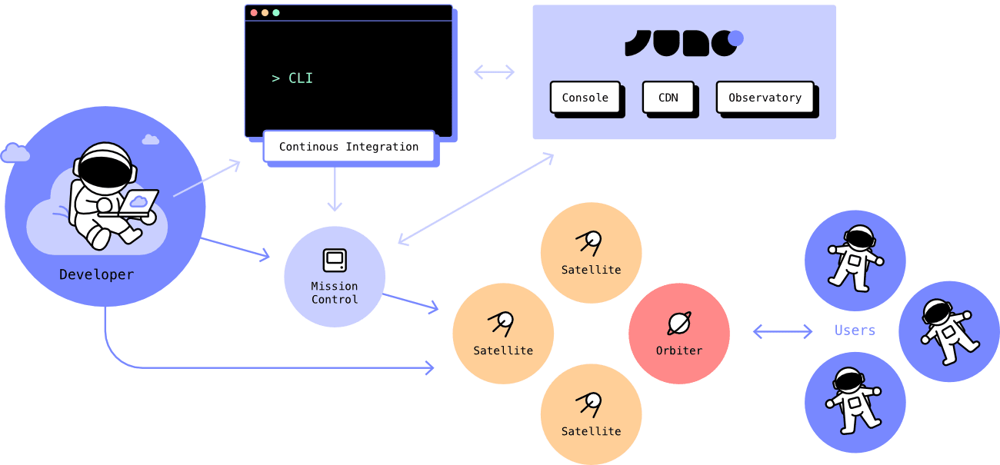

# Technical Architecture

The architecture of Juno is designed to give developers complete control over their data and applications, ensuring a decentralized and secure development environment. It continuously evolves to meet the needs of developers and to incorporate the latest advancements.

---

## Core Components

**Console**: The console is an admin interface for developers, providing a comprehensive suite of tools to manage and customize their projects. It maintains a list of Mission Control smart contracts and their associated anonymous user IDs. When a developer signs in, the console retrieves the developer's Mission Control and sends this information back to the developer's browser, allowing them to manage their Mission Control, satellites, and orbiters independently, with no control or intervention from Juno.

The console offers a full range of administrative features for managing smart contracts, including the ability to top up, start, stop, and delete projects, as well as create new projects. Developers can manage anonymous users associated with their projects and handle data management tasks such as creating collections and entries in the datastore or storage. Additionally, the console allows for customization by setting new custom domains for projects. Developers can also consult logs from serverless functions and set up monitoring to keep track of application performance and health.

This user-friendly interface ensures that developers have full control and flexibility over their projects, enhancing their ability to build and maintain decentralized applications efficiently.

**Observatory**: The observatory is a specialized smart contract that developers authorize to call specific information through their Mission Control, particularly regarding the current status of their smart contracts. In essence, the observatory acts as a watchdog, performing periodic checks to monitor and ensure the proper lifecycle management of the developers' smart contracts. While it currently only reads information, it might be extended in the future to perform additional tasks such as automatic top-up.

**CDN**: The CDN is a satellite that holds various libraries and assets used by Juno. It contains the metadata of WebAssembly (WASM) source files that developers use when upgrading their smart contracts. When a new version of any developer's smart contract is released, the updated version is published to the CDN. This ensures that releases are shipped end-to-end securely, providing a seamless and secure upgrade process for developers.

The Console, Observatory, and CDN are the smart contracts which aim to be controlled by a Juno DAO.

---

## Developers Components

**Mission Control**: Each developer is assigned a unique smart contract known as Mission Control. This smart contract acts as a hub for managing all of a developer's smart contracts (projects and tools), as well as serving as a wallet. This ensures that developers maintain full control over their applications and funds, with Juno having no control, rights, or access to any of the developer's creations.

**Satellites**: Satellites serve as comprehensive entities that include memory, permission checks, and other Juno abstractions. Essentially, a satellite is a container for a developer's project or dApp, encompassing all necessary data, storage, application bundles, and assets. Each satellite operates independently and is dedicated to a single application, ensuring clear organization and management.

**Orbiters**: Orbiters are specialized smart contracts used for analytics, functioning as a decentralized alternative to services like Google Analytics. They collect and process data, providing developers with valuable insights into their applications' performance and usage patterns. Like satellites, orbiters are fully controlled by the developer.

---

## Libraries, Tools and Templates

In addition to the smart contracts themselves, Juno also provides a variety of libraries, tools and templates. These are meant to be used within the developer workflow when developers start, maintain, and develop their projects. They are designed to provide the best state-of-the-art developer experience.

- **Javascript Libraries**:

  - **Core**: The core client library for interacting with satellites.

- **Analytics**: A tracker for integrating analytics.

- **Admin**: Tools for interfacing with admin features, enabling project management.

- **CLI**: A command-line interface for administrative purposes, allowing developers to manage their smart contracts and projects from the terminal.

- **Plugins**: Various plugins meant to ease the integration of Juno in frontend applications, specifically for ViteJS and NextJs.

- **GitHub Action**: Automation tools for interacting with and deploying via GitHub.

- **Docker Images**: Pre-configured Docker images for local dApp development and end-to-end (E2E) testing, providing a consistent development environment.

- **Plugins**: Various JS libraries

- **Templates**: To help new developers discover Juno or seasoned developers start new projects, Juno provides a set of templates for the most well-known frontend frameworks, namely NextJS, React, Vue, Svelte, Astro, and Angular.

---

## Documentation and Communication

Juno maintains a website that serves as the landing page and documentation hub for developers. It offers comprehensive guides, tutorials, and resources to help developers get started with Juno, understand its features, and make the most of the platform. Additionally, the website plays a crucial role in communication and SEO, helping to attract new users, engage the community, and provide updates about the platform. This site is a key component for onboarding new users, supporting the developer community, and increasing Juno’s visibility and reach.

The website will not be part of the DAO, as it requires frequent updates to reflect changes such as those in tooling and libraries, and because it is also used for communication, such as when new tutorials are published.
