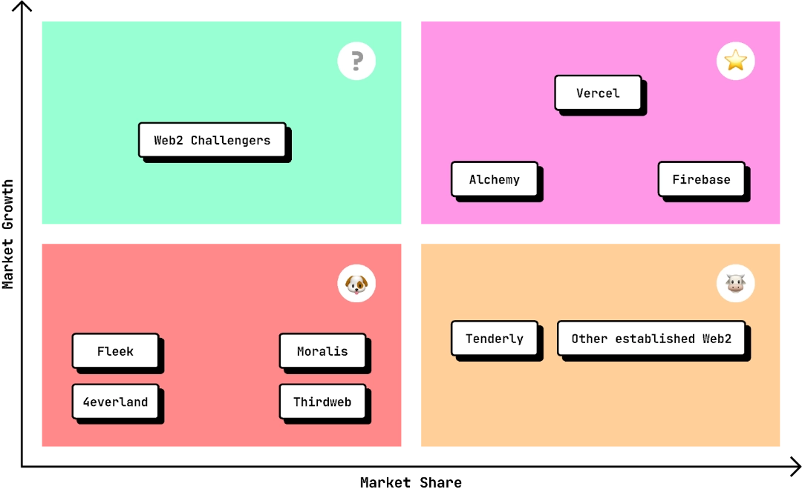

# Competitors

While Juno's blockchain-as-a-service approach offers a unique solution for developers, it is helpful to compare it with potential competitors across Web2 cloud providers and Web3 platforms. Here is a summary of the strengths and limitations of these key players.

## Comparison

- Web2: Established Platforms (Firebase, Supabase, AppWrite, Vercel, Netlify, Heroku, DigitalOcean, AWS Amplify)

  - Advantages:

    - **Established**: Well-established platforms with extensive support and resources.

    - **Market Share**: Large share of the market with many developers already using these services.

    - **Features**: Comprehensive set of features for development, deployment, and maintenance.

    - **Scale**: Proven scalability to handle large workloads efficiently.

  - Disadvantages:

    - **Stuck in the Web2 Paradigm**: Reliance on centralized infrastructure, lacking the decentralization and security features of Web3 solutions.

 

- Web2: Newcomers (Render, Flightcontrol, SST)

  - Advantages:

    - **Features**: Address market demand for alternatives to established Web2 cloud providers.

    - **Scale:** Well-funded and positioned to rapidly gain market share.

    - **Trendy**: The “cool kids on the block”.

  - Disadvantages:

    - **Stuck in the Web2 Paradigm**: Share the same disadvantages as established Web2 providers, including reliance on centralized infrastructure and lack of decentralization and security features inherent in Web3 solutions.

 

- Web3: API Platforms (Alchemy, Moralis, thridweb)

  - Advantages:

    - **Established**: Strong presence in the Web3 space with robust ecosystems.

    - **Market Share**: Large share of the market with many developers already using these services.

    - **Cross-Chain Capabilities**: Support for multiple blockchain networks, enhancing interoperability.

  - Disadvantages:

    - **Focused on Wallets and Transactions**: Primarily centered around wallet management and transactions.

    - **Gas Fees**: Transaction costs can be high, impacting the overall cost-efficiency.

    - **Not Fully Open Source**: Some components may not be open source, limiting transparency.

    - **No DAOs**: Lack of decentralized autonomous organization and governance for their users.

    - **Off-Chain Frontend**: Often rely on off-chain solutions for frontend development.

 

- Web3: Hosting Platforms (Fleek, 4everland)

  - Advantages:

    - **Established**: Reliable hosting platforms with a focus on Web3 applications.

    - **Cross-Chain Capabilities**: Support for multiple blockchain networks, enhancing interoperability.

  - Disadvantages:

    - **Web2 Auth and DB**: Uses traditional Web2 authentication and database solutions.

    - **No DAOs**: Lack of decentralized autonomous organization and governance for their users.

    - **Not Fully Open Source**: Some components may not be open source, limiting transparency.

 

- Web3: Developer Platforms (Tenderly, OpenZepplin)

  - Advantages:

    - **Adopted Tooling**: These platforms provide a good developer experience, adopted by many and fulfilling their needs.

    - **Infrastructure**: They deliver various tools (Testnets, debuggers, alerting) required for node and smart contract development at scale.

    - **Cross-Chain Capabilities**: Support for multiple blockchain networks, enhancing interoperability.

  - Disadvantages:

    - **Other paradigm**: While both address “Web3 development,” Juno distinguishes itself by focusing on dApp development and could potentially offer bridges.

    - **Ease of onboarding**: Web2 developers, particularly those familiar with JavaScript, are more likely to onboard quickly on Juno.

    - **No DAOs**: Lack of decentralized autonomous organization and governance for their users.

---

## Potential Market Structure

To provide a visual comparison, here is a BCG matrix highlighting the potential market share and market growth rate of those various Web2 and Web3 platforms based on my personal interpretation. This representation may be subjective and potentially incorrect, but it reflects how I perceive the market dynamics.

