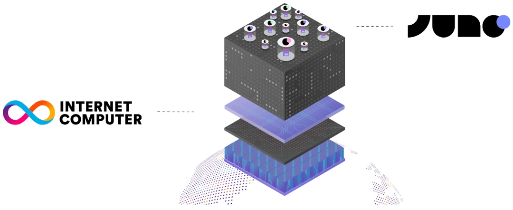

# Infrastructure

Juno's infrastructure is designed to harness the full potential of Web3 technologies, creating a robust, secure, and scalable environment for developers to build decentralized applications.

---

## Internet Computer

Juno operates on the Internet Computer (ICP or IC), a blockchain unlike any other. The Internet Computer is akin to adding a super-powered, self-running cloud to the regular internet. It enables the creation of various systems and services on a decentralized network using "canister software", which represents a more advanced version of smart contracts.

The IC comprises a set of protocols that facilitate independent data centers worldwide in coming together to offer a decentralized alternative to the current centralized internet cloud providers, often referred to as Big Tech. These independent entities operate specialized "node machines" to generate the same number of blocks as other machines within their network, ensuring uniformity through a Proof-of-Useful-Work mechanism. Their tasks involve replicating smart contract computations for optimal efficiency.

Thanks to its architecture, protocols, and cutting-edge cryptography, the Internet Computer stands out as the fastest blockchain, capable of directly delivering web content from smart contracts. This breakthrough enables 100% of online services to function on the blockchain, delivering complete decentralization and cost-effectiveness.

---

## Multi-Blockchain

While the Internet Computer is our current backbone, Juno is not limited to using only the IC. Our infrastructure keeps doors open for future integration with other blockchains. This approach ensures that Juno can adapt and incorporate new technologies as they emerge, maintaining our commitment to decentralization and leveraging the best available blockchain solutions. Furthermore, Juno aims to enable communication across different chains, enhancing interoperability and expanding the possibilities for decentralized applications.

---

## Web2 Services

While Juno aims to strictly use only Web3 providers and services, there are edge cases where technical or financial limitations necessitate the use of Web2 services. One example is the monitoring tool that sends emails to developers using Google Firebase Functions if their smart contracts are running out of resources. Another example is the usage of the services of the Boundary Nodes, which allow developers to register custom domains for their projects. These types of services are never enforced and are always subject to developers opting-in.
