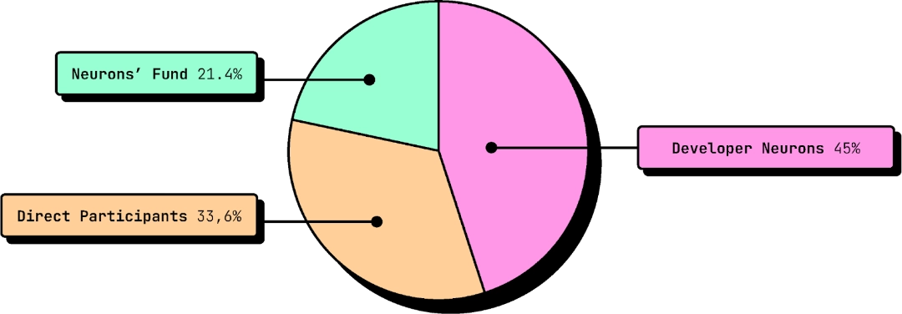

# Voting Power

To participate in the governance of the Juno Build DAO, a neuron will have to possess a minimum dissolve delay of 6 months to be eligible to vote. This duration aligns with the roadmap shared in this white paper and could be reviewed in the future.

The SNS voting power distribution at genesis will have the following proportions for direct participants, the Neurons' Fund, and developer neurons:

:::note

The percentages presented in chapter were calculated using the [SNS Tokenomics Analyzer](https://dashboard.internetcomputer.org/sns/tokenomics) on August 29, 2024.

:::
